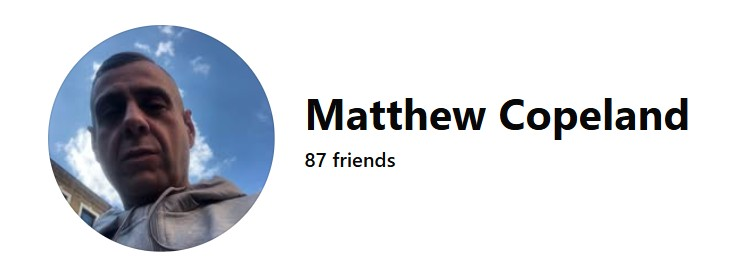
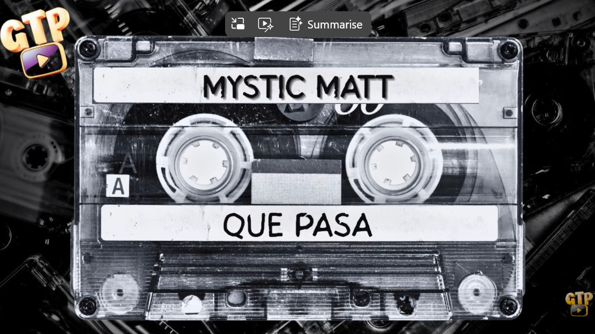
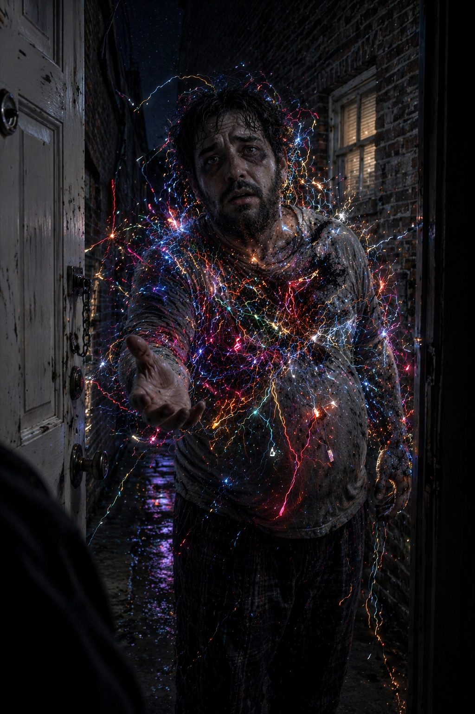

# 1993 

## Meeting Matthew Copeland in dreams

- Matthew and I fell in love in probably January of 1993, just three-and-a-half years after the Tottenham rape-gangs had hold of me.
- I was older, not much wiser, and at university (one of the only things my dad did for me in my life was to help me get a place on this university course - I wonder if he had been advised to do so).
- Me, Matthew, and Paul were out raving in London.
- We were very high on extasy.
- Matthew had the same birthday as my brother (back when me and my brother were the firmest of friends).
- THE COINCIDENCE WAS HUGE, IMPORTANT, SIGNIFICANT!!!
- I have to wonder now if that's really his birthday.
- He told me his dad was a porn-king.
- I thought he was just being an idiot.
- He showed me a picture of him when he was small.
- He was so sweet, scared and tiny, at his grandparent's (on his porn-king father's side) standing in the garden in Muswell Hill wearing his little suit and bowtie.
- I loved him more.
- His grandparents looked a bit like the Cambridge-ugly crowd. 
- I do have to wonder...
- I fell out of love with Matthew as soon as the brute showed up, which was not long delayed.
- Nevertheless, always in good spirit, we remained firm friends over the years... at least that's what I thought.
- It's only now I wonder if Matthew always assumed that, because we'd had sex he owned me, like everyone seems to do with women - having sex with them not even necessary, porn-voyeur sex is sufficient - and especially with the *special* ones who've been starring in sedated rape-porn without their knowledge for years.

### Matthew and Winston May

- Matthew probably knows Winston May, and probably fairly well too.
- The evening I met Winston May, in August of 1989 at the Camden Palace, Willow and I had been in the car with them all after the club.
- They'd driven to Matthew's house to see if there was a party on.
- There hadn't been anyone in.
- But Winston was keen we moved on elsewhere for some reason.
- Later, in 2015, Matthew posts photos of music sessions on his Facebook with a man who looks like Winston May (face hidden) knowing that I will see them.
- This was at exactly the same time I was writing [my police statement to the Met](../early-years/2015.md#statement-to-the-metropolitan-police) about Winston May while living at Joan Fuster, 11, in Dénia.

#### Matthew's connections to Las Marinas

- Matthews mum knew Dénia and had been there. We spoke about it.
- Winston May spoke to me of a Spanish town by the beach where [he'd been on a sedating-101 course with Nikki](../../crimes/protagonists/winston-may-and-nicky.md).
- Do the sedating kits used by rapists around the world come from Las Marinas?

### Meeting in dreams

- I'd been devouring Castaneda around that time.
- If you're unfamiliar, it's packed full of lucid dreaming techniques and parallel universes.
- I said to Matthew, when we were in love, *why don't we meet in dreams?*.
- He was interested.
- I explained.
- We pick a time and place, when we're asleep, and we agree to meet there.
- We picked the top of my road, underneath the lamppost, at 3am.
- That night, I wake up to the sound of the front door knocking.
- I run downstairs.
- I open the front door.
- Matthew is standing there.
- It's Matthew, but he's a bunch of electrical wires, disconnecting, misfiring, broken, disordered, totally chaotic.

- He says my name: *Katie*.
- I'm horrified, and wake up.
- It's 3am.
- I tell everyone about my dream the next day, including Matthew.
- He says, yes he was there because he'd gone to the lamppost as arranged and I'd not been there so he came to my house instead.
- But he could not have been conscious of what I saw of him, or he would have been a different person completely; a person who knows they need and want help.
- Perhaps I don't understand God well enough to understand what happened.
- I know Matthew was asking for help, and I know I couldn't help him, at that time.

### Matthew's uncle

- Matthew always talked about his *uncle*, but never introduced me to him.
- I understood that he had worked on the fairgrounds with *uncle* and saw him pretty regularly, for what purposes I have no idea.
- I have to wonder if Matthew's uncle is [our international-man-of-mystery, Ugly](../2001-to-2010/2001.md#amsterdam).
- There is most decidedly a resemblance.

### Matthew and I have contact during periods of intense sedated sex attacks, and at no other times

- The last time I saw Matthew was probably 2008 and before that, maybe 1995.
- We have contact again in the Autumn of 2015 while I'm writing [my police statement to the Met](../early-years/2015.md#statement-to-the-metropolitan-police) because the repeated sedated sexual assaults are triggering depression and trauma and I've nothing to relate it to except what happened in 1989.
- We also have contact in [August 2023 while the porn-gangs are battering me with drugs and online manipulation](../2023/august.md#matthew-copeland) in Cauterets in France.
- He blocks me soon after that for dubious reasons.
- When I contact him again about Ugly in 2025, he does not respond.
- I ask Paul to contact him in 2025 to see if he can get copies of the original child gang-rape porn from 1989. 
- Paul never gets back to me on that; even though I'm offering £1000 a copy and Paul really *really* needs the money!
- I'm certain that Paul, Matthew, Niall, Lee, all my male friends from the early 90s, and most likely my male family members too, have seen the porn I'm starring in without my knowledge.
- Is anyone else noticing it's the men who have been f**king everything up for decades?
