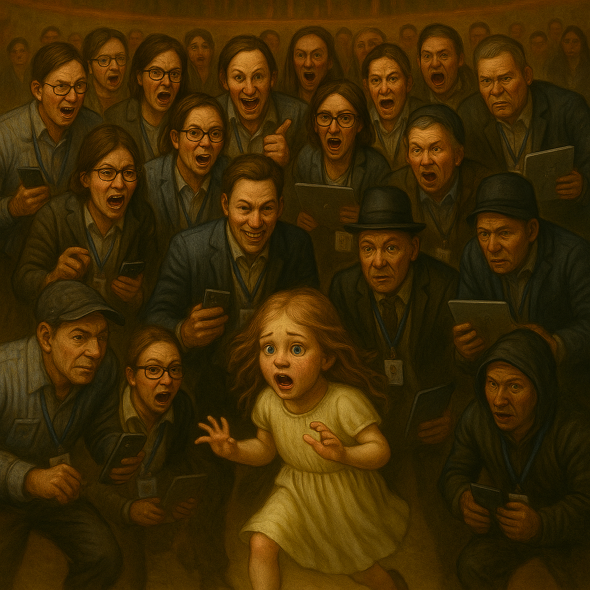

# 2003

## Porn fatwa

- Sometime in or around 2003, a porn fatwa was issued on my head.
- Undoubtedly this has happened to numerous people for various reasons.
- In my case, criminal gangs responsible for distributing pornography in which I had repeatedly "starred" as a sedated child, gang raped by numerous black men, were watching closely as it became clear I was going to suddenly have a lot of extra cash from the Lockerbie air disaster compensation payouts; £250k to be precise.
- This was a figure criminal honey-trap and porn-gangs could not ignore, obviously.
- The fatwa, as it were, I believe to have been a notification on men's underground porn communities requesting any porn addicts responsible for DIY spy-cam and sedated porn, to target me and make contact where they could.
- At the same time, the early films will have been re-released so as I would be recognized and to get them excited.
- I'm guessing substantial payments would have been on offer for any more porn with me in it, the end result being more content to eventually blackmail me with.
- For that reason, every single relationship, and indeed every job I have had since 2003 is potentially part of the wider conspiracy.
- I expect I'm starring sedated or otherwise in countless more spy-cam or sedated porn videos since then.
- It is my belief this *fatwa* became uncontrollable and its spidery-tentacles extended everywhere; my professional life, my personal life, everywhere.
- I believe criminal gangs, global tech professionals, and porn addicts the world over have been watching in horror as I pick up the multiple threads and untangle them one-after-the-other.

- Apart from the relationships already detailed in this statement, it's probably worth mentioning another few.

### Dennis Buchwald 2003

- A Dutch porn addict living in Rotterdam I met in Australia in early 2003 who love bombed me and paid for a flight for me to visit him in Hong Kong for two weeks.
- I believe he made porn of me while I was there.
- Dennis was a computer programmer working for a major tech company at the time.
- The company name was *something like* Centrica, but not that, and I believe they merged and lost the name at some point. I'm trying to remember.
- The reason it's important is because it is likely the team he worked with, that I met for dinner in Hong Kong, knew what he was doing.
- The last time I looked him up, about 10 years ago, his Facebook page was a picture of him and two women posing as ISIS terrorists which I found extremely odd and then promptly thought no more about it.
- He was the first guy who overtly spoke to me in an affected disingenuous manner as if he thought I was an idiot.
- He told me by text in Australia that he had decided he was calling me *Pookie*.

### Adrian 2007

- Adrian was a friend of [Anita Diamond](../early-years/2006.md#guardian-soulmates).
- She and her husband introduced us and set me up with him.
- They were very keen on getting me into a relationship for some reason and had been instrumental in the [Dave Porter affair](../early-years/2006.md#guardian-soulmates).
- I met Adrian in Valencia and we stayed in a hotel one night and had sex.
- I told him I'd remembered being gang raped and for that reason I was not interested in taking it further.
- I don't really know why I had sex with him, but he was a nice enough guy.
- Looking back, I believe I was re-traumatized and my behavior was erratic and self-destructive for that reason.
- I was also extremely easily manipulated by "friends" and I had known Anita since I was 11, a near-perfect conspirator.
- I wonder if that occasion begat another porn video.
- If so, the hotel room would have to have been set up with spy cams.
- Adrian had links to criminal gangs; I think he'd been a doorman at one point. 
- He met Anita at university, I believe she said.

### wip
