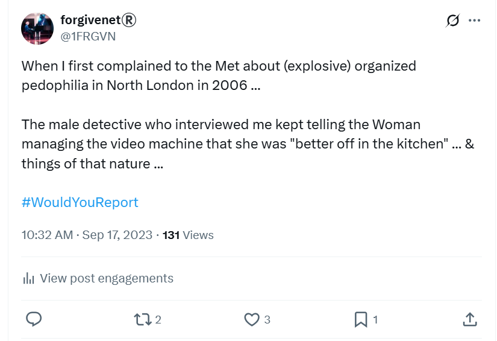
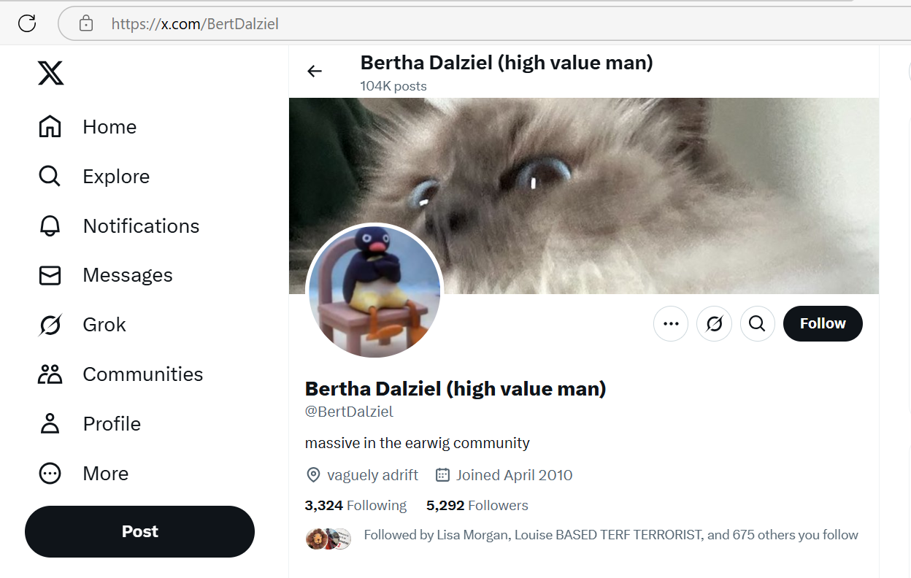

# 2006

!!! tip "Why so much historical information?"
    - Early years information is critical to understanding current events in a number of ways:
        1. The criminal activity I have encountered is perpetrated by honey-trap gangs who, by definition, are in it for long game rewards.
        1. People I encountered in earlier years play significant roles later on.
        1. As I lived through the terror in Dénia, it became clear to me that my experiences had started a long time previously. Initially, I believed, in [2014 when I first joined the conservatory](2014.md#at-the-conservatory). It then became obvious that I had been targeted by criminal gangs in Dénia as early as 2006. Now, I believe, it's highly likely that British criminal gangs with strong connections to Spain have played a malevolent role in my life since 1989, watching and waiting. 
        1. Indeed, [events from 2005](../2022/july.md#crystal-dreaming) suggest that I had been targeted long before I went to the police in 2006.
        1. These facts suggest that the lives of historical victims of pedophile rape and porn gangs, especially where police have failed to act decisively, remain in continual jeopardy.
        1. Given I was unaware of these long-standing conspiracies until very recently, it's essential for the reader to have some insight into my state of mind in order to understand the various groups' motives - including the relentless gang-stalking and choreographed events designed to terrorize me - and my reactions to them.
        1. The criminal gangs expected to be able to do whatever they wanted with me without much bother, as they no doubt have done to thousands of other women and girls. However, it is essential to understand that even though they were under the impression that I was completely alone and friendless, that has never really been the case.
        1. Insight into my state of mind over the last years leaves us in no doubt that the sole intention behind terrorizing me was my death and, therefore, the actions of everyone involved constitute attempted murder.
        1. Furthermore, my descriptions of some of the more sinister psychological traps technologically-advanced criminal gangs can inflict on the unwary via social media may be helpful to parents, guardians, and perhaps even law enforcement agencies trying to understand how criminal networks, including vast networks of what we used to call "perverts", or sex offenders, control and manipulate huge numbers of women, children, and young people. 
        1. Indeed, given my hacked devices are full of advanced criminal honey-trap software and similar, it's surprising and disappointing that the police are wholly uninterested in it.

## January

### Reporting child sexual abuse to the Metropolitan Police

- I go with my mother to the old Highgate courthouse building to report the child sexual abuse I had remembered during a therapy session that took place in December 2005.
- The interview, with one detective from Hornsey Metropolitan Police, was recorded by a woman PC.
- I had remembered one instance of being drugged and gang raped by a Tottenham rape gang that had targeted me in North London when I was 16 in 1989.
- Remembering this single event was extremely traumatizing.
- I also remembered other smaller peripheral details at that time; such as, for example, a man with a black case, which I believed, and said, was a video VHS camera although I didn't remember seeing it.
- I had no other memories concerning filming and only one memory of the gang rape that took place in a house in Plevna Crescent, London N15. In fact, in 2006 I did not give the police the street name; that came later, in my second report to the police in 2016.
- I also did not mention in 2006 how the rape-gang had got hold of at least three other friends of mine. I mentioned this in 2016 and I believe the police spoke to those people. It's not clear if they had anything helpful to say. Sedating and poisoning victims is an extremely effective way to commit crimes against them.
- I did mention in 2016 a high level of racism towards me from the gang; vile things they said to me, insults, comments. 
- They only went for the white girls from my group of friends, although I did report seeing one black victim.
- At the time of the interview, I was studying for my PhD at the technology department of the Universidad Politécnica de Madrid and I lived in Madrid, Spain.
- After remembering this horrible event and going to the police about it, I suffered from a debilitating re-traumatized PTSD and I found it extremely difficult to be among my colleagues and classmates at the university and found some comfort in isolating myself from the world.

!!! info "Why is this important?"
    - I believe the child sexual abuse I experienced at the hands of North London grooming gangs in 1989 is at the foundation of everything I am about to relate.
    - I believe the porn gangs of Dénia found out about what happened to me in 1989, and even have copies of various porn films taken of me being raped as a child, events I still have no recollection of.
    - I believe that teachers and staff at the conservatory were able to justify attacking and persecuting me relentlessly because they were aware of this pedophile porn and blamed me for it happening and were utterly disgusted with me because it happened to me!
    - Furthermore, I believe the original films and the enormous amount of content the people of Dénia have seen from hacking my home network and devices, and watching me continuously, i.e. online mass voyeurism, have been monetized by the porn gangs. 
    - I also believe that the original intention was to frighten me into leaving the conservatory for good in June 2023, never to be seen again, while the porn gangs would continue to stalk me and somehow recreate the same thing I had suffered in 1989 for the enjoyment of rape porn addicts the world over.
    - I didn't let that happen and so everything escalated into a can of unpredictable, roaming international worms which I hope will make Dénia famous.

- Astoundingly, the detective makes constant sexist comments and jokes to the female police officer.

## September 

### Move to Dénia

- I moved to Dénia to live alone and write my PhD thesis, returning to Madrid to see my professor from time to time.
- I lived at Cami Llavador, Dénia 03700 Alicante.

### Guardian Soulmates

- Friends recommended I join Guardian Soulmates. In retrospect it was a terrible idea, I was reeling from sexual trauma.
- Anyway, foolishly I joined and met a boy Dave Porter who manipulated me by love bombing me on one occasion which he never repeated. I invited him out to Dénia.

!!! tip "Dave Porter's gang"
    - Highly likely to be connected to Dave's North London associates, if it's not him himself, the following account:

    

- He visited and we had sex and it was all very weird and something wasn't right.
- Just before he left Spain, he told me about how he had been chatting up a 15-year old the previous weekend at a mate's party.
- Prior to him visiting, I was very *very* unsure about what was going on, and I asked a psychic for advice.
- There were these spiritualist meetings going on in Dénia that I attended, just out of curiosity really. They were run and attended by Brits.
- A woman called Sandra Smith organized the meetings. She sat on the stage with some others doing readings for people.
- I never interacted.
- I only went to one or two of these meetings, I believe, and at one of them, a "famous" physic had been there; a large muscular gay man who lived in Benidorm with a coiffed handlebar moustache.
- After the meeting, I privately asked him a question about this Dave Porter from Guardian Soulmates who I was worried about.
- The psychic said something to me at that time which was very strange, and gave me pause. He said, "it's good someone like you is doing this" (as in joining online dating). 
- What did he mean, someone like you? I could not shake off the obvious child sexual abuse reference that he was implying.
- Did this man know who I was and what had happened to me already? Did Sandra Smith know who I was already? Did they know I was able to support myself financially? Was this the first instance of me being targeted by honey-trap gangs?

!!! important "I was a potential honey trap target from 2003"
    - In 2003, I had received a large amount of money as compensation from an aunt who had been murdered in a terrorist attack.
    - I used this money to support myself through university to gain a masters and a PhD.
    - I also used this money to pay for the trauma healing I needed related to historical child sex offenses.
    - There was a repeat payment a year or so later, and a smaller payment after that.
    - There was no way anyone in Dénia could have suspected I had this money until 2009 when a friend may have seen a church service program I kept in my living room dresser. But to have extrapolated from seeing that to knowing about compensation payouts would have been a fair stretch.
    - Nevertheless, honey-trappers knew about this money (which I spent a long time ago, and wisely in my view).
    - During vicious cyber-stalking activity, the hackers mentioned this money and where it came from on a few occasions.
    - How did the criminal honey-trap gangs of Dénia know I had money?
    - Do they hack every visitor who comes into the area to live to check how much money people have?

- Consequently, I met this man David Porter, and, unbelievably and utterly horrifyingly for me, I believe he filmed us having sex with the help of his flatmates who seemed to have a studio set up for that purpose in the next bedroom in their shared house in Stoke Newington, London. 
- His flat mate was grinning and laughing that laugh as we went into Dave's bedroom, sat in front of two or three monitors. He may have even been rubbing his hands.
- Dave Porter ghosted me immediately afterwards.
- Curiously, although he broke off all communication with me, there was some social media activity for a while afterwards which now, thinking back, was extremely similar to the kind of online stalking I endured in parallel to the in-person gang stalking in Dénia. It was the same intriguing content, trigger words and images, suggestive posts, and weird accounts reaching out to chat. I now wonder if even my 56k modem (my landline) was hacked at that time. It seems likely.
- I informed the Metropolitan Police about Dave Porter and his flatmates anonymously a few months later. It had been less than a year since I had remembered sexual assaults from 1989 where I was drugged and sedated, and I had reported these hideous crimes to the police who did nothing about them, even though all the men I named were known criminals and very likely police informants too. 
- It was too traumatizing to deal with the police directly again at that time. I believe criminal gangs are very aware of this sex offense victim trait.
- I have to ask myself, does information from child victims of rape gangs get shared around with criminal gangs after the police speak to suspects, who they know very well are most likely guilty? 
- Is it possible that certain factions of police (perhaps the porn addict community of police officers) gather information about sex abuse victims? This is certainly [what was happening in Rochdale](https://www.bbc.co.uk/news/uk-england-manchester-68300484) and elsewhere. Why not North London too?

## October

- I pop home to see my family.
- While I'm there, one of my friends recommends a healer in Enfield. I can't remember the details but I book an appointment.
- It is table healing, hands gently applied, but I can't remember much more about it.
- Except for one thing.
- After the healing, the healer told me she'd seen something during the session.
- I asked her what.
- She said she saw a brutish Neanderthal-type man following me everywhere I went.
- I thought this was a strange thing to see and promptly didn't think about it again.

