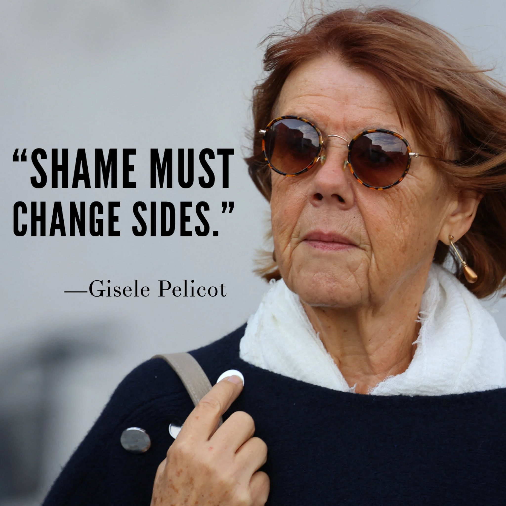

# 2007

## November

### Hazel Smith

- I meet two women in Dénia via the U3A, Sandra and Hazel Smith - mother and daughter (apparently).
- I already knew Sandra from the [spiritualist meetings](2006.md#guardian-soulmates). Sandra was very keen that I meet her daughter.
- They remind me of two women, a mother and daughter I had seen in a Channel 4 documentary, aired in the 90s, when I was living in London.
- The documentary told the story of a mother and daughter who "befriended" old, wealthy people with dementia, or who were close to death. The women somehow managed to get them to change their wills - with the help of random strangers such as bookshop assistants for example - and then took all their money when they died.
- Adult children of the victims were telling their stories on the documentary and it was appalling and sickening to learn that this sort of thing was actually happening in the world. I was horrified, in fact.
- One of the victims had lived in a North London townhouse, a bit like these.

- There was a strong suggestion that the targets had been drugged, possibly poisoned, and there was even a suggestion of sexual activity with regards to the male and female victims and the younger woman Hazel. 
- The women secured witnesses for the new wills from sales staff at a local bookstore.
- The documentary went on to say that they had actually been charged, and the case went to crown court. However, they were found not guilty.
- These two women in Dénia were *EXACTLY* like the two on the documentary, even down to the mother's headscarf.
- I went to dinner with them one evening, and I was not surprised to hear constant references to them borrowing money, to suggestions they couldn't pay their bills, to them waiting for me to suggest I would help them out.
- I was silent and I did not mention my suspicions.
- Sandra, the mother, was involved in a "situation" with someone in the community she had borrowed money from and it was all a bit of a drama.
- Hazel was talking about how she was sleeping with a married man, a local Spaniard. She told me his name was Paco Sendra.
- I must have shown concern because she told me that it was OK, she had him in his box, and that she puts people in boxes. I had no idea what she meant by this but I assumed she was referring to some psychological technique she used to deal with difficult situations.
- Nevertheless, their behavior and everything they said made me more and more sure that they were who I thought they were.
- Hazel invited me to go out for drinks after the dinner. She had drunk an awful lot, well over a bottle of wine, but nevertheless drove safely to a club at the start of Las Marinas beach in Dénia.
- We drank a fair bit of alcohol. She found two men and we went back to her house with them.
- Hazel Smith, at that time, lived in the Rosaleda II urbanization in the Las Marinas area of Dénia. Currently, a German friend of mine Alex, and her British partner John also live there, people also implicated in the recent gang stalking.
- Hazel disappeared into the bedroom with one of the young men, who may have been Raul Perez, a future English student of mine. Looking back, this man appeared nervous and never spoke, and I wonder now if he was on something.
- Myself and the other fellow left and walked home to our respective houses. The slobberiness of his kiss goodnight when we got to my gate suggested he had been assured of more happening.
- Hazel invited me for an Indian meal a few days later and I accepted.
- She told me things over dinner that suggested she used sex with men to get what she wanted. She mentioned getting off a speeding ticket like this. 
- She told me she had nearly been married once but backed out at the last minute, but not before she'd got a car out of him.
- She asked me did I like the boy she left me with the night we went out, and the suggestion was in a sexual way. I asked her if was she out of her mind. She was shocked.
- I then told her that I had recently remembered serious child sexual abuse and I had reported it to the police and that, at that time, my life was all about healing.
- Her demeanor changed at that moment and she became weirdly angry and aggressive towards me.
- I figured I had hit a nerve with regards to something similar that may have happened to her as a child.

!!! danger "Another interpretation of Hazel's words and anger"
    - Was Hazel's anger actually due to the fact I was clearly unashamed of what had happened to me, and was happy to share the information?
    - Had she planned on exploiting or blackmailing me with the porn videos she had of me at that time?
    - Were all her lack-of-morality examples gaging how easy it would be to get me into situations with men in which I would be vulnerable?

- We paid, and when the waiter brought the change, she threw it at me in a very unpleasant way, as if she was disgusted!
- She then asked me back to hers for a drink and a smoke. 
- I agreed. I did not smoke pot, but I had a few puffs. She explained she was a pot addict.
- She gave me a drink and soon after I started to feel extremely woozy and heavy.
- We were listening to Comfortably Numb by Pink Floyd and I remember singing along a little.
- At some point she declared loudly I was to get up from my chair, she was taking me home.
- I dragged myself up, and staggered speechless into her car, with her help, and she drove me to my apartment building. She leaned over me to open the door from inside the car and told me to "get out" loudly. She may have pushed me. She may have had to push me.
- I managed to get out of the car and into my flat and into the bathroom.
- I probably vomited.
- I then lay on the cold tile floor, completely still, unable to move or speak, for about 6 hours. 
- It was winter and I believe the vomiting and the cold tiles kept me alive.
- I knew that I had been sedated with an extremely strong drug or anaesthetic.
- It was horrifying and overwhelming. I was unable to go to the police about it.
- I made excuses in an email, pretending I was concerned about how much I was drinking, and I never saw her again. 
- Well, I did see her one other time, in passing. She was standing up and reading a magazine at the Carrio bar in the Calle Diana one morning when I was walking past. This is the sort of thing I know now that stalkers might do to "present" themselves to their target for some sick and convoluted reason.
- In any case, as I came round from whatever she had given me that November morning, I was 100% sure that Hazel and Sandra Smith were the two I had seen in the documentary, and that they were still active.
- I wondered if having that sort of power over people was addictive.
- It horrified me that Hazel was working as an accountant and financial adviser for British pensioners, and over subsequent years I saw her advertising talks and seminars for the British expat community, via the U3A and similar, on things like how to manage taxes. 
- A few times I saw her on social media she had been listed under a company name, Smith and Sendra.
- When we had been out drinking, Hazel had talked about her time on P&O cruise ships as the ship's accountant and mentioned how it was a "long way down" if you had fallen from deck on those boats. The implication made me shudder.

!!! info "Why am I telling you all this?"
    - There is so much "normalized" sedating and poisoning in Dénia, it seems there must be a connection.
    - In September 2023, when I stubbornly returned to Dénia to continue my piano studies after having been severely terrorized by teachers and staff at the conservatory, the gang stalking got exponentially worse. Specifically, the online stalking on social networks was suddenly delivered in native vernacular English.
    - It was intense and overwhelming; a mix of sexual grooming, hypnosis, NLP suggestion techniques, and threats of violence and murder.
    - Furthermore, the illicit drugging and poisoning that was going on without my knowledge also intensified and exaggerated the emotions triggered by the online content I was seeing; fear, sexual arousal, euphoria, anxiety, on a loop. I can see this now in retrospect.
    - I believe Hazel Smith was involved. Fake accounts that interacted with me knew things only she could know.
    - Certainly the stalkers/hackers mentioned her many times in our bizarre exchanges, and they even created a fake X account with an AI generated profile photo which looks to be a mix of mine and Hazel Smith's face. Note the name: "Connie".
      
    

!!! danger "In retrospect"
    - Writing this statement has brought a lot of old memories to the surface.
    - I wonder if, while at dinner with Sandra and Hazel in 2007, they managed to turn the conversation around to me playing the piano, and I can hear Hazel saying at that moment, "Oh, Domingo plays the piano doesn't he?" to Sandra, who then told her to shush.
    - I then asked who's Domingo and they said oh just someone we know.
    - If this memory is true, then it is likely I was targeted long before I mentioned the sexual abuse to Hazel and they already had their conspiracy planned out.
    - The criminals of Dénia, Domingo the piano teacher, his family and friends, the trumpet teacher, and the online hackers, always have a habit of informing you about what they're doing long before you could possibly know about it. I believe they get a sick little kick out of that.
    - Had the Metropolitan police found child rape-gang porn footage of me and if so, why would they not make arrests?
    - How did the criminal gangs of Dénia know about the porn and get access to it, and from whom?
    - Did those criminal gangs conspire to reenact the rape-gang's crimes while live-streaming me on porn networks from my apartment?

## Rewards offered

- I have no doubt that footage will come to light now as it must have gone around to many, many people over the last 35 years.
- I'm currently offering a substantial reward for any files of pedophile rape-gang porn where the offenders will be predominantly black males.
- I'm also offering rewards for any Dénia, sedated or otherwise, spy-cam porn from my flat or my hacked devices.
- I'm emotionally and psychologically prepared to see all of it; thanks, ironically, to spending 3 years in the psycho-sexual-emotional warfare trenches of Dénia. 
- I believe that women who stand up to sexual abusers with the boldness and courage that comes from full knowledge that they are innocent, like Gisele Pelicot did in 2024, can heal the world.

## Javea Computer Club

- Around this time I join the [Javea Computer Club](https://javeacomputerclub.com/). I am introduced to Christine, the chair at the time, by a member of the U3A.
- Christine and I become friends and she is very supportive of my PhD efforts.
- The club is extremely busy in the years I visit, 2007-9, and 2012-13.
- It is now not so busy.
- At some point in 2008, I believe, Christine insisted I borrow one of their computers. I had no need for it at all but she pushed it on me. I wonder why now. I borrowed it for a while and returned it. I often walked around naked in my flat in front of it. I wonder if there was a camera inside. I was only on a 56k modem at that time so I can't imagine they would be live streaming. 
- I wonder if the JCC is another central point where incoming expats to the region are assessed for targeting, i.e. how much money they have, if they are sensitive or vulnerable, etc. 
- The reason I wonder about this is because my "friend" Christine pretended she knew nothing about what was going on in 2022-24 but, in fact, everyone knew. She threw me to the wolves.
- I think I might vomit if I ever see her again.
