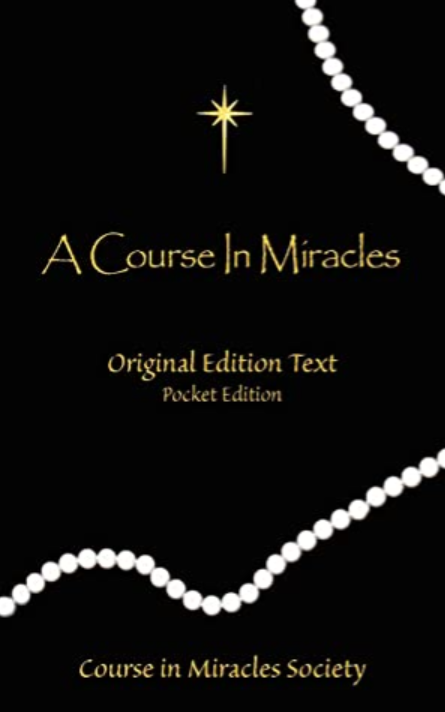
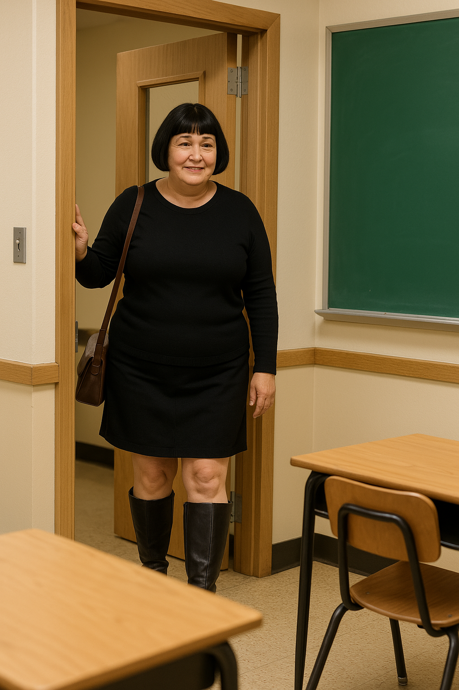

# 2008

[{width=36%}](https://en.wikipedia.org/wiki/A_Course_in_Miracles)

## A Course In Miracles

- I never saw Hazel Smith again apart from that one time, fleetingly, and [outside the conservatory in 2023](../2023/october.md#hazel-outside-the-conservatory) but I did see her mother Sandra a couple of times.
- On one occasion she picked me up from outside my house and we drove over to Javea to attend a kind of "spiritual" event where there were two speakers, a psychic from Bulgaria, and Trudy, a Dutch yoga teacher who was giving a talk about A Course In Miracles.
- The psychic was extremely giggly and silly, and I was not impressed by her. She found me equally unappealing due to my suspicious attitude towards her and was a little violent towards me.
- The talk that Trudy gave about A Course In Miracles blew my mind.
- As she began to describe what the book was about, the room erupted.
- Holy war kicked off fiery arguments and debates about God and religion. People were getting offended left right and centre. I couldn't believe it. It was utterly unexpected and a little insane.
- But whenever I looked at Trudy, she was calm and collected. And everything she said was exactly the right thing. 
- She never reacted. She always responded calmly, and she never exacerbated the chaotic conflicts around her. Rather, her words had a curious power that extinguished the flames of anger.
- Whatever she had, I wanted it.
- I ordered the book immediately, and from the moment it arrived it has been the only book I'm able to read.
- I used to be a voracious reader but now reading feels like looking inside people's heads, and it's rarely a pleasant view.
- I study A Course In Miracles every day.
- A Course In Miracles, to me, feels like the key to the door out of hell. Like Jesus Christ himself came down and showed me where to find that door, and handed me the key to it at the same time.
- The irony is, of course, that Sandra Smith took me to that meeting.

## LinguaLink

- I start working part-time for [LinguaLink (now LinguaLogic)](https://lingualogic.es/).
- LinguaLink is owned and run by Lorraine Blackbourn and her partners, an British ex-pat couple.
- I teach a class on a Friday evening.
- An older woman, Theresa, teaches and finishes at the same time.
- She invites me for a tea after work one evening.
- She has an adult daughter Zoe BJ who is around my age, a little older perhaps.
- The whole meeting is about her persuading me to meet Zoe.
- The woman seems nearly desperate I meet her daughter Zoe.
- It's weird and reminds me of Sandra Smith's insistence that I meet her daughter Hazel.
- I'm reluctant mainly because of [the Hazel poisoning incident from the year before](2007.md#hazel-smith).
- Zoe's mum mentions how Zoe and Hazel had gone walking in the mountains.
- I become even more reluctant.
- I say I'm too busy, or whatever.
- Zoe's mum is relentless.
- She looks at her phone a lot during the conversation, over tea.
- Worn down a bit, I agree to meet Zoe.

## Zoe BJ

- It must be February or March when I meet Zoe for the first time.
- We go for coffee.
- She spends a great deal of energy lauding the benefits of prostitution.
- I'm pretty horrified.
- It's the usual, "oh high-class hookers have a great life", type thing.
- I wonder if she is justifying something she does herself or if she is truly that ignorant.
- Or is she grooming me?
- I remember her telling me repeatedly how men are "visually" sexual, not like women, "aren't they Katie?" 
- It was such an overly repeated statement I added it to a book I was writing at the time as an example of incorrect thinking.
- She has a young teenage daughter she is trying to get into "modelling".
- I find this very troubling at the time, more so now.
- I wonder if Asia is safe and well.
- Hazel Smith is all over this conversation but never mentioned.
- I wonder why Zoe doesn't mention Hazel as her mother had done. 
- Anyway, Zoe and I remain friends.
- I rather liked her company, except for the things she would say sometime which were excruciating.
- When I moved back to Dénia in 2012, after meeting her again at [Barbara Loftus' wedding](2012.md#barbaras-wedding), I rekindled our friendship.
- We hung out a bit; we were both writing books at that time and had a shared interest.
- Nevertheless, she would say ridiculous things at times, often, and it made my head hurt.
- One afternoon in 2012, on one of our lunches while we were both writing books, I remember she brought up the Islamic rape gangs out of the blue.
- Was she researching my reaction?

### Meeting Luke

- My brother visited me in Dénia one summer and we went out and got drunk.
- Someone stole his passport in a club on the Las Marinas road and we had to go to the British consulate in Alicante the following Monday to sort it out.
- Luke, Zoe's brother, was in the club that evening, and we all went back to mine together.
- I had never met Luke before but he explained that he was Zoe's brother.
- Luke stayed a short while at my apartment in Cami Llavador with us, chatting.
- During this miniscule time we met him, he specifically mentioned an Islamic gang on the Arenal raping a young white girl.

### Having a nap at her family's mansion

- I visited her family's house a few times. 
- It was a big villa with swimming pool in the country.
- Her dad had been a roadie for Cat Stevens; at least that was the story behind the money.
- I enjoyed her company, even though she said ridiculous things, and I loved their little dog Lola(!).
- One afternoon, I was invited for lunch and afterwards, Zoe put mattresses down in the little guestroom and insisted we had a nap.
- I thought it was a bit contrived but entertained her.
- I have to wonder about this now given the wider story.

### Dreaming we were a lesbian couple

- I meet Zoe and she tells me her dad has had a dream about how she and I are a lesbian couple and I pay for everything.
- I'm pretty disgusted at the thought of it, but more so that she would tell me such a thing.
- My mother also found this rather sickening when I told her.

### Meeting her dad

- One Sunday I was invited round and Zoe kept saying, *my dad wants to meet you*.
- I didn't know why, I didn't notice she was making a *thing* of it, as if it was important.
- We kept hearing him roaring at something in the background.
- I took it he was a bit volatile and certainly that's how Zoe describes him.
- Anyway, it came to evening time and it was time to meet the dad.
- And I sat down on the sofa next to him, said hi, shook his hand probably, and I don't remember another thing about it.
- Could this have been a preliminary test of some sort?
- This was in 2013 when I was living at Passeig Periodista Ricardo Ortega.

### Lauding male violence

- The death knell in our relationship came one afternoon not long after that when we went to the beach for a picnic with her younger daughter.
- Zoe spent the whole time talking about her ex-boyfriends; the violent men she had been in relationships with.
- The whole time.
- Every relationship she recounted was a tale of bitterness, sadness, and violation.
- Her daughter listened eagerly.
- I was horrified.
- It was when she started to retell the relationship she'd had with someone where they'd both been self-harming, I had enough.
- I had to try to reset the tone somehow, and bring back some love.
- I told a story about an ex-boyfriend who had really loved me.
- Zoe's daughter's face went from frowning to smiley.
- I explained that this man had loved me so much, he even loved my farts.
- Zoe starts to get uncomfortable.
- I explain that whenever I farted, on those rare occasions, he would grab me and put his nose right...
- Zoe stands up, and starts shouting; "Stop stop!"
- "That's enough!", she says, implying that she doesn't want her daughter to hear any more of this story.
- I'm flabbergasted.
- How can a loving and intimate, yes a little crazy, story like mine upset Zoe so much, especially when she'd just spent the last couple of hours relating every violent exchange between her and her ex-boyfriends.
- I was trying to present an alternative view to her 11-year-old daughter.
- The interaction made my head hurt so much, I couldn't see Zoe again.
- I couldn't explain her behavior sufficiently to myself so that it made any sense either.
- However, in 2025, in the light of everything we know now, I wonder if she might have been recording our conversation, and for some reason, what I was saying didn't fit into the context of acceptable male violence.
- Were they still trying to groom me into some weird relationship where I would be frightened all the time and hand over my money?
- Or maybe the whole intention of the meeting was to be so weird our friendship would end.
- Is that what happens when the porn-gangs are given the green light from above to start entering a woman's property and set up spy-cam and sedating tech; all the *introduction agents and shepherdesses* drop away and disappear?

### Horse riding with Zoe's friends

- A few weeks after that I went horse riding with Caroline England at a riding school up in the valley.
- Caroline, you may remember, was the [woman I saw crying in the Indian restaurant](../2021/july.md#lorraine-blackbourn-commits-suicide) the day, or day after Lorraine's funeral.
- I find myself utterly allergic to horses that day, but they seem to like me.
- What I found very strange was how Caroline and the other woman there (the ranch owner or manager, a British woman) kept saying the following:
- "Oh Zoe is so lovely looking, don't you think?"
- "Yes, she is isn't she, so attractive."
- And they were sort of waiting for me to say something.
- It felt like someone had been telling lies about me and Zoe, or perhaps Zoe had.
- The truth was, the ugliness rotting the Marina Alta was steadily emerging.

## Dénia TV

- Sometimes, late, I would flick through the TV channels to see what was going on.
- Usually I'd flick past Dénia TV because the signal was so poor you couldn't see or hear anything - my apartment was not more than a kilometer out of town.
- If it wasn't some weird porn on a loop, it'd be locals talking in a TV studio that looked like someone's garden shed.
- The porn on a loop was remarkable.
- A long blond haired naked woman stood completely still and upright while two naked grinning men ran round her and entered her one after the other.
- The original video lasted about two minutes, less even, and it was replayed over-and-over, week-after-week.
- I never considered the possibility the woman was sedated, but looking back she did indeed seem to be.
- Curiously, I saw one of the men working in the VW garage; the very short stocky one with ginger hair.

## Working for Lorraine Blackbourn

- I worked for Lorraine Blackbourn a lot when I lived in Dénia.

- Over the years 2007 to 2009, I worked for her at the [Lingualink academy (now Lingualogic)](https://lingualogic.es/en/) which she ran with a British expat couple.
- Later, in 2012-15, I worked for her as part of her own English academy, [the English Studio](https://www.englishstudiodenia.com/), which is still running today and is managed by her trans-identified daughter.
- During the years 2013-14, I also worked for the Spanish academy she worked for, [Grupo Glorieta](https://grupoglorieta.com/), and taught some intensive English classes paid for by the European Union due to the unemployment situation in Spain at that time. My Spanish tax records reflect some of this work.
- Curiously, one of the trumpet teachers may have attended one of these classes, under the name Marc, and I found him very attractive but I noticed his wedding ring immediately.

!!! tip "A conversation with Lorraine in late 2013"
    - Lorraine was interested in which of the men in the class I liked, and I told her. 
    - His name was Mark.
    - She was surprised it hadn't been someone else, the cowboy-type sitting in front of me.
    - I said no, I didn't find the cowboy attractive at all. But the guy sitting at the end of that row, next to the muscle man, yes, I found him very attractive.
    - She looked up thoughtfully and said, "Um, but he's ..." and trailed off. 
    - I asked her, "What is he?". 
    - She said "never mind", and that was that.
    - Mark looked like her husband; they could have been related.
    - Both trumpet teachers looked like Lorraine's husband, who was shortly to become ex-husband.
    - Was that what she was going to say? 

- Aside from that, I worked cash-in-hand for Lorraine whenever she needed me.
- At some point during this time we had an interesting conversation.
- I believe it was when I was working at Lingualink, so it could have been between November 2008 to March 2009. It had to be in the colder months because we had our coats.
- It was the end of the evening. I was teaching three men from the area, one of whom I [mentioned before](2007.md#hazel-smith), who may have been at HS's apartment the night I was there, and may have been sedated.
- Lorraine started to talk about a woman she knew. She started with, "we know this woman" and I thought that to mean she and her friends had been discussing the woman.
- She explained that the woman had a new boyfriend who was a lot younger than her. She kept saying that none of it made any sense.
- Lorraine looked thoughtful.
- I started to think about Hazel.
- Lorraine went on to say the boyfriend was a footballer, for Dénia (maybe), and was extremely well known.
- I asked Lorraine if the woman was British.
- Lorraine said yes, and then she added that it just didn't make any sense that they would be together.
- I felt it must be Hazel Smith but Lorraine did not mention any names.
- I wonder now if this was another example of the sedating and sex-ploitation epidemic in Dénia?
- Was Lorraine getting suspicious even back then?
- Was that why I often heard people talk badly about Lorraine, slandering talk, talk which annoyed me immensely?
- Was Lorraine targeted online in the same way as I was, with the intention of destroying her because she knew what was going on and who was behind it?
- Had Lorraine whistle-blown as some of the [stalker accounts](../2024/march/13-end.md#lorraine-tortured-whistleblower) appeared to suggest?

!!! tip "Suspicions"
    - The particular account I just linked to (which I now believe was run by the Smiths) was [tag-team gang-stalking me while I was being terrorized continuously on the run up to the piano concert in March 2024](../2024/march/13-end.md#online-stalking-and-threats-over-this-period) and beyond.
    - Bizarrely, or perhaps just more proof of the wider involvement of criminal gangs into this sorry business, was owned by a woman who ended up standing for the [Party Of women in the UK election in July 2024](https://electionresults.parliament.uk/general-elections/6/political-parties/264/elections) alongside myself.
    - Seonaid appears to be familiar with the [Granny Smith account](../2025/january.md#seonaid-dawn-and-granny-smith) which I suspect was controlled by Sandra Smith.

!!! quote "You can't make this stuff up"

    
<iframe src="https://www.facebook.com/plugins/video.php?height=314&href=https%3A%2F%2Fwww.facebook.com%2Fjack.chardwood.3%2Fvideos%2F1686361321869766%2F&show_text=false&width=560&t=0" width="560" height="314" style="border:none;overflow:hidden" scrolling="no" frameborder="0" allowfullscreen="true" allow="autoplay; clipboard-write; encrypted-media; picture-in-picture; web-share" allowFullScreen="true"></iframe>

    - Indeed, who the hell are these people?
    - https://x.com/1FRGVN/status/1707479849630089437: a tweet response to stalkers from September 2023.

## Enric

- Enric runs events for new arrivals to the area such as language interchange services, quiz nights, and other things to encourage community involvement with new and older arrivals.
- He works for the Dénia town hall in the capacity of [international relations officer](https://www.denia.es/es/denia/directori/directori.aspx?id=297).
- Through Enric around this time I meet good British friends, Alf & Petra, who I haven't managed to get in touch with yet but we're working on it.
