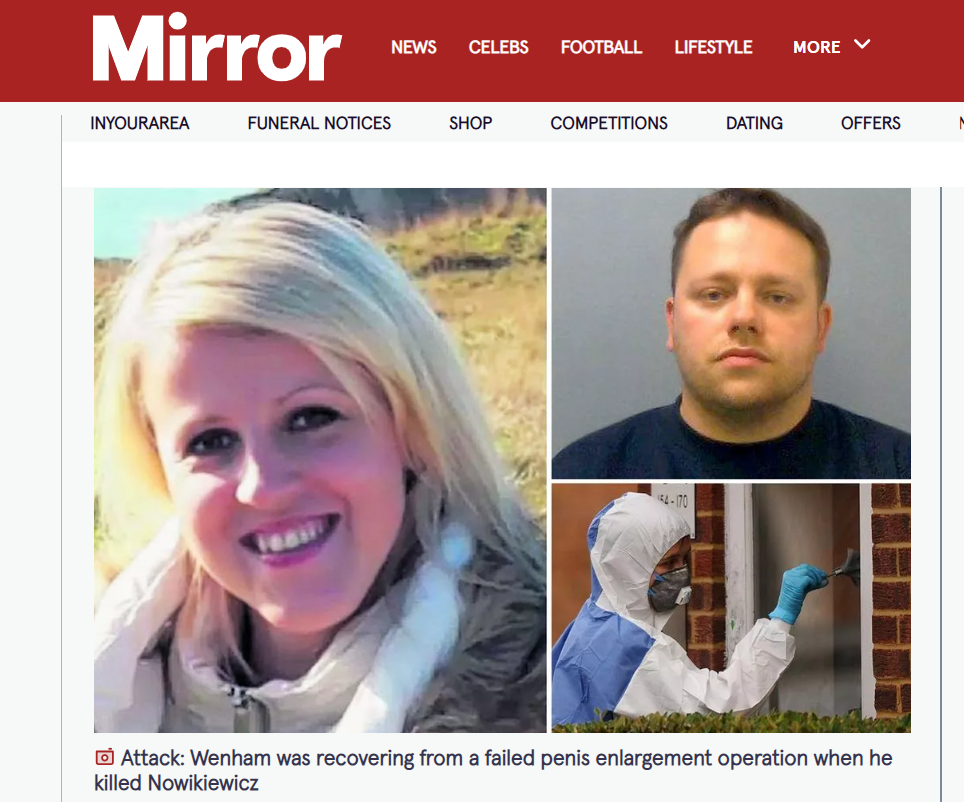

# 2010

## Mike Wenham

- I'm back in the UK and I get my first job in programming as a junior Java developer for a e-commerce company owned by British Telecom.
- I love the job.
- I'm one of two women in a department of many men.
- The other woman is being bullied, relentlessly. It's ugly.
- I don't know how to help her. It's my first job as a programmer and I want to do well.
- About four months after I start, she walks out.
- The team sing, 'Ding dong the witch is dead'.
- Another man, Peter, walks out in disgust at the same time.
- The bullying reverts to me immediately.
- Porn on my screen. Rape jokes.
- It's relentless and overwhelming.
- I realize I will never advance in a brutal and hostile environment like this, and leave.
- My boss, Mike Wenham, is furious and tries to get me to stay.

!!! info "Two weeks before I hand in my notice"
    - I hand in my notice on the run up to the New Year.
    - Mike was moonlighting as a builder and had an account on one of the builder platforms.
    - Two weeks before I left, Mike had been doing building work in a maisonette in Lesley Road very near to my street in East Finchley, literally the next road.
    - He had asked me to come and see him there one Saturday morning. It must have been December 4th or 11th of 2010.
    - I wasn't sure why he was asking me to pop over, I just thought friendliness.
    - Anyway, I went along and he let me in, or the door was open and he was at the top of the stairs. 
    - He was carrying a stanley knife.
    - All the floors were protected by plastic sheeting.
    - It was the upstairs maisonette and I only came up half way before deciding I didn't want to go up to see him and left.

### Two years later

- Mike's wife emails everyone asking for support because her husband has just murdered a woman. I'm in Lourdes at the time.
- Mike had contacted me a couple of weeks before the murder, out of the blue, and asked me if I wanted to go to an ayahuasca ceremony with him.
- It seems like he might have been hoping to murder me.

### Three years later

- Details about Mike's extremely sordid case is [published in the tabloids](https://www.mirror.co.uk/news/uk-news/michael-wenham-dad-who-decapitated-5071160).
- Mike, it turned out, appeared to have become homicidal towards women after a botched penis enlargement operation.
- It seems he must have been suffering an exaggerated porn addiction at the time and probably when I worked for him too.

## Cyber-stalking in Dénia

- When the gang stalking peaked, in [March 2024](../2024/march.md), online and at the conservatory and in the streets of Dénia, wherever I went in fact (they had been tracking my movements online for years it turned out), the stalkers and criminal gangs used the above history to try to intimidate and frighten me even more. 
- They knew everything about me, where I was, what I was doing, and they shared my life with the people of Dénia.
- So, now, I'm returning the kindness for God's purposes. 

