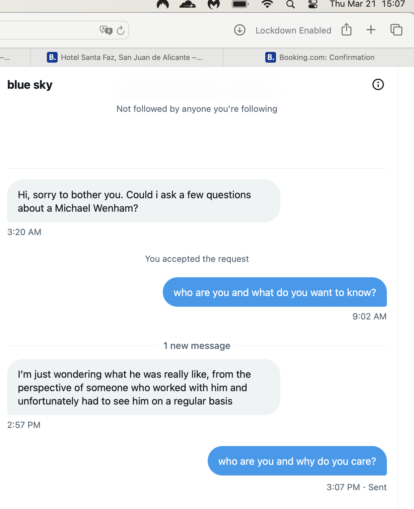

# 2010

## Why I decided to be celibate for the rest of my life

- Even with a PhD in Computer Science, I find it impossible to get a junior position as a female programmer.
- I travel to India in April to get professional Java qualifications.
- In May, I plan on doing some intensive yoga activities.
- I search for a yoga course online.
- The only course that comes up, again and again as the first option in Google search, is [a course in Rishikesh run by a Jitendra Das, PhD in Yoga](https://www.patanjaliyogafoundation.com/).
- There are hundreds of yoga courses and ashrams in Rishikesh, but only he came up on search.
- I found it weird and *significant* that only his course came up in Google search.
- I never considered online manipulation; ever. Not once.
- I thought it, perhaps, a spiritual matter (which inevitably in some ways it was, but not the way I thought at the time).
- The course was taking place during, or just after, an extremely important Hindu festival, the Kumbh Mela in Haridwar.
- I signed up.
- Jitendra requested students send photos of themselves, which I found weird. I can't remember if I sent one. Maybe.
- Anyway, I quickly found out that Jitendra Das was a pervert.
- Actually, in truth he was a lost soul who had been doing intensive spiritual practices while young for long periods and had made huge progress in yoga.
- However, something made him lose his way, and he had clearly become a rampant sex addict with no control of himself at all.
- Anyway, he targeted me as a *lover*.
- Now, I was not interested but, at that time, I had no boundaries.
- It was not that long after having remembered gang rape and I was still injured emotionally, mentally, and spiritually from the retraumatizing.
- It's possible I had been sedated and raped in Spain also between 2006-2009... keeping the effects of trauma going...
- Although I gave a bit of a fight, a man like Jitendra, who had no respect at all for women, just pushed his way in and I seemingly lost any ability to say no.
- We had a lot of sex.
- And all of it was unpleasant.
- Jitendra was rough and unloving, verging on violent, and he obviously despised women.
- I complained to him.
- I told him I didn't want to have sex olympics every darned night.
- He didn't care about what I wanted.
- I told him he was like a farm animal. 
- He was offended.
- Even so, I found it impossible to say no, and stay in my hotel on my own.
- It was like I was enchanted, bewitched.
- One night, while we slept, I saw a demon-like being lying curled up in his second chakra.
- Like all demons, and all evil, it is weak and pathetic. Sad. Colorless.
- It looks ancient; like it has been here for millennia, all shriveled up and desperate to cling to life somehow, anyhow, but always in some self-imprisoning way.
- I realized that his addiction, however naively it may have begun, had drawn a spiritual parasite into his energetic field and he was mostly feeding that.
- Is this true of all sex addicts, I wondered?
- I saw that he really couldn't help himself and would probably need an exorcism of some sort to have any hope at all of ever being his true self.
- TT might do it. TT brings sufficient resilience so that the client has the strength to step away.
- Yet, he wasn't even aware that he had a problem and a client must want healing.
- Anyway, it was a very unpleasant month with Jitendra and it unbalanced me mentally and emotionally and it took a long time to get over it.
- I thought I was in love with him.
- I see now that that was a defensive accommodation; the only way I could keep myself safe in such a horrible situation.
- An optimal way to deal with such things maybe; ultra-fawn of course.
- Thank the Lord he didn't love me back; we were totally incompatible in every possible way.
- He was doing very powerful sorcery on me somehow; or maybe he just sought out vulnerable women who had been sexually abused, and he spotted me immediately.
- Or was he told about me, that I was coming, that he should target me, and maybe even film me?
- Jitendra always had a little pen in his top pocket.
- He never used it but he fiddled with a lot.
- He was always looking for a pen too.
- I guess his room was wired up with live-streaming spy-cam tech.
- When I realized I was not in love with him, about a year later and after some intense meditative practices, I liberated my mind.
- Anyway, that was that ...except...
- Five years later, in 2015, when I was living in Dénia, and attending the conservatory, and living in Joan Fuster where I was regularly sedated and raped, including when my father visited me, and thus becoming more and more severely depressed and anxious, I noticed Jitendra was running courses in Valencia together with a local female yoga teacher:

- Jitendra usually worked with a Ukrainian team who organized trips out to India from Kiev.
- He had visited Kiev too at some point.
- He told me about a dog in a Kiev street going crazy at him.
- He showed me some professional photos he had done there. 
- There were hundreds of miniature shots of him in various yoga poses wearing tiny red pants; his substantial tackle most obvious.
- I'm guessing these were pre-porn photos, perhaps casting pics.
- Jitendra told me, again and again, how he was going to set up an orphanage at his new yoga centre that was being built at the time. 
- I shuddered.
- He got very excited when he told me he was having toilet stalls put in at the centre, with gaps in the floor and ceiling; he was very specific that these gaps were a marvelous thing.
- The man was an out-and-out pervert and I don't believe he had any limits at all.
- I saw more lately on his website that he is offering pregnancy yoga, which is more than concerning.
- My guess is British criminal gangs hacking me in 2010 lured me onto Jitendra's course and Hazel/Fiona will have the details.
- Perhaps a business partner is the Ukrainian woman and the multiple young women she brought out for him over the years, and her connections.
- Of course, it is no surprise I saw him "popping up" in the Valencian region.
- One of the most curious things about my experience doing yoga in India that time was that a very weird girl, Miss VD Stain (phonetic spelling - Stein), was also a student in the class - I kid you not.
- She was a curiously ugly person, inside and out, and I suspect she was also having sex with Jitendra when she wasn't having sex with someone she'd just met in a cafe and he wasn't having sex with me.
- A strange thing happened one morning after class when we went for breakfast.
- We were sitting at a table finishing our breakfast. 
- Miss VD Stain got up from her chair, and a second later the ceiling fan came down on her empty chair, brushing her slightly.
- It would have killed her if she had been sitting there. She had been a nano-second away from instant death.
- It scratched me slightly on the way down.
- Miss VD Stain made an enormous fuss and drama about that scratch. It was extremely bizarre.
- I remember thinking it was a warning; to me; about her.
- She was also running game on me for Jitendra. 
- I remember one instance of her making a huge drama, tears, wailing, etc., with the intention of getting information out of me, for him I assumed.
- I remember thinking; "This young woman thinks she's in Big Brother!".
- She was rather like Sandra Rita Diaz, in retrospect.
- She most certainly could have been one of the team, and she was certainly ignorant and immature enough to have been delighted to be doing porn.
- Oh I nearly forgot, Jitendra was a total coward, and not very bright, and there was *a lot* of food-poisoning going on in Rishikesh at that time.
- If he got bored of you, and fancied another woman, or man for the night, he might take you to a restaurant he knew well and tell the chef to use toilet water.
- I read an online review from a woman about his new place which said he touched her inappropriately at check-in for a course, and after complaining she ended up with food poisoning the whole time!

- I was sick constantly in Rishikesh; every few days I came down with something it seemed.
- One night, in my hotel, it seemed like the whole floor of tourists was sick too.
- Everyone was vomiting loudly; some of us in unison! It was quite amusing.

## Mike Wenham

- I'm back in the UK and I get my first job in programming as a junior Java developer for a e-commerce company owned by British Telecom.
- I love the job.
- I'm one of two women in a department of many men.
- The other woman is being bullied, relentlessly. It's ugly.
- I don't know how to help her. It's my first job as a programmer and I want to do well.
- About four months after I start, she walks out.
- The men sing, 'Ding dong the witch is dead'.
- Another man, Peter, walks out in disgust at the same time.
- The bullying reverts to me immediately.
- Porn on my screen. Rape jokes.
- It's relentless and overwhelming.
- I realize I will never advance in a brutal and hostile environment like this, and leave.
- My boss, Mike Wenham, is furious and tries to get me to stay.

!!! info "Two weeks before I hand in my notice"
    - I hand in my notice on the run up to the New Year.
    - Mike was moonlighting as a builder and had an account on one of the builder platforms.
    - Two weeks before I left, Mike had been doing building work in a maisonette in Lesley Road very near to my street in East Finchley, literally the next road.
    - He had asked me to come and see him there one Saturday morning. It must have been December 4th or 11th of 2010.
    - I wasn't sure why he was asking me to pop over, I just thought friendliness.
    - Anyway, I went along and he let me in, or the door was open and he was at the top of the stairs. 
    - He was carrying a stanley knife.
    - All the floors were protected by plastic sheeting.
    - It was the upstairs maisonette and I only came up half way before deciding I didn't want to go up to see him and left.

- There was some online activity that suggested I had been hacked at that time by silly males (porn infestation), and my bank card was used online to buy men's clothing, the first and *only* time that has ever happened to me.
- Did Mike Wenham hack my devices? He certainly organized hacking my work terminal to put porn up while I was working, sometimes with my name in it, one of the reasons I could not stay there.

### Mike Wenham current theory

- My current theory is that Mike Wenham did indeed hack my devices while I was working for him, bought himself some clothes on my credit card in December 2010 just before I quit, stalked me a little online quite often with perverted content, and sabotaged *all* my future jobs that he was able to before ending up in jail: Leon N, Nokia, anything I was doing online that he could upset.
- However, little did he know I was the target of an international porn fatwa, and so he became a person-of-interest to the porn gangs also, and that is why they ended up *working with him* so closely.
- Did they manipulating him into thinking about murdering me? He clearly hated me enough already, can't have been too hard. 
- Was the real murder prep for when he got out, and the gang could reignite his murderous intent all over again, and have him do their dirty work for them in dispatching with me?

### Four years later

- Mike's wife emails everyone asking for support because her husband has just murdered a woman. I'm in Lourdes at the time.
- Mike had contacted me a couple of weeks before the murder, out of the blue, and asked me if I wanted to go to an ayahuasca ceremony with him.
- It seems like he might have been planning on murdering me.
- Do men (and women) become overwhelmed with hatred for women who have been targets of rape-gangs and it didn't destroy them?
- I read the news article (it *pops up* on my timeline) on my first *ever* day serving Mary at Lourdes.
- Coincidence?

### Five years later

- Details about Mike's extremely sordid case is [published in the tabloids](https://www.mirror.co.uk/news/uk-news/michael-wenham-dad-who-decapitated-5071160).
- I do not read this article until Easter Sunday 2015, when I'm staying at the Buddhist temple in Pedreguer and it *pops up* on my screen.
- Mike, it turned out, appeared to have become homicidal towards women after a botched penis enlargement operation.
- It seems he must have been suffering an exaggerated porn addiction at the time and probably when I worked for him too.
- Is it possible Mike was targeted by the sentiment-manipulators also as part of the [porn fatwa](../2001-to-2010/2003.md#porn-fatwa) debacle?

## Christmas with Jitendra

- I had arranged to meet Jitendra in Thailand that Christmas for a few days.
- Curiously, my brother was in Samui at the same time as me.
- The last time I saw my brother before going up to Chiang Mai, he told me he had met this British guy who told him how to get high by buying a certain type of medication at the pharmacy.
- My brother had followed this man's advice, and when he told me about this he was really speeding hard.
- I was worried about him.
- Anyway, I went up to Chiang Mai for a bit and I met someone really nice. A Dutch man. 
- And then… suddenly… my brother went totally AWOL in Samui on these pills, my mother was calling the embassy as no-one could get hold of him, and I had to go rescue him and put him on a flight home.
- So that was that with the Dutchman.
- I wonder if my brother's British drug adviser was the same guy I saw at the Radiance restaurant in December 2024 who looked like the H Samuel’s thief from 1989 … greasy black longish hair with a much younger Mediterranean wife, a man who literally bared his teeth at me.
- Were they tracking my every move back then too?
- Did they know about the Dutchman? 
- Did they have to stop any relationship so I would continue with this ridiculous plan of meeting Jitendra?
- Were they heavily financially invested in Jitendra and making sure everything went to plan?

## Cyber-stalking in Dénia

- When the gang stalking peaked, in [March 2024](../2024/march/1-12.md), online and at the conservatory and in the streets of Dénia, wherever I went in fact (they had been tracking my movements online for years it turned out), the stalkers and criminal gangs used the above history to try to intimidate and frighten me even more. 
- They knew everything about me, where I was, what I was doing, and they shared my life with the people of Dénia.
- So, now, I'm returning the kindness for God's purposes. 

