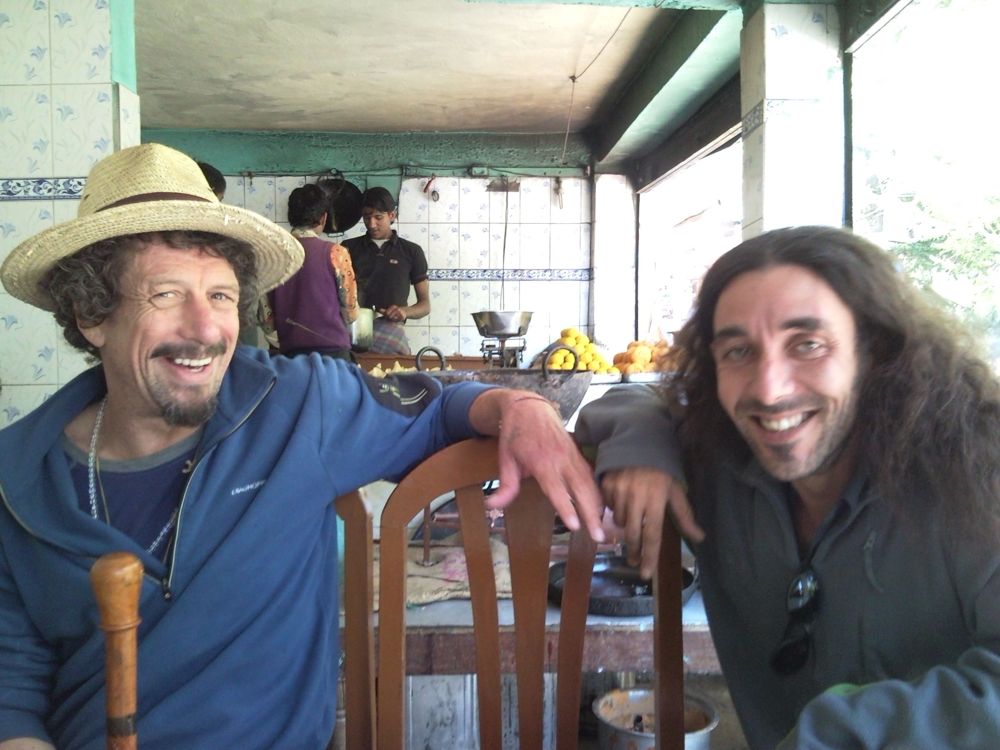
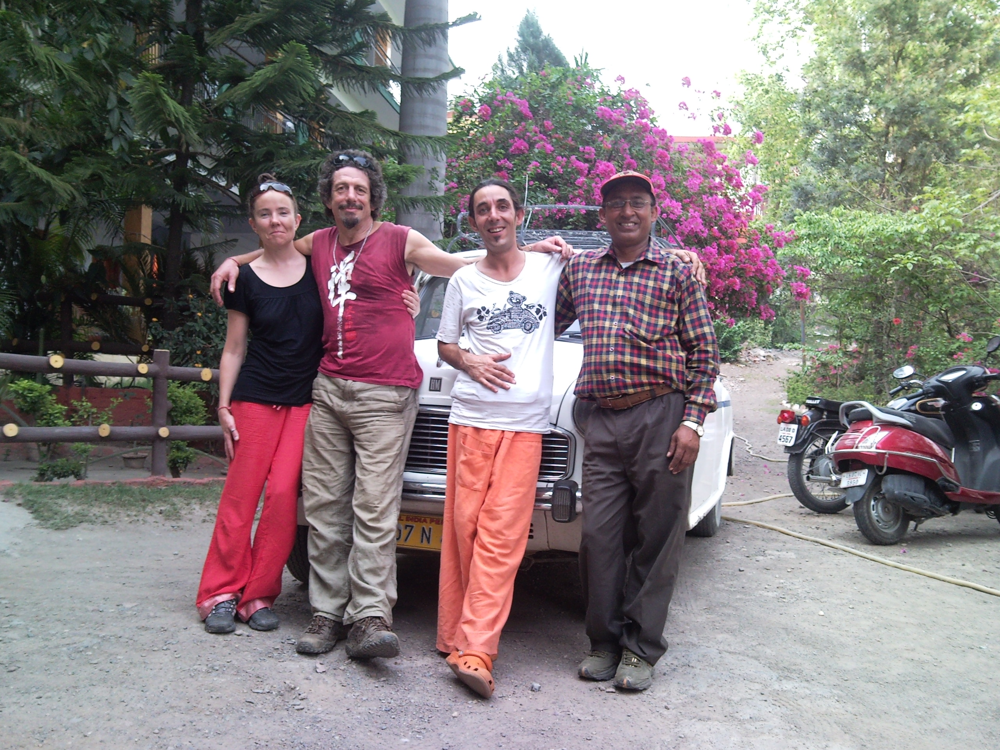

# 2011

- After the [devastating experience with Mike Wenham](2010.md#mike-wenham) which heralded the beginning of the nearly-complete destruction of my professional career as a developer, I realize I would benefit from an extended trip to India.
- I spend 6 months in India from March to September, then a month in Thailand before returning home.

!!! tip "What I did in India this year..."
    - I attend a [Sivananda yoga teacher training course](https://sivananda.org.in/neyyardam/) in Kerala.
    - I then spend two weeks in Rishikesh at [Parmarth Niketan](https://parmarth.org/) on a yoga course, then go on to make the Char Dham pilgrimage by private car.
    - I spend a month in Dharamsala doing Buddhist meditation practices, mainly Vipasana, then I return to Rishikesh for more intense yoga courses at Parmarth.
    - After this I spend a few weeks at an ashram near Rishikesh run by a follower of Sri Aurobindo who is, thankfully, away traveling when I visit.
    - I then do an Iyengar course in Dehradun at the [Yog Ganga centre](https://www.yog-ganga.com/centre/) before heading to Thailand for fasting practices.

## Gammadian

### India

- After the devastating blow to my professional life and career from [misogynist porn-addict and murderer Mike Wenham at British Telecom](2010.md#mike-wenham), I decided to spend 6 months in India.
- While I was deciding what to do in India, something made me sign up to [Jitendra's course online](2010.md#why-i-decided-to-be-celibate-for-the-rest-of-my-life) again.
- I believe this was online manipulation again, from the porn-gang hackers.
- I even sent him some money; about 400 euros.
- Something brings me to senses and makes me realize I've made a massive mistake, and I ask him to return the money.
- In Rishikesh in April, a man from London - Richard who calls himself Gammadian - comes with me when I get my money back from a very nervous Jitendra.

### Meeting Richard

- I met Richard who calls himself [Gammadian Freeman](https://openwing.weebly.com/about.html) initially at [a Tensegrity course in Barcelona in 2008](../2001-to-2010/2008.md#cleargreen-in-barcelona).
- He made a beeline for me on the course, *pushing his way in*, as they do.
- Interestingly, an older woman got between us and distracted him, and he left me alone in Barcelona after that, but he had already got my contact details and so we stayed in touch a little on Facebook, etc.
- He texted me very unusually one time, at a significant moment in November or December 2010 while I was working for [Mike Wenham](2010.md#mike-wenham) and at the exact moment some horrible event occurred with regards to work.
- It surprised and alarmed me.
- Richard never texted me outside of a day we might have been meeting.
- I hadn't heard from him for months on end and suddenly, perhaps after Mike has sent me a threatening missive; Richard texts me "BUM BUM Bhole", a reference to Mahadev, but the orifice reference is way clearer to me.
- I think, at the time, he must be drunk.
- Now I wonder if this text was timed perfectly by hackers to trigger a memory of anal rape, at the same time as something evil is happening to me at the hands of Mike Wenham, with a person they're setting up for a future sedating scam.
- *Oh, the men of the most famous criminal porn studio in the world would never do anything like that*... is an extremely naive and somewhat suicidal attitude. 
- In London in early 2011, I attend a Tensegrity workshop in Finsbury Park.
- Richard is there; I think it was him who suggested I come.
- I tell him I'm traveling to India and he tells me he's also going to India at the same time.
- I say we should meet up maybe. 
- He agrees.

### Rishikesh

- I meet Richard at Parmarth Niketan in April and we do the two-week yoga course.
- I'm finding Richard's behavior a bit odd.
- Without my knowledge, he has told the guru at Parmarth that he's a personal friends of the Dalai Lama.
- He's exaggerating a connection his Cleargreen teachers had *once* with the Dalai Lama and he wasn't even there!
- One of the residents tells me this in August when I return to the ashram.

#### Richard is pretending he is in love with me

- Richard appears to have *assumed* a romantic relationship with me.
- It's news to me.
- He never once asked me if I was interested in him, or spoke to me about it at all.
- I was not giving him any signs apart from being friendly with him.
- Yet he is showing symptoms of being romantically interested in me, except, it's not very convincing.
- It was very difficult, actually.
- Perhaps it was supposed to be.
- He got extremely rude and angry with me when it became obvious to him I wasn't interested; or perhaps that was the whole scam's goal; a falling out, unpleasantness, stress and anxiety.
- The following year while I'm suffering from severe and sudden onset colitis, Richard's Spanish mate Santiago from Madrid, another Cleargreen student I had met in Dénia, turned up in London also pretending he liked me, but didn't.
- I assumed it was the Spanish game of *get the woman back who rejected your mate*, but maybe it was more sinister.
- Santiago was at one of Elke's Tensegrity workshops in Dénia where I had met him (2008-2009), and had also likely been in attendance at another workshop she ran at the Hostal Loreto also attended by [the dodgy geezer who may be one of the switcheroo trumpet teachers in 2013](2013.md#daniel).
- It's possible these two events in my mind were the same event; you could ask Elke if she hasn't collapsed from exhaustion and poverty.
- Richard played a weird game of never revealing his intentions, keeping me wondering, and then suddenly buying me a gift out of the blue which I tried not to accept.
- Indeed, prior to buying me the gift he'd even tried the old love-triangle trick with a Polish woman at Parmarth on the same yoga course as us.
- But his heart wasn't in it; he was a bad liar.
- I said; "I don't deserve this", after he passed me the necklace.
- I meant he shouldn't have given me the gift, it was not deserved.
- He replied as if he was offended and my words meant that I thought he was too good for me.
- It was all very bizarre and contrived and very very unpleasant.

### Char Dam

- After the course, Richard and I go on the Char Dam pilgrimage. 
- I had started to think about the pilgrimage during the course and didn't really want to be traveling alone in wild-man North India.
- I ask Richard he if would like to accompany me and he agrees.
- We rent a taxi which drives us to Gangotri, Yamunotri, Kedarnath, and Badrinath over 11 days.
- It's spectacular!
- He's invited someone without asking me; his pothead mate. 
- The two of them get high the whole trip.

- It's embarrassing.
- They never ask the driver if it's OK to smoke pot in the car, and the driver is too polite to complain.

#### Gammadian's mate

- He was Italian with a British accent and a horrible pot addiction.
- He played the accordion like a Roma, and carried his instrument with him.
- He had those sad, Christian-icon eyes, just like Sandra Diaz.
- His hair was like Jitendra Das's hair.
- He spoke about his underpants in a lascivious way, all the time.
- Why did Richard invite him along without asking me?
- He told us his nickname was Super Mario.
- He was very very short, not much taller than me.
- The man wasn't even interested in spiritual matters, and was thoroughly bored with temples.
- He never entered any of the temples we visited; the purpose of our trip.
- It was totally unclear why he was with us, in fact.
- He was constantly complaining about spiritual practices like yoga and reiki, etc, he made a huge and repeated fuss about how useless they were, about how it was all just lies... then when we were alone one night he then told me he was into the 11:11 thing and how good it was and how I must sign up.
- I told him, *you have spent the whole week moaning about reiki, yoga, meditation, etc, and now you are recommending something totally off the wall?*.
- He agreed, it didn't make sense.
- What was the true purpose behind it?
- In March 2026, I attend the yoga festival at Parmarth Niketan and there is a trumpet player, Ryan, who looks *a lot* like this man and could be his son.
- I start to wonder if the accordion player, Richard's mate, is a resident of India; a member of the honey-trapping Roma porn-gangs, ready to spring into action whenever needed.
- Ryan seemed to be having a love-affair with a very vulnerable man at the festival..

### Spiking

- The night we returned to Rishikesh, we stayed in a guesthouse together for one night and parted ways the following morning.
- I may have been spiked that night.

- I had a very strange lucid dream about waking up on a bed in a forest and not knowing who I was.
- I had no identity; the whole story of "Katie" was missing, like an Alzheimer symptom.
- I told so many people about this dream because it related to yoga practice.
- However, I had the same dream at Carrer Furs, a lot; this lucid dream about being alone on a bed in the forest, and it was also the same dream [I had in Lamai in July 2023](../2023/july.md#the-first-time-i-become-terrified-about-being-arrested) while fraternizing with [Hala](../2023/july.md#hala).
- I have to wonder if the relationship with Richard was a set up; just one year after the [Jitendra Das](2010.md#why-i-decided-to-be-celibate-for-the-rest-of-my-life) affair which must have made the gangs millions in revenue.
- Santi's future weird-ass role and [the presence of a future switcheroo trumpet-teacher at one of Elke's Tensegrity workshops](../early-years/2013.md#daniel), and the proximity of all events and everyone involved to criminal-porn capital of the world, Dénia, make me wonder about what was really behind Richard's bizarre behavior.
- I have to also wonder if whenever I dream *the bed in the forest* dream, it's a signal of having been sedated.
- Did the last night I spent with those two consist in a "date"?
- Over the following weeks, I still saw them.
- They never spoke to me in that "after the event" way men can't even look at you after they've raped you while sedated.
- Richard and I attended a Vipasana course soon after and we spoke a little afterwards.
- When he got out of meditation, he told me he was going to be a good boy and stop doing drugs.
- I told him he should meditate on: *look what you made me do*.
- He remained rude and offensive towards me.
- I remember telling him about PTSD reactions (I'd unusually - interestingly - had an extreme one while with him and some others one afternoon about a month after the Char Dham pilgrimage).
- He called me a *trooper*, which I thought was a curious word to use to describe me.

### Spiking-prep

- We've established a need to prepare a reason for a sedated-rape target to be upset to coincide with attacks and thus provide an explanation for sudden-onset anxiety and depression.
- The romantic relationship set up had been a total disaster but even so, at the end of our trip, as we were heading back to Rishikesh, Richard and his mate started to be really nasty to me.
- For example, they ate all my dinner leaving me with no food.
- Richard said offensive things to me, bare insults.
- I was appalled by his behavior; not offended.
- At the time, of course, I thought he was upset because I wasn't interested in him. 
- But now I think he probably the whole narrative was prep.
- Richard is a big druggy, a lifer in fact.
- I'll never forget the way he befriended this beautiful 20-odd year old British woman and kept telling her about his drug taking as if it was such a good thing to be doing.
- This is a man who paralyzed himself by injecting heroin into his penis!
- Richard has, more recently, added the Indian term of respect *ji* to his own name.

## Roberto from Alicante & Catalina

- While on yoga teacher training in Kerala I meet a Canadian woman, Catalina, whose mother is from Chile and her father Jewish.
- We become friends.
- Catalina is a psychotherapist and lives in Toronto, Canada.
- We are also both in Dharamsala in June doing Buddhist meditation retreats, and we reconnect there.
- She has met a man on her course from Alicante, Roberto, who does Iyengar yoga in the city and lives in Elche.
- They fall in love.
- She gets pregnant really quickly.
- They visited me in 2012 in Dénia at my apartment in Ramon Ortega.
- I spent New Year's with them in Elche in 2012 while I was working for Nokia.
- On New Year's Eve, I mentioned to Catalina how I was struggling with child sexual abuse trauma.
- I wonder about this now... does this mean sedated rape had already begun at my apartment by New Year's 2012 and I was traumatized by it and relating the consequent stress and anxiety to what I consciously knew about happening to me in 1989 - in the absence of any other explanation?
- In December 2024, during prolonged online communication with international criminal gangs - unknown to me at the time also monitored by global law enforcement bodies - I noticed a man staying at the same hotel as me in Lamai who looked *exactly* like Roberto; he could have been a brother.
- At the time, it felt friendly, protective. I was high though.
- I tweeted about it; although it may have been on a profile post because I cannot find the tweet now.
- Was it friendly, or was it evidence of the bad guys becoming more and more panicky about my continued survival, and needing to keep a very close eye on me to see who I was talking to?

### Hacked connections

- This makes me wonder if every woman I communicated with over the last three decades, and swapped numbers with, became a potential target?
- Do the porn gangs professional psychotherapists understand that traumatized people tend to connect with other traumatized people?
- Is that why [my friend who moved to France](../2024/august.md#1) appears in the multiple targeted women I will see on my X UI in August 2024?
- It must be easy to jump into another persons devices, via a WhatsApp link or similar, and start monitoring them.
- I wonder if they look for:
    - Early trauma (Catalina's parents had divorced when she was little).
    - Recent trauma.
    - Wealth.
    - Vulnerability levels (is she living alone, is there a boyfriend, husband, etc).
    - Is anyone going to come to the rescue?
- If enough boxes are ticked, do they then move in and enslave?
- You don't think sex work is actually supposed to be a paying job, do you?
- If I'm right that the porn gangs have been operational and efficient for half-a century, assuming 11-year-old Abid Khan wasn't making up his descriptions of snuff-porn and other horrible things we should not have been hearing about at Holy Trinity primary school in East Finchley in 1983, and [the experiences of women like Irene](../2024/august.md#irene-the-plate-lady), especially in Spain, are more common than anyone can imagine, then where do you think these great minds that control the world might be leading us now...
- Certainly not to peace..
- Could the porn-gangs have become so bored of their evil business over many decades, they started targeting women who are *challenges*, such as myself with my links to international terrorism and everything that comes with that...
- Did this "challenging-women" approach become an online betting game.. together with "will the female-tech-colleague-you-hate commit suicide"?
- Isn't this what we should expect from billions of porn-sick men who despise women and girls, and are totally controlled by criminal gangs who threaten to tell their mothers, employers, police, what they've been up to if they do not OBEY?
- One wonders what the porn gangs might ask of these poor sick men:
    - Say something weird (and here are the exact words) to your sister at 12.30pm.
    - Go out and make a weird face (description given) to a woman wearing red who you will see walking down the road in 10 minutes.
    - Jump out into the middle of the road in 30 seconds in front of a (don't worry, slow moving) black car and do a silly dance (make sure you're wearing headphones).
    - Give us 80% of your tech-start-up's systems data processing power (funded continually by Western financiers) because the caliphate is paying us billions to get hold of it to use for their AI manipulation tech... (it's bloody working too)...
