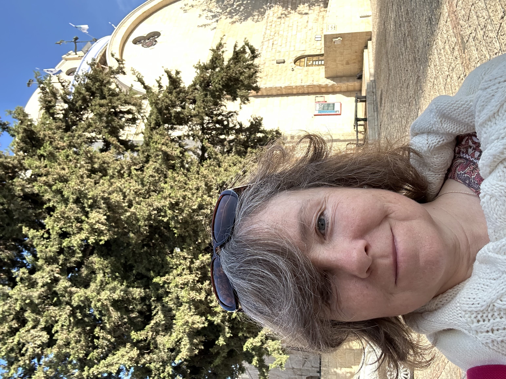
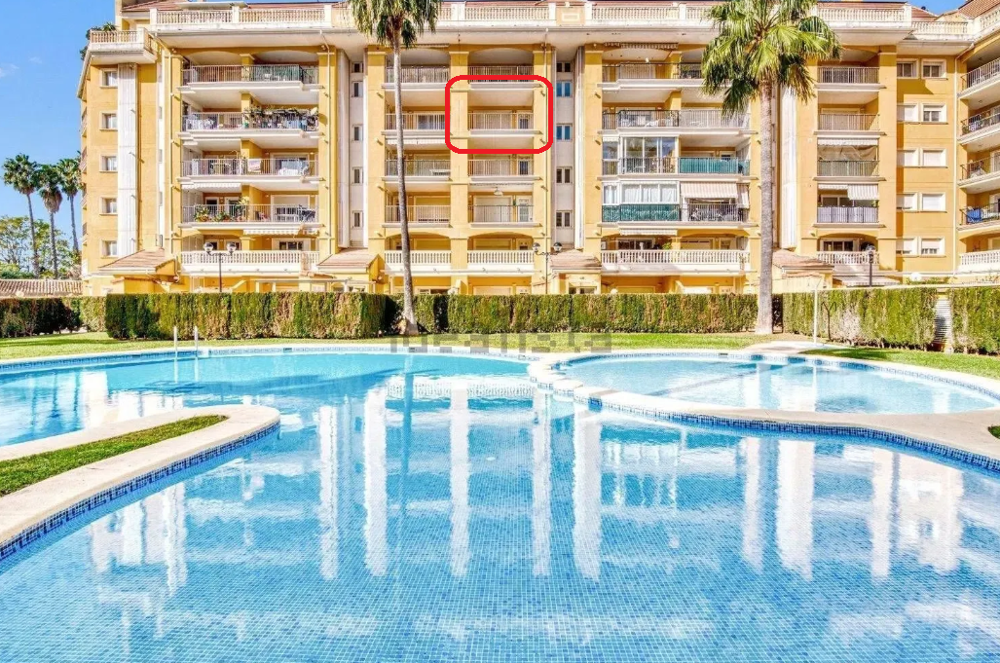

# 2012

## Leon, a man I worked for

- An example of hacking and constant sabotage of everything I do?
- Would [Mike Wenham](2010.md#mike-wenham) have been involved?
- Did the UK porn distributors and honey-trappers team up with Mike Wenham?
- Was he their first true test of whether they could use online lust and porn triggers to manipulate someone into undergoing extremely risky genital surgeries and then murdering a person?
- Was another *test*, as it were, Lorraine's daughter?
- Did the trans ideology manipulation software, aimed mainly at children, girls usually, get released soon after these successful outcomes?
- Can we tie it all back to a small town in Spain?

## Tiferet 

- In early May I visit Israel and take a 7-day Holy Land tour.
- I fall in love with the country, in a million different ways.
- During our visit to Jerusalem, we stopped at a square which I always called Tiferet Square.

- It's not really called that, but kind of.
- Anyway.
- As we walked up to the square, back then in 2012, I could hear music.
- Two buskers, a female keyboard player and a male instrumentalist, possibly a trumpeter, I'm not yet sure; they were playing [*Bésame Mucho*](https://youtu.be/BueVGiyx_E4).

- I became entranced.
- The reason I remember this so well is because I didn't listen to music at the time and I had the song in my head for weeks after.
- I told our tour guide, and a few others since, that I want to live on Tiferet Street close to the Hurva Synagogue, which resurrects, periodically.

- I still want to live there.
- Why did I tell you this story?
- You tell me.

## Barbara's wedding

- Barbara Loftus invites me to her wedding in Dénia.
- Barbara was a teacher at LinguaLink.
- We worked together with Lorraine Blackbourn and Zoe BJ's mother Theresa did a short class every Friday.
- I'm delighted to receive the invitation and I visit Dénia for the wedding weekend.
- Barbara is marrying a Spanish civil servant Joan who may work for the Generalitat but more likely another Spanish government department.
- Zoe BJ and her mother have also been invited and we sit together at dinner.
- Zoe doesn't know Barbara and it's not clear why she was invited.
- She keeps telling everyone this and giving a reason why she is invited, which I do not remember.
- At church, myself Zoe and Zoe's mum are standing together.
- As Barbara walks out of the church up the aisle, Zoe and her mum make very loud fat-shaming statements about Barbara.
- I can hardly believe it; it's disgraceful!
- Not only that, Barbara can hear it and she'll think I think this too because I'm standing with them.
- I can't remember but I do hope I told Barbara how beautiful she was later on at the party. I have a feeling I did. She was beautiful that day.
- This was around the time where Zoe was going on constantly about her much younger sister's new *man*.
- He was an older man, in his late 50s, from Dubai, and a billionaire, and he had invited the *WHOLE FAMILY* out to Dubai for a few weeks.
- They all stayed in a villa at the Palm resort over there, all expenses paid.
- Zoe made sure we always knew that her sister was not marrying this man, and that he wasn't her boyfriend either. 
- This was important for us to know, for some reason.
- The sister got married a few years later, I believe, with an age-appropriate Arab in Dubai, although she had been hanging around the Ibizan yacht scene for some time before that and Zoe had expressed continued concern for her safety.
- There was never a good explanation for the trip and I always remember incongruous things.
- Did Hazel join them? I guess that's unlikely.
- Perhaps they sent Zoe's dad - well-known friend of Islamicists - to do business with the Arabs?
- Did they sell the manipulation tech at that time to the Arabs?
- The tech was functional at that time, as I noticed after the [Dave Porter](2006.md#guardian-soulmates) affair.
- When I think about Zoe and her mother's frightful behavior at the church, I wonder why they would have behaved that way.
- These two were not usually so ignorant, never in fact, and it took me aback at the time.
- Again incongruous; I have to say it was a bit, well, staged.
- Knowing what I know now about the porn-gangs of Dénia, I have serious concerns about Barbara's safety and wellbeing.
- I'm so sorry I didn't keep in touch with her when I returned later on in the year, but perhaps that was also manipulated.

## Passeig Periodista Ramon Ortega

- I move back to Dénia in October.
- I have had severe colitis since I moved back to London the previous September.
- For a whole year I have been bleeding from my bottom, badly.
- I'm back in Dénia for about a week when I notice it has completely cleared up.
- Prior to moving back, I did a colonic fast and cleanse in Thailand.
- I rent a flat in Las Rotas initially, but the woman has lied to me about their being sufficient internet so I have no option but to find somewhere else.
- I find a flat in Passeig Periodista Ramon Ortega.
- By the way, my mother has all the full addresses somewhere, I can't be bothered to look. 

- The size and layout is exactly like this flat: https://www.idealista.com/en/inmueble/109473972/.
- I rented the flat from [Lex estate agents](https://inmobiliaria-lex.com/) so they will have the information too.
- Zoe visited quite a lot as we were both writing books and exchanging notes.
- One afternoon, I remember she started talking about the Pakistani rape gangs out of the blue in my sitting room. I found it a bit weird. I wasn't thinking about it.
- My dad also visited at Fallas time in 2013 and stayed about a week.
- I wonder about that visit.
- Did someone approach us in the Irish bar?
- The only reason I have to be suspicious about my stay here - which I loved - was that I had extremely bad genital boils after that.
- I remember because I would burst them sometimes and they would stain the wall opposite with blood and pus. They were *really* angry.
- Does this mean I was being sedated and raped in my apartment here too?
- I'm not sure.
- When I left the apartment, I tried to sell a few items to my neighbors. A man came round. He walked into my apartment looked around, looked at me in disgust, made a rude comment, and walked out without saying anything. This makes sense if I was being sedated and repeatedly raped in my apartment here and everyone knew about it which would not surprise me anymore.
- I do know that the woman who moved in downstairs looked a fair bit like the [sedated woman I saw on Dénia TV](2008.md#denia-tv) in 2008, enough to make me do a double take when I met her.

## The Liar

- On 21st December 2012, I finish my first book, [The Liar](https://www.amazon.com/Liar-Niramisa-Weiss-ebook/dp/B00CA5F602), inspired by my visit to the Western Wall in May of this year.
