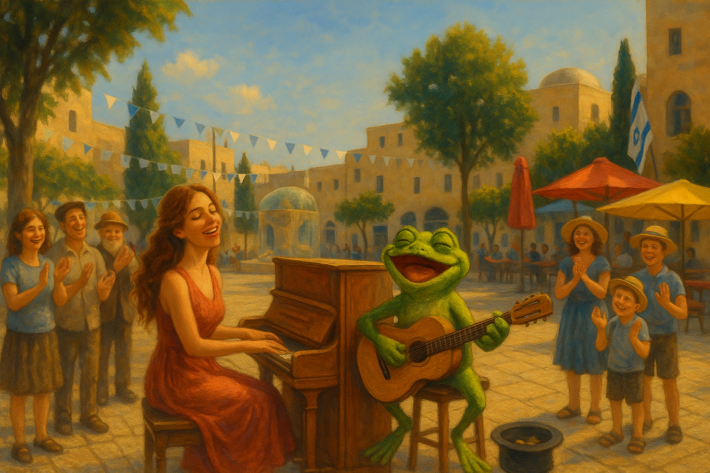

## Tiferet 

- In early May I visit Israel and take a 7-day Holy Land tour.
- I fall in love with the country, in a million different ways.
- During our visit to Jerusalem, we stopped at a square which I always called Tiferet Square.

- It's not really called that, but kind of.
- Anyway.
- As we walked up to the square, back then in 2012, I could hear music.
- Two buskers, a female keyboard player and a male instrumentalist, possibly a trumpeter, I'm not yet sure; they were playing [*Besame mucho*](https://youtu.be/BueVGiyx_E4).

- I became entranced.
- The reason I remember this so well is because I didn't listen to music at the time and I had the song in my head for weeks after.
- I told our tour guide, and a few others since, that I want to live on Tiferet Street close to the Hurva Synagogue, which resurrects, periodically.

- I still want to live there.
- Why did I tell you this story?
- You tell me.
