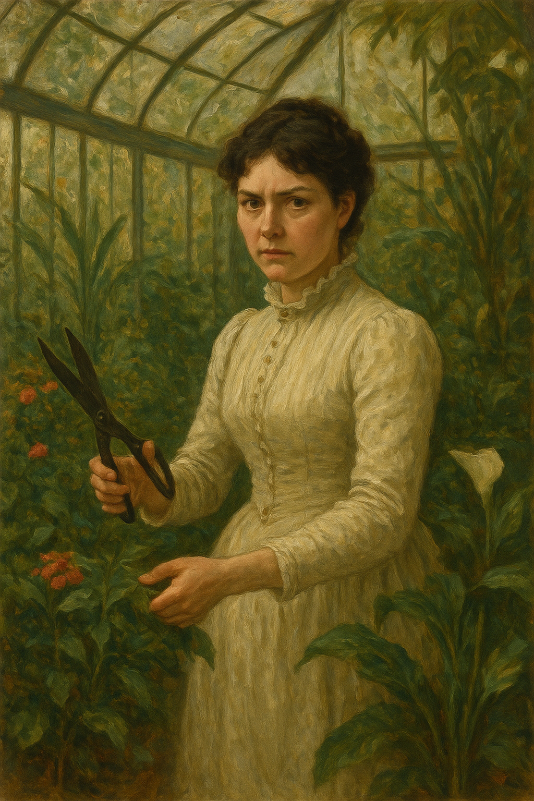
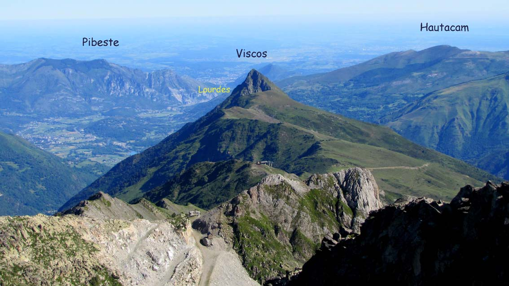
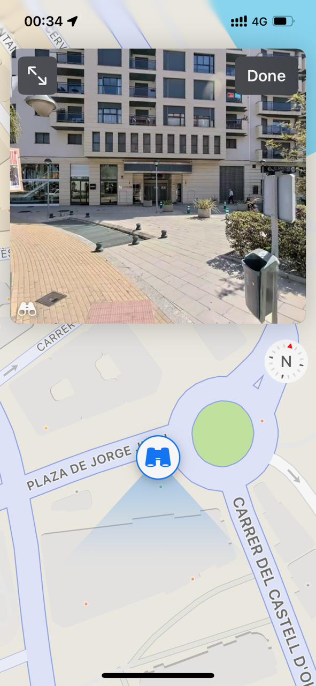

# 2014

## March to July

- I move from Dénia at the end of March to live in Lourdes, France, to volunteer at the baths.
- I put all my things in a [secure storage facility in Ondara](https://securistore.com/).
- I stay one night at the Best Western in Lourdes before starting service the following morning with the Hospitalite de Lourdes.
- In Lourdes, I intend to write a novel that has been forming in my mind for a couple of years, *Life Without The Liar* under a pseudonym, Margaret Murphy, my grandmother's name.

[{width=50%}](https://www.amazon.com/Life-Without-Liar-Margaret-Murphy-ebook/dp/B00M0CZN94/)

- I feel like my time in Lourdes inspires every chapter; as if Mary is guiding my attempt to heal the horrific experiences of child sexual abuse and London rape gangs from thirty years previous, experiences which statistically are likely to destroy a person (see some [ACE study data](https://www.cdc.gov/aces/about/index.html) for more info) but, for some reason, I survived.
- I bring my piano keyboard with me so I can practice for the audition at the conservatory.
- I study for the written exam and the sight singing, and I practice my keyboard every day.

### Mike Wenham murders a woman

- The morning of my first day of service, Mike Wenham's wife emails - he is an old boss of mine.
- She tells us Mike has murdered a woman and asks if we would write to her saying what a good bloke he is because they think he's gone temporarily insane.
- He bullied me out of my job, so I don't agree he's a good bloke, but I do offer to light a candle at the grotto for him.
- The picture on the wall of my room at the Best Western becomes even more curious.
- I had slept really badly that night, and I was finding the picture on the wall really scary.
- Every time I turned the light on I would see it.
- A woman dressed in Edwardian style is in a conservatory garden. She has a pair of sheers with her for pruning the plants and flowers.
- She holds the garden sheers open and looks directly at us. She is not smiling.
- She has black hair and pale skin, and she's beautiful.
- I find the picture sinister, yet powerful; energy I don't understand pulsates from it.
- Mike's wife's email seems in keeping with the tone of my hotel room.

- I tell a lot more of the [Mike Wenham story](../2024/march/13-end.md#mike-wenham) in a section from March 2024 where it becomes apparent I'm being stalked and harassed by people in Spain who know him very well.

### Sandra Rita Diaz

- A woman called Sandra Rita Diaz attends the volunteer's course at Lourdes at the same time as me.
- I tell her about Mike Wenham as it is on my mind.
- She is Portuguese and lives in Paris, and is a translator for the police and other social services in France.
- She is a member of the Hospitalite de Lourdes, and she is in the system.
- We become friends and I mention her throughout the story, especially during the three years or so that I was drugged and cyber-stalked.
- I'm never quite sure if I can trust her. Something's off, but I'm not sure what. 
- She presents as a ditzy blond, always late, giggly, etc, but every now and then [the mask slips](../2023/december.md#sandra-rita-diaz) and someone very calculating appears for a nanosecond.
- Over the years I know her, every now and then she will say or do something extremely out of character and I wonder if this is to gauge a reaction.
- Is she part of the conspiracy? If so, it seems that whatever abuse I suffered as a child, which was filmed, must have generated a lot of interest, and made a lot of money for criminals. Thoughts like these make me feel quite unwell.
- The timing of our meeting suggests she could be part of the conspiracy. I'm about to enter the conservatory where some horror is supposed to await me.
- Like the online stalkers and others, she always pretended to be seriously concerned about what was happening to me, but when pressed for a bit of real support, became utterly disinterested and dismissive.
- A gang stalker's interest in a target is superficial. They're just doing what they're told. They don't really care. When normal concern is required from them, they deflect and ignore. They have better things to do, and lives to live. It's just a job for them. They are getting some reward for their behavior of course; you can be sure of that.
- Like other conspirators, such as [So, real name Janet, my electoral volunteer](../2024/june.md#volunteers-not-what-they-seem), she was always suggesting I came and stayed with her for a few days at her house.
- I wonder what might have happened if I had accepted either of their invitations.
- Stalkers and manipulators use common destabilizing and gaslighting tactics and language and Sandra Rita Diaz was no exception.
- Perhaps Sandra is not her real name. I would not be surprised. Sandra is a common gang pseudonym. I expect it signifies the person taking the role of throwing "sand" in the eyes of targets.

!!! tip "An accomplice?"
    - Sandra Rita Diaz may have had an accomplice at Lourdes on that first course with the Hospitalite.
    - He was a British man, Andrew.
    - He was a drama teacher.
    - We chatted. 
    - He said strange things about his girlfriend which gave me cause for concern.
    - The reason I think he might be an accomplice is because in the last few years I saw Sandra, when I was living in UK also, she was always mentioning him, how he asks about me, this sort of thing.
    - There was some intention behind it.

### Men in dresses at Lourdes

- During my time volunteering in Lourdes, there were a number of times I noticed men pretending to be women and accessing areas in which women and girls were in vulnerable state of undress.
- A pilgrimage from Glasgow had two of these men: One calling himself Mary worked in one of the bath teams with me one afternoon. An Italian woman was furious but no-one else seemed to notice.
- Another man calling himself Mary, from the same Scottish pilgrimage, was volunteering at the emergency medical station.
- I noticed these things well, but had no context around them so I did not know how to respond to them, and they didn't seem important until closer to the time of writing this police statement.

## April

- I formally apply by post to the [conservatory of Dénia](https://portal.edu.gva.es/conservatoridenia/es/inici/) to join the first year of professional studies for piano.

### Earthquake

- In the morning of 29th April, there is an earthquake.
- It wakes me up.
- It feels and sounds like a train going through my bedroom.
- Everything shook and rattled and juddered up-and-down.
- I realized at that moment why the paintings were nailed onto the wall rather than hung.
- The painting in my room was a view of the Viscos.
- It reminded me of the Last Supper, for some reason.
- I even told someone that, who may remember.

- You can see the Viscos mountain from Lourdes High Street as you drive down towards the Post Office from the direction of the train station.
- On a clear day the view can be quite startling.
- I climbed it [in 2023](../2023/august.md) and [in 2024](../2024/august.md) while I was suffering an extended crucifixion of some variety.
- Perhaps that's why the picture reminded me of the Last Supper.
- At the time of writing, in 2025, I can serendipitously see the Viscos peak from my chair; and the cross outside my building is aligned with the mountain.
- There are no thunderstorms at the moment so I've no idea where [the lightning came from](https://drive.google.com/file/d/1W92R2v8QAsAzDaAs1oIg99ozWLrcuqJ4/view?usp=drive_link).
- 29th April is the feast day of St Catherine of Sienna, just saying.
- Was this assignment distribution day?

## May

- I receive the [receipt of my application from the Generalitat](../../content/documents/papeles-conservatorio/justificante-may-2014.pdf).

## June

### Conservatory audition

- I travel back to Dénia from Lourdes to take the exam.
- Domingo the piano teacher is there, in the background. It's the first time I meet him.
- He makes a point of introducing himself to me and chatting a little.
- His English is very good.
- I find him a bit weird, odd looking, pale; unwell maybe but polite and charming.

## September

### The piano at the storage facility

- When I return to Dénia, I collect my things from the [storage facility in Ondara](https://securistore.com/).
- Pretty much right outside the area where my things are stored is an upright piano.
- Of course, I ask the English people who manage the place about it.
- It is for sale, 150 euros.
- It is so cheap, it is impossible for me not to buy it.
- The English people organize a man with a lorry to move it to my apartment in Cami Llavador 5.

### Studies begin

- I start the first year of professional piano studies at Dénia conservatory.
- Domingo is going to be my piano teacher. It has been arranged.
- I have no problem with this.
- Domingo is a muscle-man-type and looks like he may have been taking testosterone and similar. 

### Joan Fuster

- I had problems finding a flat in Dénia so I reached out to my old landlady in Madrid who told me the flat I had previously lived in was available
- It was in a terrible mess when I arrived and there was a toxic smell.
- I cleaned the whole house, but I continued to smell something weird, so I started looking for better accommodation and left.
- I found a flat nearby but there was a chain-smoker next door and poor ventilation.
- There were no more flats available, and then one came up, in Joan Fuster 11, 3rd floor above the evangelical church facing the street.
- My landlord was a lawyer with offices on the Marquis de Campo.
- I dealt with Miguel Angel Piano directly.
- It turned out Miguel Angel Piano had been in legal disputes with [Lorraine Blackbourn](2008.md#working-for-lorraine-blackbourn).
- Lorraine shuddered when I told her who my landlord was.
- Lorraine would bring her son over for piano lessons regularly; her boyfriend had also come round once to fix something.
- I now believe cameras had been set up in this apartment and I was being sedated there too.
- This would explain the [woman at yoga's strange comment](2016.md#evidence-the-town-is-surveilling-me-without-my-knowledge) and Domingo's [weird performant behavior when he came round](2014.md#domingo-comes-for-tea).
- I believe that this is the underlying reason behind I became extremely depressed and suicidal the following year and wrote to [the Metropolitan police](2015.md#statement-to-the-metropolitan-police) about the North London rape gangs again, because what was happening to me, without my knowledge, was triggering those memories.

#### Moving the piano in

- The same British man who [helped me shift the piano to Cami Llavador](#the-piano-at-the-storage-facility) helps me move it over to Joan Fuster.
- He keeps talking about how there's a picture of him naked at a piano.
- He even sends it to me because I have been communicating with him online.
- I'm not particularly impressed.
- His boy responds weirdly to me when he finds out the tram is right outside my new apartment.
- The boy laughs in a jeering way, *ha ha, it's so noisy here for you*.
- He's happy because he believes I'm going to be hurting in some way.
- Why would he have such a disposition to a woman he has never met before and knows nothing about?

#### Signs a Spanish lawyer is not behaving correctly

- A curious characteristic of Spanish lawyers I have noticed pops up when they are not treating you correctly.
- Perhaps it's something not-very-clear-minded humans do unconsciously when they feel guilty for how they're treating you and want to be able to condemn you about something to alleviate it; they set up a situation in which you will undoubtedly become disagreeable and then they can say, oh she's not very nice, whatever.
- I noticed this with Miguel Angel Piano as the rent was very high, and I had to put plastic over the main window because there were holes in it and it was cold in the winter.
- He would not address this when I complained.
- Also, my electricity bills were through the roof, inexplicably, and I complained about this too and was ignored.
- I always felt something funny was going on, as if I was paying my neighbor's electricity too.
- He had been dishonest about the car parking space from the beginning by telling me I could use a space which he didn't own, and not to worry about it, so I assumed he was a dishonest person at some level.
- After I left, he chased me for 30 euros from the next month's water bill.
- He said the new tenants were not prepared to pay it.
- I explained I had picked up at least 100 of the previous month's bills when I moved in, but he was adamant I had to pay this paltry figure.
- I got really angry with him.
- Something similar will happen in November 2024 with [a lawyer from Madrid who I pay to help me with an illegal dismissal employment claim](../2024/november.md#hiring-a-lawyer-to-help-me-with-polygons-illegal-dismissal).
- I start to become suspicious about the Madrid law firm when it becomes obvious they are mis-hearing and re-writing important things I have said, which would make me look like a liar.
- They also appear to be ignoring the sexual harassment claim.
- They then appear to be colluding with the company I'm complaining about by only calling witnesses who work for the company, and ignoring [Nadim Kobesi](../2023/november.md#polygon) who may have been working for the porn-gangs, the British Pakistani man who made a [violent sexual threat towards me at dinner in Bali](../2024/may.md#bali) who again may have been working for the porn gangs via Polygon management, and the other sacked writer on my team who was there at the time who very likely would not have lied about what happened.
- He asks me in the same petty and insistent way to pay a paltry fee of 115 euros travel expenses for a trip to Barcelona.
- I'd just paid him nearly 4000 euros to represent me.
- I sack him and he refuses any refund.

### First piano class at the end end of September

- I'm delighted to be studying the piano again after a twenty-odd year break.
- Domingo asks if I want to go for coffee after class, I decline.

#### Strange experience at the Hotel Costa Blanca

- I'm staying at the Hotel Costa Blanca in Dénia.
- I get really, *really* sick, all of a sudden after class; flu-like symptoms. 
- On top of that, I become deliriously upset about something, and I phone home ranting, two or three times, on the night I get sick.
- My mental/emotional state the next day is completely fine and I don't understand what happened.
- I felt like I was spiked with drugs it was so out of the ordinary.
- I phone home to apologize for my crazy calls.
- When I'm better, I forget about it.
- I wonder what really happened that night at the Hotel Costa Blanca and how common an occurrence this is for guests.
- The hotel manager was really very angry about something.

## October

### Second piano class

- Domingo asks if I want to go for coffee.
- I decline.

### Third piano class 

- Domingo asks if I want to go for coffee.
- Slightly warn down, I agree.
- We go for coffee.
- I find Domingo to be sexist and disagreeable.
- He talks about his ex-girlfriend who left him for another man who she now has a baby with.
- She's German and he visited her family in Germany, he tells me.
- It's not clear why they split up.
- We go for lunch and for dinner on different occasions.
- The dinner is at the Japanese restaurant and we are sitting at a table with two other couples. Domingo behaves in a loud and obnoxious manner. I find him a little embarrassing. I feel like he knows the people at dinner, as they do not respond normally to his very weird and loud performances.
- I find out he has a problem with food, something like bulimia.
- He keeps telling me, loudly, about how I'm too old. You're so old, he says repeatedly. I find it offensive and weird given he is only a couple of years younger than me.

!!! important
    - I now believe Domingo's references to my age were with regards to me not being so *porn-ready*, and/or how unlikely it was for me to be sold on to a friend for breeding purposes.
    - It turns out Domingo is probably gay and his references were likely more to do with how good a 'product' I was.

### Consequent piano classes

- We become friends, even though I don't like him particularly.

!!! tip "Domingo tells me he used to sing with the Orfeo de Dénia"
    - During our chats, Domingo tells me he used to sing in the choir I sing in.
    - Domingo and Klari have been associates for many years.
    - Klari had also told me she knew Domingo.
    - I wonder if he met his German girlfriend at the choir. I should have asked him.
    - Klari will know.

- I don't feel unsafe with him. There is not that feeling of a man wanting to have sex with me, which always used to make me nervous and apprehensive. I felt more like I would feel if I was with a gay man, but I don't register this consciously at the time.
- He starts love bombing me while at the same time saying offensive and extremely sexist things; women shouldn't be in politics, women are terrible drivers, etc.
- He tells me he is seeing a therapist for something he doesn't disclose but I guess it's bulimia and maybe relationships.
- He plays mind games with me and other women, including the yoga teacher Natalia. He shows me pictures he has taken of her doing yoga poses. It's not clear if she's aware she's being photographed.
- It seems like he is trying to make me jealous, which is ridiculous.
- I find him immature and sexist. I'm thoroughly unimpressed with him.
- He often mentions funeral marches in our discussions about music and my repertoire. Oh we will be doing a funeral march, he says, often. I think he is taking the piss and disregard it.
- Domingo came to the toxic-smelling flat to see the piano I had bought. (The piano had been available for sale for 150 euros at the storage facility I had my stuff in when I moved back from Lourdes.) On the walk there, we went through the tunnel under the castle, and when we were on the other side, Domingo mentioned how the gypsies lived in that area. 
- He said it in a kind of fearful way. I wondered why.
- Suddenly, a flat came up somewhere else. It was the only available rental. It had previously been really easy to find a flat to rent in Dénia. Now, not at all. I surmise it is because of the rise of AirBnB-type holiday accommodation.
- The apartment wasn't ideal; there was no parking and a big hole in the frontroom window, but I had no other options so I moved in. The address was Avenida Joan Fuster, 11, 3rd floor, the one bedroom flat facing the road at the far end.
- Domingo was very interested in my house hunting and had a lot of advice to give me on it.

### The gypsies with the buggy

- One afternoon at lunchtime (siesta time when no-one is around) I am walking back to my apartment from the conservatory.
- I'm walking along the CV-730 towards Las Marinas and I have just passed Casa Federico, pretty much [here](https://www.google.com/maps/place/D%C3%A9nia,+Alicante,+Spain/@38.8474069,0.1028702,3a,75y,273.19h,72.27t/data=!3m7!1e1!3m5!1sAKa379ejXnVgtE1BSn1aIg!2e0!6shttps:%2F%2Fstreetviewpixels-pa.googleapis.com%2Fv1%2Fthumbnail%3Fcb_client%3Dmaps_sv.tactile%26w%3D900%26h%3D600%26pitch%3D17.72985641868108%26panoid%3DAKa379ejXnVgtE1BSn1aIg%26yaw%3D273.1915393963973!7i16384!8i8192!4m6!3m5!1s0x129e1b226dfbd341:0x86f3d778aff1e134!8m2!3d38.8387992!4d0.1050557!16zL20vMDFoc2Ri?entry=ttu&g_ep=EgoyMDI1MDkwMy4wIKXMDSoASAFQAw%3D%3D) although it looked a bit different in 2014.
- On my left is a little turn-in road for doing a u-turn.
- I see a gypsy couple, I recognize the woman but not the man.
- The woman is pushing a buggy and there is a small boy sitting in the buggy. He is no more that 5-years old.
- The woman is commonly seen around Denia begging. 
- The last time I saw her was probably October 2024 outside the Mercadona in Avenida Miguel Hernandez.
- She is extremely fat now, but she wasn't that fat in 2014.
- There's something not right about them; they look as if they don't want me to see them.
- I'm concerned about the boy, he is completely still and his expression is fixed. 
- The three are not communicating with each other normally.
- I feel something's very wrong here as the buggy wobbles over the stoney ground and no-one speaks.

## November

### Invitation to Lourdes

- One evening, Domingo and I are walking through the town after classes.
- I tell him I'm visiting Lourdes at Christmas, and ask him if he would like to join me.
- He says nothing.

### The stressed woman

- Domingo and I are having a coffee at the top of the Marquis de Campo.
- We are sitting outside.
- He is on his phone.
- All of a sudden, a woman walks up to him and he gets up and leads her away a bit so I cannot hear what they are discussing, although I think I hear a French accent.
- She is about 50 with short neat hair, and she is fairly tall and slim.
- She is dressed nicely.
- She looks anxious and stressed.
- She has something serious to talk about with him.
- For some strange reason, I think it's his therapist. Perhaps he has been talking about that before she "popped up".
- She looks at me, stares even, in a concerned manner.
- I'm feeling a little light-headed.
- She leaves and Domingo returns.
- I think nothing more of it, until now (check commit date for exact date).
- Now, I wonder if this is another target and what stage of the game she was at.

#### I can describe her perfectly

- At the time, I thought she looked exactly like someone I know, but that she wasn't actually that person.
- I'll explain.
- In May 2005, I traveled to Chiang Mai in Thailand to [Mantak Chia's Chinese spiritual centre](https://www.mantakchia.com/tao-garden/) to do a women's sexual chi kung course.
- On the course was a Swiss lady who looked *exactly* like this woman, and we were friendly.
- There were only about 15-18 women attending.
- We may have emailed socially for a year or so after also.
- She looked a lot like Charlotte Rampling.
- Of course, I'm now wondering if this section is again part of the [porn fatwa](../early-years/2003.md#porn-fatwa).
- Nothing would surprise me anymore, and perhaps the woman I saw with Domingo was the same woman I met in Thailand; certainly if they found out she was single and vulnerable, and rich.

### Domingo comes for tea

- Domingo visits my house for tea one Sunday evening.
- He tells me he approves of my kitchen.
- We have tea and biscuits and a (I thought) nice chat.
- He leaves.
- On the way out he puts a large chewed-up bolus of the biscuits I offered him into one of my boots at the door.
- I find this when I go to put my boot on the following day.
- He had pretended to eat two biscuits, gone to the toilet and retrieved them - possibly by vomiting them up. He had kept them in his pocket for another hour and put them in my boot on his way out the door. I guess you might do this sort of thing to someone you intend to terrorize. 

!!! danger "Another theory"
    - Could Domingo have been "performing" for the audience of people who were watching me in my apartment via spy-cams?

### I visit Domingo's house

- Domingo makes soup for me.
- He serves the soup into two dishes, and gives me the broken dish.
- I take the broken dish and start to eat.
- He looks at his dish, and suddenly says he's not hungry anymore and doesn't eat.

!!! danger "Interesting"
    - Domingo lived in a rented flat at that time; an apartment on an upper floor at Plaza de Jorge Juan.

    

    - It seemed like a rather big flat for just him but apparently his ex-girlfriend had moved out recently, although she was already married to someone else and they had a baby.
    - It seems to me now that Domingo would not have stayed alone in an expensive apartment for a long period. He was a rather stingy person and the rent was very high.
    - He told me his  landlord was a British expat, a pensioner. 
    - The landlord had left the Royal Dalton tableware in the flat; the correct spelling is Doulton, I only knew it phonetically until I looked it up.
    - It turns out that Royal Doulton tableware is rather valuable. I didn't know this until recently and it begs the question, why did the landlord leave his very valuable tableware in the apartment? 
    - Domingo kept going on about the Royal Doulton tableware as if it was important to him. 
    - He suggested at one point he was going to take the tableware with him when he left the flat. 
    - I thought this was extremely low behavior, theft in fact.
    - I now wonder why he thought this seemed like a reasonable thing for him to do.

### Sexualized comments about schoolgirls

- On one occasion we are having coffee at a bar in the Marquis de Campo and a group of schoolgirls walk past in their school uniforms.
- They are probably no more than 14 years old.
- Domingo says sexualizing things about them; things you might imagine a man in the 1960s would say about 14 year old girls in school uniforms.
- I am appalled.

### A conservatory trip

- There is going to be a trip to Paris or similar for the children of the conservatory.
- Domingo suggests I come along as one of the guardians.
- He mentions something that makes my ears prick up which is in reference to looking after the girls at night while we're away.
- There's something not right about what he's saying and I relate it to his views on schoolgirls generally.

### He gets to me

- It's not clear how because he's so offensive but the love bombing is working.
- I find myself becoming a bit obsessed with him.
- But I'm ambivalent.
- It's difficult to know what to do because he is my piano teacher and I have to see him every week at the conservatory.
- He has pushed his way into my life rather forcefully and I don't particularly like him.
- However, he is using love bombing tactics on me which are making me obsess over him. In retrospect I wonder if he is doing this via social media NLP/MRA seduction techniques, i.e. hypnosis.
- I invite him to London as I am going anyway and I would like the company. I have found home very difficult over previous years due to the relationship with my brother breaking down.

!!! danger "In retrospect"
    - I wonder now if I was being medicated with some aphrodisiac-type substance at that time, just as I have been more recently.
    - The feelings I had then match exactly how I have been feeling in recent years in Dénia with regards to the trumpet teacher, albeit slightly less so.

## December

### Trip to London

- Domingo (apparently) lies to the conservatory about being unwell so he can go to London with me.
- It is Friday 5th December in the early morning. Domingo texts me and tells me to get into the car already and wait for him, and that he's coming.
- So I leave my house and get into the car to wait.
- It's an extremely cold morning and misty too.
- As I'm waiting, I see my friend Zoe walking into town in hot pants from Las Rotas. 
- I think it's strange.
- Domingo appears at the car door just after.

!!! danger "In retrospect"
    - I realize that this was another set up.
    - I was supposed to see Zoe that morning and I believe it was for some future purpose intended for me (which never transpired) where I would “realize with a shock” that everything that had happened was planned.
    - What is in Las Rotas that Zoe might be coming home from in hot pants at 7am in the freezing cold?
    - Is it the swingers club? Or the little stone house where they make porn that the English ladies told me about?
    - Was the intention that I would have ended up there someday without being able to say no for some horrible reason, and then realizing it was all set up from even before it seemed to be?
    - I guess that’s it. They’re consistent at least.

- We set off in my car to Valencia airport and take a flight together.
- Going through security, Domingo tells me he used to dance naked (or nearly so) at a nightclub in Gandia.
- I tell Domingo that when I was young I used to go raving and take ecstasy.
- At that moment, Domingo's attitude changes towards me.
- At the boarding gate, Domingo flirts outrageously with a woman from the airline and I'm offended.
- Throughout the trip, Domingo is rude and obnoxious, flirting with women constantly, and I'm so appalled at his behavior I realize I want nothing to do with him.
- He love-bombs my mum in a disgraceful manner.
- When we sit at the table with my father, my dad's reaction is unusually reticent.
- At the time, I didn't understand it. Later, I wondered if dad just knew there was something bad about this guy.
- Now, I think he recognized him from his trip in 2013.
- Horrified, I now remember how my dad had recommended Denia to my cousin Igor and his family with two small children, and how they did visit sometime in the summer of 2014, and how Igor kept mentioning my flat in Denia to me, long after.
- What had my dad said to him? Was he hoping to share the guilt somehow?
- Did Trish meet my family at that time? God help us.
- I tell Domingo I think he's an ape.
- I am disgusted with him.
- I realize in 2024 that the purpose of his trip is to check out how much money my family has and he was totally uninterested in friendship of any sort. In fact, he despised me.
- I had no idea at all he had been conspiring with Hazel from back in 2006.

### End of term concert

- I play two Chopin preludes:
    - [Op 28 No 9](https://drive.google.com/file/d/1qdEjIT6wYP62wPAf3NXEiQuy7iz2QVil/view?usp=drive_link)
    - [Op 28 No 10](https://drive.google.com/file/d/1wK_r4XZAufrCyfzHe0HdXdQki_lRAlgS/view?usp=drive_link)

### Poisoned aunts

- Domingo is upset with me and we have a breakdown in amicable communication. However, he is still my piano teacher.
- I start to feel anxious and my mind starts racing with concerns about him.
- *He threatens to poison me*: He tells me a story about a woman his uncle was with (I always assumed an aunt) who tried to leave, and then he described how this woman turned yellow over some months, with big black circles under her eyes, how she got really sick, and her hair fell out.
- I understood this to be an unequivocal threat of violence, and I realized I needed to be as far away from this man as possible.
- Domingo tells me I'm frigid, and I hear him telling the other teachers the same thing, very loudly, in the corridors at the conservatory.
- At the Christmas choir concert, a woman arrives for rehearsal, two hours before the show, and sits in the middle of the auditorium seating and glares at me. I'm sure it's Domingo's mother. The woman looks exactly like him.
- I never met any of his family, even though he visited my family home for a weekend, although he did tell me he had a sister Carmen who was in Valencia at the time.

!!! tip "Online sources"
    - Online sources suggest this uncle of Domingo's may be called Jose.
    - Furthermore, everyone will know *exactly* who this Jose is.
    - Could this person be the threatening man from [Halloween 2023](../2023/october.md#halloween)?

### At the conservatory

- Although our relationship has broken down, he is still my piano teacher.
- One day, Domingo says to me loudly at class, "I know who you can be with".
- Suddenly, another teacher, Nacho the clarinet teacher, is always around looking weird. He looks a bit like Brian Ferry.

!!! tip
    - When I say "always around", it's like he's always there when I am; planned, choreographed, and contrived.

- I realize Domingo's intention is to set me up with this guy.
- I feel quite sick. The implication is that Domingo owns me and will continue to control what goes on my life. I wonder how he could possibly feel this way about random women he hardly knows.
- It doesn't occur to me, at that time, that Domingo believes he owns all the women and girls in his life and it is his prerogative to use and manipulate them all, and quite likely find ways to make money from them too.

!!! tip "Tweets from more recently"
    - The Bryan Ferry character becomes extremely aggressive in more recent years, following me around town for example. I tweet about him a few times.
    - https://x.com/1FRGVN/status/1707151247059321125
    - This tweet was in reply to something very obviously related to the intense gang-stalking I was suffering at the conservatory at that time. 
    - School teachers should not engage in gang-stalking and terrorizing students.
    - One wonders how many students have been targeted in this way by teachers and staff at the conservatory of Dénia, and for what purpose. Psychopathic fun? Or something more sinister?

