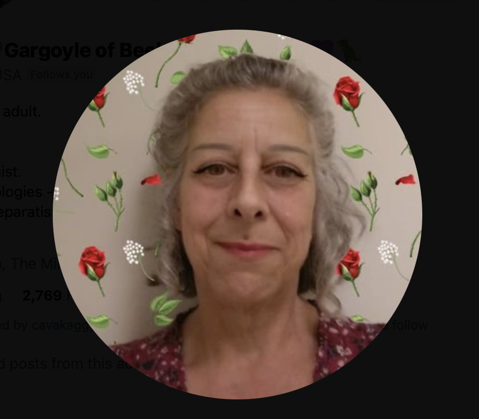
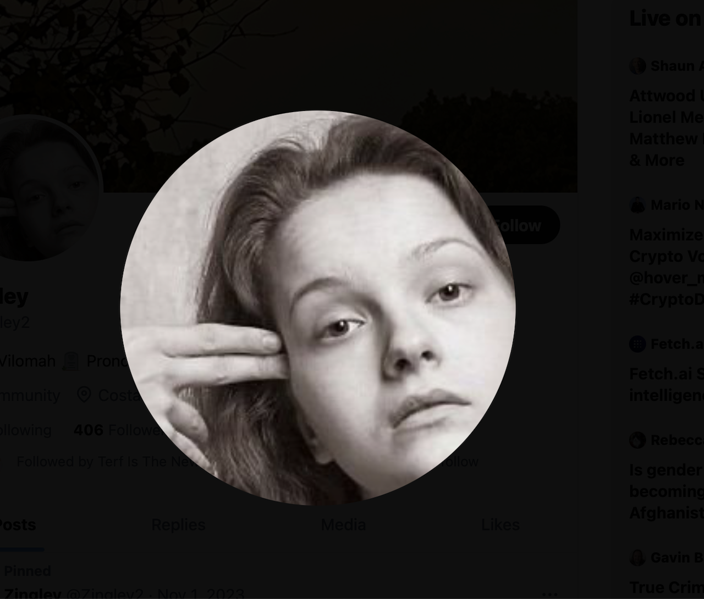
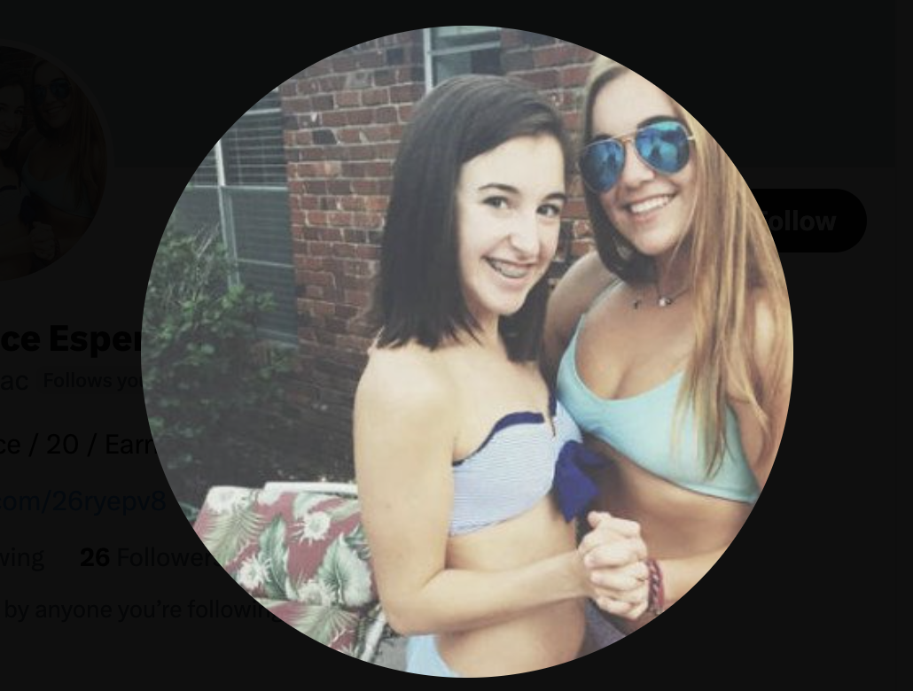
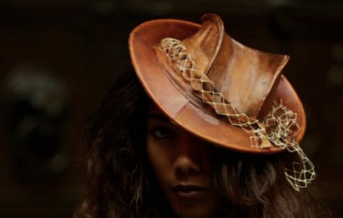

## First class of January

- After Christmas break, Domingo tells me he has "decided" everything is OK and we can continue with classes.
- I'm horrified by his blase demeanor after everything that has happened and I request a new teacher from the management.

!!! warning
    - You can find a list of current teachers and staff on the [conservatory website](https://portal.edu.gva.es/conservatoridenia/es/inici/).
    - The Generalitat Valenciana systems are so vulnerable to attack that it is possible that names are incorrect or even false in the GV systems and/or websites.
    - As a taste of things to come, hackers created numerous fake Twitter accounts and sent them to me with pictures of all the conservatory teachers and staff of interest, often in their younger years. For example:
      
    An AI mix of the trumpet teacher and Gloria the conservatory receptionist, following me from September 2023.
     
    {width=35%}
      
    My piano teacher for year 4, young Paqui in a rather threatening pose, posted around March 2024 after threats to my life.
     
    {width=35%}
      
    An AI mix containing Domingo Lopez Cano posted around March 2024.
     
    {width=35%}
      
    A young Maria Hontanilla, posted around March 2024.
     
    {width=35%}
      
    The chamber music teacher from year 4, a lovely man, posted no doubt to cause unnecessary trouble, posted around March 2024.
     
    {width=35%}
      
    Ana the violin teacher in a modeling role for Finnish artist Julia Lohmann. A whole bunch of these pics were sent to me via the trumpet teacher's apparent account around June/July 2023 in order to convince me that Ana and the trumpet teacher were an item.
     
    
      
    - [Relevant tweet thread](https://x.com/1FRGVN/status/1846120069010473024).

## Joan Carles Poquet

- Joan Carles becomes my new piano teacher. He is quiet and respectful and I feel I can tell him everything that happened, which I do, including Domingo's inappropriate attitude and sexualization of teenage girls.
- I explained to Joan Carles that Domingo shouldn't ask students out for coffee. It's inappropriate and causes problems.
- I can hear myself being talked about throughout the conservatory.
- The rest of the academic year is uneventful except I feel a lot of negativity towards me at the conservatory.
- I love playing the piano however. It's a huge privilege and joy.

## Maria Hontanilla

- In September I start the second year of professional studies and Maria is my new teacher.
- I'm sick a lot this autumn.
- My studies are fine but I have other things on my mind.
- Mercedes begins with Domingo as her teacher and it is clear she was never particularly advanced on the piano.

## Statement to the Metropolitan police

- Since 2006, when I first reported child sexual abuse to the police, I had spent a lot of time thinking about what had happened to me in 1989, and over the years I had pieced together a fuller story.
- I take a full month to write a statement to the Metropolitan Police on my laptop and I send it to them via email.
- The statement was very detailed; names, addresses, car descriptions, and events such as being drugged and raped repeatedly.
- The process of writing this out re-traumatizes me. I have no emotional support. My family is uninterested and extremely unhelpful.
- The police arrange for me to make another video statement in London.
- They claim they have no records of my visit in 2006 but that seems unlikely.

