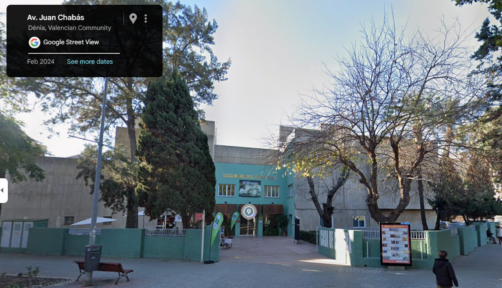
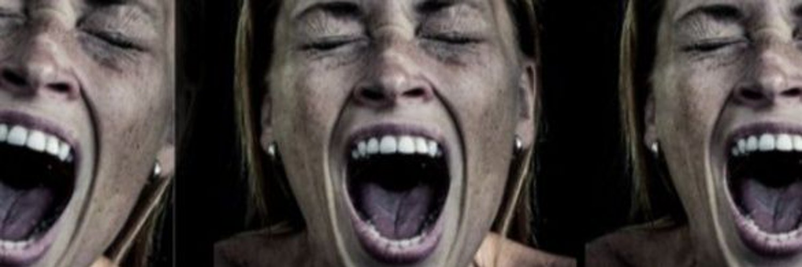
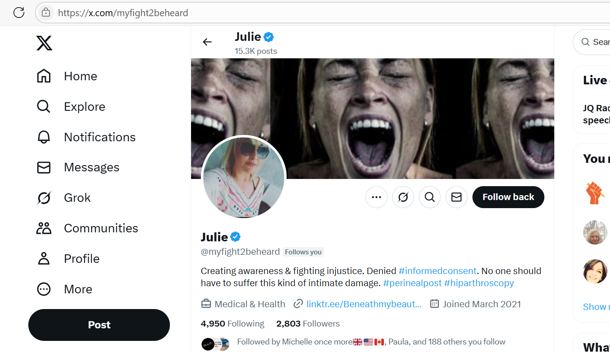
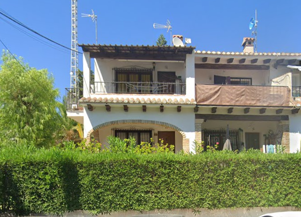
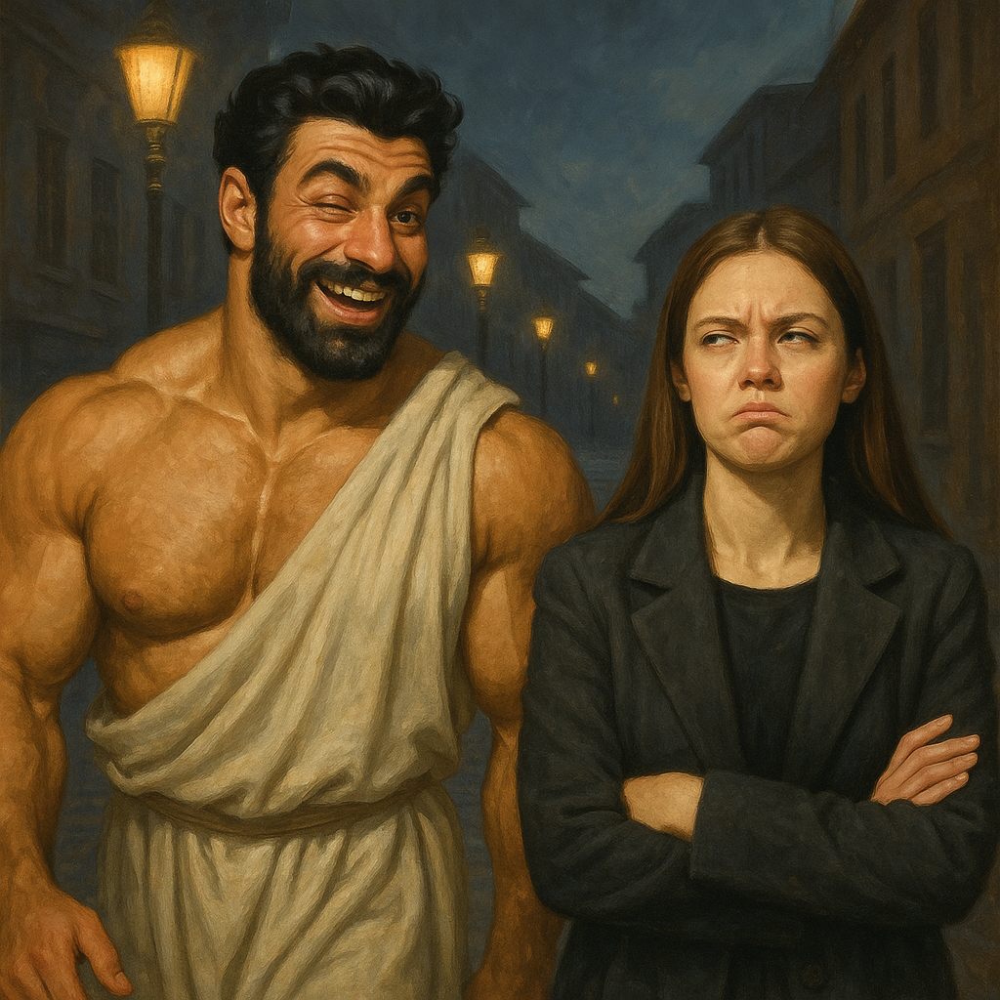

# 2015

## First class of January

- After Christmas break, Domingo tells me he has "decided" everything is OK and we can continue with classes.
- I'm horrified by his blase demeanor after everything that has happened and I request a new teacher from the management.
- This really *really* pisses him off.

## European concert trips

- Before I have finally had enough of him, he tries to persuade me to go on European capital city concert trips.
- He shows me some of the concerts he has in mind; in Austria, Germany, and Holland.
- He spoke about this often while we were *friends* of sorts.
- Interesting, isn't it.

## Domingo pretends he has another girlfriend

- The piano students, including myself, all go to listen to a piano performance at the [Dénia Centro Social](https://www.denia.com/en/centro-social/).
- I sit with Joan Carles and Paqui Fornet.
- Domingo arrives with a very loud woman who talks in a rough manner so that everyone can hear her.
- I later realize that this woman is a nurse, or medical professional, who works at the [Dénia medical centre in Carrer de Beniarmut](https://www.denia.com/en/centro-medico/) where I was signed up for care since 2022.
- I always saw her smoking outside, sometimes with the scanner technician, whenever I visited my doctor in 2023.

## Joan Carles

- Joan Carles becomes my new piano teacher until the end of term in June.
- He is quiet and respectful and I feel I can tell him everything that happened, which I do, including Domingo's inappropriate attitude and sexualization of teenage girls.
- Joan Carles listens, and says nothing.
- I explain to Joan Carles that Domingo shouldn't ask students out for coffee. It's inappropriate and causes problems.
- I can hear myself being talked about throughout the conservatory, and the word "coffee" is prevalent.
- The rest of the academic year is uneventful except I feel a lot of negativity towards me at the conservatory.
- I love playing the piano however. It's a huge privilege and joy. I try and put the weird stuff behind me.
- At the spring concert, I play [Bach invention in D minor](https://drive.google.com/file/d/1Trs8Nh-PmpUj0D7NT2JqxjEZITuMw1Zj/view?usp=drive_link).
- At the summer concert, I play, from memory [Granados Andaluz](https://drive.google.com/file/d/1fUYOFNUYwoI4sSeFwFud5XpisiUU47zl/view?usp=drive_link).
- I also play a mini-concert at the end of the year.

### End of year piano concert

- My dad visits and comes to the piano concert at the end of term.
- He cannot stay for the mini-concert I'm scheduled to play the following week.
- He *bumps into Domingo* in the toilet at the Casa de Cultura while we're all gathering to play at the concert, he tells me.

- He met Domingo in [December 2014](2014.md#trip-to-london) when we went to London together and stayed at my house.
- I ask him if Domingo said anything. 
- He says no.
- He did say he was washing his armpits as it was very hot and he had been sweating, and that was why he took so long in the toilet.

#### Colitis symptoms

- Right around the time my dad is visiting, I have a sudden reemergence of colitis symptoms one morning.
- I'm bleeding, profusely, big dark-red drops; there seems to be an anal fissure.
- I don't understand it.
- I never once considered sedated sexual violence involving my father.
- Could they have entered my apartment in Joan Fuster while my dad was visiting? 
- If so, I hope investigators will find the films broadcast on Denia TV or the various porn networks they're affiliated with.
- At the time, the injury to my anus is so inexplicable, I put it down to eating bread with my dad while he visits.
- Sometimes, eating wheat does make me bleed, but only a tiny bit usually.
- It's the only explanation I have.
- I hardly ever eat bread because of my sensitive digestive system with is prone to autoimmune diseases having had a horrible year of colitis only two-and-a-half years before.
- It heals quickly after dad leaves.
- If Domingo approached my father in the toilet at the Casa de Cultura and scheduled a rape-porn meet up which then took place, a lot of my future years make more sense.
- Would he have said something like, "we've been doing it for years, she doesn't have a clue, she'll never ever know?"
- Does he put it like this: "Haven't you always wanted to rape your daughter?"
- Did he show him some examples he carries around with him for sales purposes?
- Does every sexual deviant go ahead?
- This puts my [mother's panic attack the following year at the Hotel Costa Blanca](2016.md#april) in a completely different light.
- It also puts my decent into a suicidal depression in 2016 into a different light; something I related to sedated sex offending but from 1989 given I had no suspicions about my life in Dénia in 2015.

## Viktor

- A man called Viktor takes our musical language class from September.
- Mercedes and I are in the same class, with a couple of youngsters.
- One of those youngsters was a Russian girl who, from some of the things she said to me, seemed to have information about what had been going on with me and Domingo.
- Viktor is a very nice man; good-looking too.
- I often see him with Domingo.
- He was at the [concert with the nurse](#domingo-pretends-he-has-another-girlfriend) sitting next to Domingo.
- In July 2025, I suddenly realize I did not see him at all at the conservatory over the last years, and I find myself concerned for his safety and wellness.

## Nati de Prati yoga

- I go to yoga classes with a lovely woman called Natalia. She's from Argentina.
- There's a couple of other teachers giving classes at her school; a long dark haired pale woman, and short stocky blond woman.
- Domingo knows Natalia and behaves as if he is playing us off against each other. 
- It's ridiculous. He obviously thinks we're idiots.
- He shows me pictures he has of her in yoga poses in his flat; the [apartment with the Royal Daulton he's planning on stealing](2014.md#i-visit-domingos-house).
- It looks like Natalia is unaware she is being photographed.
- She is an excellent ashtanga yoga teacher and she trained in London with senior teacher Hamish.
- [Ana the violin teacher](../../crimes/protagonists/domingo-et-al.md#ana-requena) goes to her classes too.
- At some point during the year, she closes her yoga school. It's all very sudden and she's only been open for a short time. It doesn't really make sense and she is not teaching anywhere else.
- Her classes were perfect; really professional and in a great space.
- The other teachers that taught there were not as good as her.
- When I ask her what happened, from what she said she appeared to have no choice in the matter. I wonder if jealousy has played a role.
- I go to a different yoga class instead, in a different venue and run by one of the other women that worked in Natalia's yoga school; the long dark-haired woman. Natalia is not there.
- The long dark-haired woman looks like one of the women who are working with her now in 2025, and you can see her on the website. She is the one who doesn't have her back to the camera.
- Ana is floating around at the class, as is the [small man I see her with in 2024](../2024/may.md#climbing-the-montgo).
- A bunch of other Spanish people are at the class.
- The woman gives a Sivananda yoga class but ends in a ridiculous manner by playing strident and discordant notes on the harmonium during rest pose. 
- It's like a horror movie and I say so.
- When I mention it, everyone says, "Oh, we got used to it." They're lying of course.
- I realize now that they didn't want me there.
- At the time I did not know this was a staged choreography for my benefit.
- Looking back, I'm assuming this class was another "introduction agent" set up, en event that tourists and newcomers to the area might like to attend and be assessed for their handing over to porn gangs or whoever else might want to relieve them of their wealth.
- It's clear these people have been terrorizing women and children, with the sole intention of making money from them, for a very long time, and this explains their expertise in terrorizing me.
- I'm guessing they did not want me there because it was "crossing the threads"; i.e. I was already making money for the porn gangs while sedated in my apartment in Joan Fuster 11, and so I "belonged" to someone else.
- I go to another class with the other teacher from Natalia's original school. It is even worse in many ways.
- The teacher was an unpleasant little woman, short blond and gloomy, who always seemed to be a bit stoned and jeering at someone or something.
- I wondered if she had been jealous enough of Natalia to force her out.
- After one class with her, I was mentioning my sizeable belly in a lighthearted manner - I termed it my "bulk" - and she looked alarmed, scared even, when I put my hands over my belly. 
- She didn't know what I was referring to with this word. I wonder if she misunderstood my message to be referring to pregnancy?! And why she look so alarmed?
- Natalia offers no alternative classes at the time or I would have attended.
- When I look Natalia up in 2025, I see she is running a yoga school in the campo.
- She has had a son also, in the interim of about 10 years since I saw her last.
- While being hacked, I often see videos on her Facebook page get highlighted for me, and there is often a man I recognize in them.
- He looks like [one of the men on the beach](../2024/october.md#sunday-6th-october) I videoed.
- He also reminds me of [a man I met at the Vipasana ashram in December 2023](../2023/december.md#a-mutual-friend).
- Is he the father of her child?
- I see them often in a boat, and he is at the wheel with his back to the camera.
- I wonder if he is also one of the many men who were pretending they were the trumpet teacher online while terrorizing me; the one who kept talking about how he'd been in the Spanish Navy and was a sailor maybe?
- Someone posts a significant picture of what looks like Natalia screaming in a stolen account's profile while I'm drafting this police statement.

- When I think about how they manipulated online me to want a child, and to even expect that this was something that was definitely going to happen, over the summer of 2024 while drugging me at the same time, I have to wonder about what happened to Natalia given she was in Domingo's and the porn gang introduction agents' clutches when I first knew her.
- I notice at her [yoga school](https://www.natideprati.com/) they are doing [micro-dosing events](https://www.natideprati.com/event-details/microdosis-y-gong-viernes-20-19-00h) with psychoactive substances, and I also saw events related to [sexual practices](https://www.natideprati.com/event-details/conchastelaciones-2).
- Has she become yet another introduction agent, with or without much choice in the matter?
- Friendly hackers informed me that she indeed suffered something like my experience online and in the town.
- Did they manipulate her to have a child?
- If so, why?
- Is she required to tell someone about all new students that might want to join classes with her? Or is all the marketing, photography, and administration already managed by the porn gang business infrastructure?
- Who lured her to the town, I wonder, and how?

## Kailash

- I circumambulate Kailash this year.
- As we're walking through the sky burial area, I hear a voice say "Katie", the name I commonly used at that time.
- I tell my traveling-companions what I heard.
- They all say things like, *oh I'm always hearing my name*, which was quite nice.
- The voice was very friendly, very welcoming, masculine.

## Vipasana Maria

- I'm so disappointed with the yoga offerings in the town, I search for someone practicing meditation.
- I find a woman who is an adherent to Goenkaji's practices, the same meditation I do.
- She lives at 16 Calle Deneb in the top flat.

- She is very unwell. It looks like she has liver disease. Her stomach around her liver is swollen and distended.
- I ask her about it.
- She is extremely anxious about her health. It's clear something is very wrong indeed.
- She says she has been to the doctor numerous times, and has had countless hospital appointments in Valencia, and they always tell her nothing is wrong.
- I don't understand it.
- She gets irrationally angry at times.
- She signs my [statement to the Metropolitan police](#statement-to-the-metropolitan-police) as a witness in person and I send it by post to London.
- Was Maria being poisoned?
- I meet someone who knows her during my intense drugging and harassment period over [Christmas 2023 at Vipasana meditation near Madrid](../2023/december.md#a-mutual-friend) that culminates in my [other "friend" poisoning me](../2023/december.md#madrid) to shut it all down, temporarily of course.
- Could this man be the same man who may have [fathered a child with Natalia](#nati-de-prati-yoga)? Although I'm guessing that was [the deep-set man I've described as being one of the trumpet teachers](../../crimes/protagonists/vidal-sastre.md#dark-thick-curly-haired-deep-set-man), a man who has possibly fathered 100s of children in the region.
- Did Maria recover? Or did they want to take her apartment from her?

## Horror novel AntiChrist by Jack Chardwood

- Domingo the piano teacher's outrageous behavior inspires me to write a horror novel.
- Most of this book is my attempt at trying to make sense of how men can hate women so much. It is also my attempt at healing such lost people.
- I publish the book on Amazon in October. Click the image for more info.

[{width=50%}](https://www.amazon.com/AntiChrist-Jack-Chardwood-ebook/dp/B0167HVL2K/)

- Curiously, much of what I wrote in this novel parallels exactly what has happened.

## Greek man with a twitch, and Sylvie

- I start hanging out a little bit with a French woman who lives in Dénia.
- Her name is Sylvie and she worked for an estate agent on the Avenida Marquesat. I visited her there on a few occasions.
- Our relationship is ostensibly for a language interchange but we end up just speaking English.
- She introduces me to her friend, a Greek man. Dimitri or Andreas may have been his name.
- He may have been one of the [muscle men outside the tunnel](../2023/december.md#muscle-men-outside-the-tunnel) I saw in December 2023.
- Sylvia is suggestive about him, that he likes me maybe. I'm not interested.
- He's been bodybuilding.
- One evening he walks me home (unnecessarily) after the three of us were out somewhere.
- He blinks at me in a weird way the whole time.

- It's very strange.
- I'm reminded of a PTSD twitch after child sexual abuse that I may have mentioned to the police in 2006.
- If the Greek was "twitching" on purpose to upset me, like, perhaps, the people at [the meditation retreat may have been in December 2023](../2023/december.md#the-finnish-lady), then the question is how would he know about the twitch?
- It seems to me, the only way anyone could have known about this was if they had seen the child gang-rape porn from 1989 where, I have been led to believe, my eyes were twitching as the only possible way of expressing myself while sedated during a vicious and violent sexual attack by multiple men.
- Do events like this trigger me [going back to the police](#statement-to-the-metropolitan-police) with a fuller statement a month or so later?
- If so, it does seem to suggest Dénia criminals *already* had information that could jail pedophiles and decided that instead of making the world a better place, they would use the information to terrorize a victim of pedophile gangs even more.
- If true, the information and video clips must have come from the Smiths.
- I get angry with Sylvie for introducing me to this dickhead and I never see her again.
- I wonder where she is now.
- Is Sylvie [Silvia](../2023/february.md#silvia)? If so, is she safe and well?

## The child trafficker's instructions

- One evening I'm walking to the conservatory from my apartment in Joan Fuster.
- I head towards the town centre by walking through the small kind-of alleyway after passing over the train tracks.
- There is a group of men walking with two small children, a boy and a girl.
- The boy could be 4 or 5, the girl a little older.
- The men are young Spanish men.
- The scene is a little incongruous and then more so when I hear the main man telling the children in a loud and strict voice that they are going to meet a man and they have to call him uncle.
- A cold shudder runs up and down my body.
- Was this man another trumpet teacher? 
- Looking back, he looked a bit like the Mark fellow from English class but it wasn't him because I would have recognized him.

## Frozen shoulder

- I start to suffer really badly with two frozen shoulders; it is really bad on the right side and I cannot move my arm without a lot of pain.
- I end up suffering with this, to a lesser and lesser degree, for about 6 years.
- I still have very little mobility in my shoulders as a consequence.
- Frozen shoulder can sometimes be considered an autoimmune problem, and can also be the result of side-effects from certain medications or substances.
- It could also have been a trauma reaction from being held down and raped sedated in my flat in Joan Fuster multiple times.

## Depression

- I start to become suicidally depressed around September 2015.
- I believe it was because I was being sedated and raped, and live-streamed throughout the town and on porn networks.
- I related it to an example of exactly the same thing, the child sexual abuse from 1989, and this sparked my [statement to the police](#statement-to-the-metropolitan-police).

## Maria Hontanilla

- In September I start the second year of professional studies and Maria is my new teacher. 
- I would have preferred to continue with Joan Carles but the decision has been made.
- I'm sick a lot this autumn with continuous colds and flu.
- My studies are fine but I have other things on my mind.
- Mercedes begins with Domingo as her teacher and it is clear she was never particularly advanced on the piano and doesn't even know how to pedal.

## Statement to the Metropolitan police

- Since 2006, when I first [reported child sexual abuse to the police](2006.md#reporting-child-sexual-abuse-to-the-metropolitan-police), I had spent a lot of time thinking about what had happened to me in 1989, and over the years I had pieced together a more complete picture.
- Domingo's behavior was so disturbing to me that I realized that I still had a lot of healing to do around personal boundaries, although it was clear the situation with Domingo had been very much out of my control.
- His behavior somewhat triggered my decision to return to the police and make a fuller statement. 
- Since 2006, there were hugely positive developments in terms of justice for sexual abuse survivors, see [Jimmy Savile](https://en.wikipedia.org/wiki/Jimmy_Savile), etc., and the police made it clear that sex-offense victims will be believed.
- I take a full month to write a statement to the Metropolitan Police on my laptop in my living room. When I'm done, on 1 November 2015, I send it to them via email.
- The statement is very detailed; names, addresses, car descriptions, and events such as being drugged and gang raped, and specifics which suggest I had been sedated on more than one ocassion in the presence of groups of black men.
- The process of writing this re-traumatizes me massively. I have no emotional support. My family is uninterested and extremely unhelpful.
- The police arrange for me to make another video statement in London.
- They claim, at that time, they have no records of my visit in 2006 but that seems unlikely.

!!! critical "Were Dénia hackers reading my police statement as I wrote it in 2015?"
    - From what I know now, I'm pretty certain the hackers who targeted me over the last years (2022-25) had access to my home network at the time I wrote this statement.
    - Words, phrases, and behaviors I detailed in the statement were re-enacted *exactly* by teachers at the conservatory as part of the terror they inflicted on me; clearly with the intention of triggering severe psychological and emotional distress.
    - It may be sensible to assume that, if the hackers were members of mass-voyeur porn gangs, the more sordid details of my statement would have interested them greatly.
    
