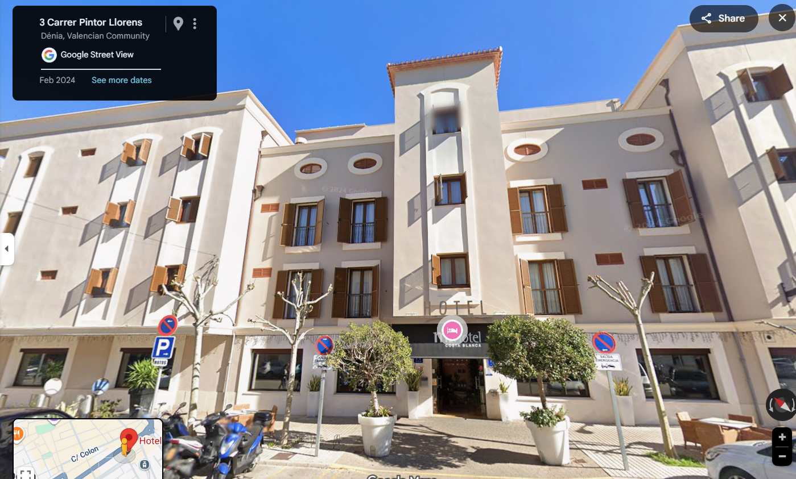
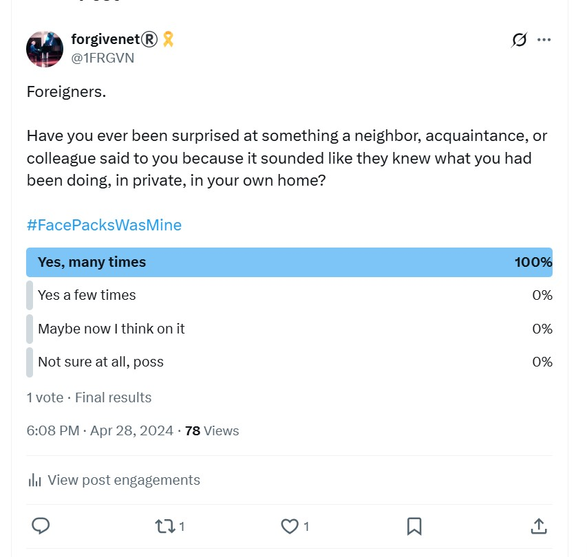

# 2016

## January

- I visit London and give a video interview with a Metropolitan police detective, Lauren Ott, and a female colleague of hers.
- It was difficult but ultimately an extremely positive experience. They believed me and I had hope for some justice.
- The process re-traumatized me, however, and put me on the road to a debilitating depression coupled with extreme anxiety from retriggered PTSD.
- My family were disinterested and said extraordinarily hurtful things to me.
- Unfortunately, the world tends to blame women for the vile acts of men.
- While I was in a deeply traumatized state, however, any time they said anything like this to me, it felt like a stab in the heart. They broke my heart, in fact, and eventually I had to get away from them to survive.
- These continuing experiences, that every rape victim will recognize, inspired a story: [Not all bus drivers](https://medium.com/@forgivenet/not-all-bus-drivers-5caf8f5fa083).

- The police carry out their investigation and, I believe, talk to everyone I mention in my statement.

!!! info "I wonder who spoke fairly of me to the police? Anyone?"
    - I do wonder sometimes how many of the people I mentioned in my initial statement; friends, parents of friends, etc, put the pedophile-pornographers first by saying despicable things about me.
    - Nothing would surprise me.

- They arrest without charge the main protagonist Winston M on the basis of my claims. He stays arrested for nearly 10 months while the police investigate.
- The man was already well known to the police and had been in prison more than once.
- Him, all his mates that I mentioned, and most certainly his main accomplice - a man whose name I never remembered but my friends at the time had met him - were likely police informants.
- I felt really hopeful about finally getting some justice and felt pretty sure there must have been more cases like mine.
- While all this is going on, I'm continuing with year 2 of professional piano studies at the conservatory in Dénia.

## March

- I am looking for work as a Java developer.
- I am either headhunted or apply for a job that comes up in Alicante.
- I am interviewed online by a man who explains that his company does scientific research into sexually transmitted diseases and they need a developer. However, I would be looking at genitals every day. 
- It's disappointing. I don't want to be looking at genitals every day.
- I tell Mercedes about this. She has been somewhat over-interested in my job hunting. I remark that the last thing I want to be doing every day is looking at genitals. She says something to the effect that I shouldn't be concerned and it's a job. I tell her it would make me feel a bit sick.
- A few days later, without warning, Mercedes asks me for the name of the company and even asks me to spell it for her. She takes out a pen and paper and writes down the name of the company. We are at the door of the conservatory when she does this.
- I wonder why this information is so important to her.
- The guy who interviewed me never contacts me again. I'm ghosted, although weirdly I believe I see him in Dénia a few days later.
- I believe at the time, and now, that Domingo is behind me losing a job opportunity like this. I assume that Mercedes probably phoned up the company and maligned me at Domingo's request.
- To back up that suspicion, Klara Sarkadi had previously told me that Mercedes had phoned her up at some point and put on a silly voice pretending she was someone else and asked her stupid questions.
- Now I'm not so sure about my initial suspicions. I believe instead that the man who interviewed me and Domingo knew each other. It seems more likely that Domingo simply instructed Mercedes point-by-point, to say this thing, and that thing, and she obeyed, so that I would assume she was maligning me behind my back.

!!! important "The trumpet teacher?"
    - I now believe the man I had the interview with is the same man who acted as trumpet teacher at the conservatory in 2022/23; a man who was able to get recruited as a teacher in a public school for the sole purpose of terrorizing and sexually grooming at least one student, probably more.

## April

- My parents visit me for a few days.
- They stay in the Hotel Costa Blanca.

- On one evening, they say mum is very tired and they'd like to go back to their hotel early.
- I think nothing of it.
- My mum gets sick during the night and goes to the emergency room in Dénia.
- Dad has decided I'm not to be told about it until the following day when they tell me over lunch in a weird way as if it is something secret.
- There's no good reason for them not to have told me at the time.
- He says he decided that it would be better for me if I was not told immediately.
- Perhaps I may have seen something suspicious if I'd been called round at the time it was happening?
- Given the [concerns I have about my father's previous visit in 2015](2015.md#end-of-year-piano-concert) and my [anal injury at that time](2015.md#inexplicable-anal-fissure), not forgetting my [inexplicable experience at the Hotel Costa Blanca in 2014](2014.md#) after my first piano class with Domingo Lopez Cano, I really have to be concerned about this now.
- My mother had become extremely anxious and shaking, her heart racing, and she was very scared because of her high blood pressure.
- She thought she was having a heart attack and they were both concerned enough to go to A&E in Dénia.
- Did the porn-gangs get the dose wrong, or was her whole body reacting to an unconscious experience, like so many other women have reacted over the decades?
- She went to the emergency room and they gave her a sedative and she was completely fine.
- In absence of a better explanation, she put it down to the two coffees she'd had.

!!! danger "Spiking willy-nilly in Dénia? Even all the way back then?"
    - I now wonder if she had also been somehow "medicated".
    - I remember [the night I had stayed there](2014.md#first-piano-class-at-the-end-end-of-september) after my first piano class with Domingo and how I felt like I had been spiked with drugs.
    - This was an early comment. I find my mental process of remembering all this contextually very interesting.

- Incidentally, the hotel manager was very angry about something, my parents told me, and I remembered he had been the same with me the year before.
- A further horrible memory was that the day after, we became tired in the afternoon after lunch and mum and I napped in my apartment, in my bed, while dad read the paper with the blinds drawn.
- Did I dream there were loads of people in the apartment and remark on it?

## May

### Evidence the town is surveilling me without my knowledge?

- I join an informal yoga class near to my house in Joan Fuster.
- One morning, I do a face-mask at home before yoga.
- When I go to the yoga class, one of the women says hi, points at her face, circles her finger around her face, and then points at me, and circles her finger around her face again, and says "very nice", and smiles weirdly.
- I'm really surprised. Her actions make me think she has seen me with my face-mask on but that's not possible.
- I think nothing more of it.
- In April 2024, I remember this incident and wonder if I have been under surveillance since 2016 or earlier.
- I tweet about it.

- At the time, and for a good while afterwards and during 2023, it seemed to me that if I had been hacked, it would have been from my laptop camera alone.
- A spy-cam installed apartment for rent was way out of the realms of possibility in my mind at that time and up until August 2024.
- The woman ran an English academy in the town and I was hoping to get some work from her.
- She asked for my CV, interrogated me on it, and during the interrogation I realized she had no work for me at all she was just nosey.
- I believe the academy is now called My English House, and Samuel's Venezuelan girlfriend works there.
- I spent some time with this woman for a short while. She told me she was cooking for an old man and was expecting to get something from him when he passed.

### Planning to leave

- I plan to leave Dénia and go traveling.
- I am starting to become depressed by everything that's happened with regards to the child sexual abuse and police action, and so I hope to get some relief and peace by attending fasting, yoga, meditation, and healing retreats in Asia.
- Maria, my piano teacher, seems desperate to convince me to stay. We have this discussion every class; about how I can stay, what job I can get.
- She says I can get a job at the Dénia hospital as a computer specialist and that she will organize it. 
- Domingo is obviously behind this.

## The British woman and her poisoned husband

- At the end of the 2nd year of piano studies, I play a mini-concert at the Dénia Club Nautico.
- A British woman comes to watch.
- She lives in Pedreguer with her husband.
- She is with another woman I know, who I now can't remember.
- She makes a fuss about how good I was.
- The woman behaves strangely, as if she has power over everyone. She's rather unpleasant.
- She has a hobby making dolls and adding them to dolls houses.
- I guess she wants me to think this is sinister.
- She says she's a witch repeatedly, but offers no more information.
- I know a lot of witches, in Glastonbury and beyond, so it's not a big deal to me.
- She arranges a Chinese dinner and brings her husband the next time we go out.
- The woman from Pedreguer's husband looks extremely unwell.
- He had lung cancer (or some other cancer) and had been treated for it in the hospital and even though he's only 60 he looks about 100.
- He is yellow and losing his hair. He cannot walk without sticks.
- We all assume it is the cancer treatment, but he complains he's not getting better, he's getting worse.
- She says she is poisoning him.
- He confirms this.
- I think they are both joking.

## Leaving Dénia

- I clear out my flat in June before leaving Spain.
- I'm in a bit of a quandary about the piano. I'm not sure what to do with it.
- I ask Maria, my piano teacher, if she can help.
- She says she'll ask around.
- She tells me one of her other students parents will take it.
- She also tells me they can get me a job at the hospital again in the tech department, and I say no, I'm not interested.
- I meet the parents and the children at the conservatory.
- The father is an extremely fat man.
- His two children are very small and the daughter plays in the end of term concert with me.
- The man comes to collect the piano one afternoon with a couple of dodgy looking blokes, one of whom I will see again in October 2023 [glaring at me from a parked car](../2023/october.md#the-gypsy-glares-menacingly-at-me).

### My guitar

- My brother bought me a guitar a few years back.
- He told me it was extra special, very expensive apparently.
- It had a short arm.
- I need to sell it because I have no room for it.
- I sell it to Concha for 250 euros.
- I will see it again in a guitar concert at the Centro Social in 2022; a surprise concert for Concha's brother who was retiring from the conservatory.

### The Scottish woman

- Just before I leave Spain, there's a [Buddhist conference in La Sella](https://www.facebook.com/permalink.php/?story_fbid=459388790933183&id=259562020915862).
- The main lamas have traveled over from India so I'd like to attend.
- Once I leave my apartment in Joan Fuster, I arrange AirBNB accommodation close to the Buddhist temple for the duration of the conference.
- I'm sharing an apartment with a Scottish woman, the host.
- She was born and raised in Stranraer.
- I remember vividly; my genital boils were off the scale and draining explosively every day.
- The woman, very interestingly, had chronic cystitis which no-one could do anything about.
- She felt she was getting fobbed off by her GP.
- I have to wonder about that now... especially considering this woman was very pally with [Zoe BJ](2008.md#zoe-bj).
- Zoe BJ even mentioned her as being a great mate when [I met her in 2022](../2022/june.md#meeting-zoe-and-marie-while-walking): *we hang out all the time*, she said.
- The woman had also "set up" a charity of some sort and I saw photos of her events.
- I noticed Marie Fielding was attending one of them.
- When I say "events" I mean like a coffee morning for a handful of middle-aged ex-pat women.
- I was instantly reminded of [Hazel and Sandra Smith](2007.md#hazel-smith) cos something felt really bogus to me.
- She kept saying, *I'm so happy I started the charity, it's really changed everything for me*.
- But it was never entirely clear what the charity was for and how on earth she could be benefitting from it financially, which was the implication.
- Maybe second-hand toys and books for children, or something.
- I even gave her a donation.
- You see where I'm going with this, of course.

## Asia

- I attend yoga and meditation retreats in India, Thailand, and Myanmar.
- I'm full of anguish about everything that's happened and I don't feel like I'm getting any better.
- While in Kerala, at an ayurvedic retreat, I see a UK documentary about a woman police officer returning to work after a career break. She was wearing a secret camera to report on the outrageous things going on in the police service.
- In one scene, a fellow officer shows her some porn on his mobile phone. It is a woman in a field with horses. The two male officers are laughing.
- I find this commonplace attitude to serious crimes against women utterly horrific.
- When I get onto Twitter in 2021, and connect with the women's movement, I tweet about this: https://x.com/1FRGVN/status/1444576152086097925.
- You can see the documentary here: https://www.youtube.com/watch?app=desktop&v=jOlnhjDX30E&t=755s.

### Thailand

- I stay at a hotel alongside Lupini Park, the Dusit Thani I believe. 
- It's all in my Hotels.com history and my credit card references, as you know.
- I am becoming severely depressed and, in retrospect, the intensity of my feelings are a little bit inexplicable, although I'm explaining it to myself as being to do with the 1989 Jamaican rape-gang business that I have recently gone back to the police about, and Winston May is arrested on the basis of my statement.
- Is it possible that the gangs could have tailored my hotel stays to places they use to sedate, rape, and film women?
- Would they have wanted me anxious and stressed, suicidal? Did that suit them?
- I mention this hotel because no-one was there, I felt constantly threatened, and I had a dream about a Thai woman shouting "nay nay nay nay nay", as if something really bad was happening to her without her consent.
- I had just got back from a stay in Koh Chang at a healing retreat centre there.
- The daughter of a famous Jamaican politician was there at the same time. 
- I look her up and there is some online funny business with the result I find about her.
- She tries to make a pass, I believe.
- Was I getting famous in porn already?
- I feel like I'm having to make enormous efforts to remain centred, and I'm not doing very well at that at all.

## End of October, early November 

- The Crown Prosecution Service changes the charging criteria for rape.
- I speak to Lauren when I'm in Bangalore in India and she tells me they're not charging the man they've arrested, Winston May.
- Incidentally, Theresa May was visiting the same hotel while I was there.
- I didn't see her.
- I rather liked Theresa May.
- Anyway, this is besides the point entirely.
- I'm devastated by the call with Lauren and I very quickly slip into a more serious depression.
- I'm feeling constantly suicidal.
- My next stop is Myanmar where I plan to do a lot of Buddhist meditation and clear my mind of all this torment.
- I fail miserably at meditation; a story in itself.
- I've run out of options.
- I call my dad and tell him I can't stop thinking about killing myself.
- He cries.
- I suddenly feel like I have one friend in the world.
- I go home to London.
- My dad is very supportive.
- On more than one occasion he says it's all his fault.
- I assume he is talking about the big picture.
- While dad is supportive and kind to me, my mother and brother are not at all.
- They say and do things that feel like they are stabbing me in the heart.
- At times it feels like they would rather like me to kill myself.
- My GP in London puts me on medication and the suicidal thoughts stop instantly. It's quite amazing.
- However, I put on about 1.5 stone in 2 weeks and feel lethargic and unwell.
- While I'm at home over the next few years, my dad and brother meet at night at the front door and, while I'm trying to get to sleep, they talk loudly and self-righteously about their far left views.
- It's intolerable.
- The suicidal ideation creeps back in.
