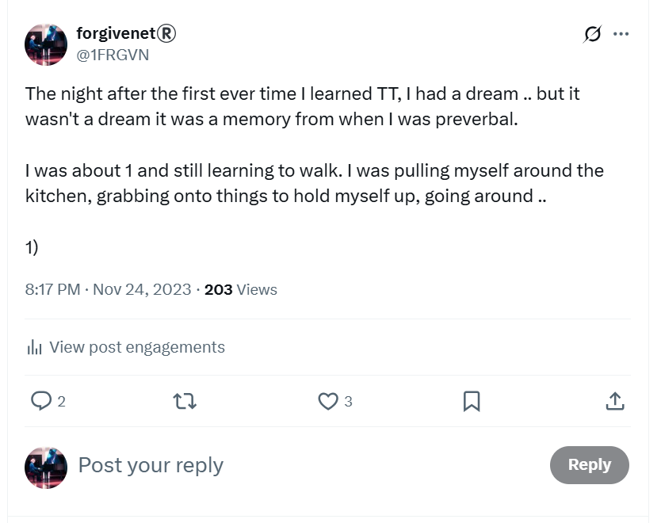

# The in-between years

## January 2017

- I change the medication in an attempt to stop putting on weight.
- I start feeling extraordinarily anxious.
- My mother offers me some valium.
- It works.

## Rape crisis Hornsey

- The Metropolitan Police refer me to the Rape Crisis centre in Hornsey.
- I'm on the waiting list for a therapist. I'm told it could take over year to get to the front of the queue.
- In the meantime, I attend group therapy.
- It may be the first session I attend. As I'm approaching the Rape Crisis building a man circles me on a bicycle. It is Winston M's accomplice from 1989. The man I could never remember the name of.
- He is extremely skinny. His legs are like sticks. He looks unwell; like he has been doing hard drugs for decades. I am in no doubt about who he is.
- I take my place in the circle.
- As we begin, the facilitator says to the group of women "just be aware that there could be a police officer here today".
- I tell the group what happened and who I saw, and how it made me feel, which was very anxious. I'm hyperventilating a little.
- One of the women at this session does not return for any other sessions.
- I can only explain this as an impromptu line up, and I most certainly pointed out the true perp.

## April 2017

- I stop taking the prescription medication but continue taking valium.
- I wonder about the true source of this medication and whether criminal gangs familiar to this story might have something to do with its distribution via Royal Mail.

## July 2017

- I apply for the Metropolitan Police. I was so impressed by the women that interviewed me this time around, I want to be just like them.
- I pass the first interview.
- I'm called for the physical but I know I'll fail because of the valium so I don't go.

## July 2017 to January 2019

- I've become completely dependent on valium. I cannot go to work and be around people without it due to the anxiety I'm suffering.
- I am trying to micro-dose as much as possible but I need it every day.
- It is valium bought online so I'm not even sure what it is exactly.
- My family is impossible to live with.

## September 2018

### Hired for sport, again

- I start contracting for a company called Adaptive in the city on Tuesday 28th August after the late summer bank holiday.
- I interview really well, splendidly, the job sounds amazing, I'm going to be doing so much interesting work, the day rate is fantastic, everyone is so nice, I'm delighted.
- The first day, the persecution begins.
- It's my first morning in the office and I'm being introduced to everyone.
- Harsha, a close colleague, has not even said hello or introduced himself yet.
- He looks at me in an unfriendly way, and he rubs his chin and shakes his head a little, making an expression that says very clearly: *I have no faith in you*.
- From that moment, I'm the target for bullying, from all sides.
- An hour has not yet gone by in my new role. 
- Even the *very few* women, mostly admin staff, are tasked with mucking in.
- Harsha is very keen to interrogate me about my PhD and becomes triumphant when he knows more about my subject than I do.
- The thing is, I cannot respond to this sort of aggression, not then and not now.
- Curiously, I was cyber-stalked by X accounts with that theme during the online oppression from September 2023.
- *I'm beginning to wonder about your PhD*, said one.
- It seems that many of those fake accounts that harassed me during this time - and while I was regularly sedated, drugged, and poisoned in my own home - were tech colleagues and the tech-bro pornocracy in general.
- At the Adaptive office, I go quiet, trying to figure out what to do.
- I know if I complain, they'll fire me.
- I'm seriously unhappy in this role.
- I'm pretty much made a secretary again too. It wouldn't be so bad if they were nice about it, but something else was going on.
- One day I'm working from home and I'm requested to attend a meeting in which I'm TOTALLY ignored for two hours. 
- My brother comes down and says, "made you a secretary again have they?" ... and that is also quite curious.
- The reason I say that is because at that time, and for many years, my brother utterly despised me and rarely spoke to me at all.
- This hatred, curiously, began in Thailand and I wonder what really prompted it. You see, we had sort of become friends again in 2009 in Koh Samui, and any male support for an online tech-colleague porn-target would have needed to be dealt with.
- I know he *met* a British man in Lamai who egged him into getting extraordinarily high every day and I had to go and rescue him with the Thai police.
- I wonder if that was to make sure I didn't have any male support.
- Back at Adaptive on one occasion they ask me what I think of Elon Musk.
- I tell them I think he's a bit of a dick, and everyone laughs.
- Anyway, I'm fired on the anniversary of a suicide attempt, November 6th or 7th. The very same day. 
- For no particular reason. 
- A couple of days before, the women go out for lunch together and make sure I see that I'm not included.
- At the time, I think that they've just decided they don't like me, and they seem to have made that decision the moment I walked through the door.
- I have no clue that this repeated pattern I experience in tech roles could be related to the criminal activities of the Cano Lopez's and Smith's in baby-rape capital of the world, Denia Spain where they even have a porn-school and thousands of missing persons presumed dead in a field up there.
- The tech-bro pornocracy probably don't care about that.
- No-one's gonna target their kids ... they think.
- Nevertheless, this firing is a psycho-emotional blow like no other, and I become immediately severely suicidal.
- I'm guessing this is exacerbated online too.
- Indeed, for a couple of years online I have been talking *a lot* about suicide-attempt anniversaries and how difficult they are.
- When I say that, I don't mean publicly either, I mean in private chats with friends or perhaps in personal writings.
- Suicide anniversaries were another *theme* that came up in 2023 and I can only assume this means a target's suicide is a desired end result.
- Perhaps they run polls to see what porn-subscribers would prefer to see and pay the most for? 
- Did my tech-colleagues want me to commit suicide? Were they hoping for that? Or did they prefer to see me running around a field naked after a horse?
- I actually try to find a way to take Adaptive to court but it's pretty impossible as a limited company contractor.
- I attend a CAB consultation, I open a case with the government employment service, I write to my professional organization the IEEE who ignore me, of course; there's a bunch of documentation all over the place on this.
- I do a 7-day fast and detox at Sura Detox in Devon which may have been life saving.
- Nevertheless, my mind is on a suicide-loop, and the Valium is now exacerbating this, except I'm hopelessly addicted to it.

## January 2019

- An old friend Willow comes round, I wonder what prompted her to visit, it was not a good time.
- I don't want to talk to her and I tell everyone at home that.
- My mother is very keen I talk to her and badgers me to do so.
- I go to talk to her.
- Seeing Willow who was around during the rape-gang times in 1989 is very triggering for me and I wish people would have listened to me when I told them I did not want to see her.
- Shortly after, no doubt with more online triggering, I take an overdose of valium and end up in A&E.
- The drug nurse meets me the next morning and puts me into the drug rehabilitation system.
- I quit valium and alcohol immediately.
- I find out valium isn't a drug you can die from later on. I'm much relieved about that.

## February to June 2019

- I'm working 3 days a week at a crypto firm [FetchAI](#fetchai) and going to outpatient rehab the other days in Finchley Central.
- Rehab is an AMAZING experience and incredibly helpful. Lifesaving.
- I see a psychotherapist once a week at Barnet Hospital.
- I'm healing.
- I realize I have to get away from my family if I want to really heal.
- I make plans to move to Ireland. I'm choosing Ireland because I have connected with a trauma therapist who is going to be giving courses there from February 2020.
- I'm still feeling suicidally depressed and anxious but less so, and I'm not using any medication or drinking alcohol.

### Fetch.AI

- The crypto firm I work with is Fetch.AI in Cambridge.
- One of the developers does something extremely weird while I'm there.
- We have an online meeting set up first thing.
- I turn up and put my zoom on.
- His camera is under his desk pointing to his crotch.
- He is sitting at his desk in his boxer shorts.
- I ask him what's going on.
- He fixes his camera.
- He doesn't apologize or explain.
- I laugh it off, as we women do knowing we can't really complain because it's just too much trouble and we need to work.
- Furthermore, I am a contractor so I cannot make an official complaint about sexual harassment anyway.
- Was this man connected up to online porn-addict communities and did he know who I was from the [porn fatwa](../early-years/2003.md#porn-fatwa) now getting out of control?
- Did he upload that morning meeting to the tech-bro porn-networks?
- James Dawes and his team [use the word "Fetch" over and over in their October 2024](../2024/october.md#bullying-at-polygon) meeting at Polygon in 2024, which I believe was specifically done to terrorize and persecute me, with management's awareness and complicity in the bigger story.

## October 2019

- I leave London.
- I have limited communication with my parents, none with my brother.

## The forgivenet®

- I build and deploy the [forgivenet® crypto app](https://1frgvn.com/).

## 2020

- I live in Belfast and I have a lot of work, even during Covid.
- I work to distract myself. I work three jobs sometimes.
- I don’t like Belfast. I find it a very harsh environment. I was targeted by criminal gangs [the moment I arrived](#targeted-by-online-scammers), which set the tone for me.
- I start volunteering with Childline and find out about trans ideology and the sterilization and mutilation of children.
- I am utterly horrified!
- I realize that if I had been born 30 years later, I would have sought comfort in trans ideology and the belief I didn’t have to be female anymore after serious and repeated sexual abuse.
- I'm only onsite at Childline in Belfast for a short while before we have another covid lockdown and the NSPCC set up their systems so we can all work from home.
- I end up volunteering for Childline online from home for about 2.5 years.
- Criminal gangs of Dénia and North London attend every single counselling session I work.
- I tentatively join Twitter at one point in 2021 to keep up with the news around what's happening to children in the UK, but I get scared and delete my account.

### Targeted by online scammers

- I quickly fall into the clutches of an extraordinarily unpleasant company Key 1 Properties who I book a flat to stay in for two weeks in December 2019 while I'm looking for permanent accommodation.
- I book or find them through Hotels.com. 
- I end up having to pay them directly, I think, which is why their scam is successful.
- I wonder if I'm lured online to this result or if it's just bad luck.
- The property is an upstairs apartment on Ravenhill Court and may have been the scene of a horrific violent murder in the past.
- As I drive up, I see a black male coming out of the front door. I see him again on the street when I look out of the window later on.
- There is a bottle of whisky in the kitchen cupboard and the house stinks of smoke.
- The apartment has security cameras all over it. I only knew this in retrospect when I bought some myself and realized what these strange items were on the kitchen surface and bedside table.
- I'm very uneasy, I have a terrible night in dread and fear, a living nightmare, and I leave the following morning.
- My car was keyed while parked outside that night.
- The company insists they will not refund me and, although I do get most of my money back as I paid by credit card, I attempt to take them to small claims but they bully and threaten me so much I give up.
- When I research them, I find out that they are very likely a criminal gang.
- This is the first moment I feel like I have ants all over me and I cannot get them off.
- I will feel this way until August 14th 2025.

### Transforming the experienced-based brain

- I begin my trauma therapy study and practice with Stephen Terrell from Austin Texas.
- When I was [on my knees in January 2019](#january-2019), I had prayed to Mary for help, and somehow I came across [Steve's website](https://www.austinattach.com/).
- I watched a few videos and listened to some lectures.

<iframe width="672" height="378" src="https://www.youtube.com/embed/MGkLEPmdkcE" title="Transforming The Experience Based Brain | Stephen Terrell" frameborder="0" allow="accelerometer; autoplay; clipboard-write; encrypted-media; gyroscope; picture-in-picture; web-share" referrerpolicy="strict-origin-when-cross-origin" allowfullscreen></iframe>

- Something resonated strongly.
- I noticed the picture of Bernadette behind his desk in his office.
- My intuition was telling me he could help me, and so I reached out to him.
- He said he wasn't able to take me on as a client as he was too busy, and in Texas, but instead he suggested I attend his courses and learn about the practice.
- I attend the first in-person course in Cork Ireland in February.

!!! tip "Visions past and future"
    - About 75 people, professional therapists and others, turned up for that first course in Cork.
    - At the end of the first day, Steve told us we may dream about him that night. He was joking of course.
    - I did dream of Steve that night. Well, his voice commented in the dream.
    - I had two visions, one of the past and one of the future.
    - In the first vision, I am pre-verbal, about 1 year old, and I'm practicing walking in the kitchen by hanging onto the cupboard and drawers and pulling myself around.
    - My aunt is looking after me and my cousin. I'm not sure where my mother is.
    - Suddenly, from behind, hands grab my throat and start to squeeze. I can't breath or speak and I'm terrified. I don't know who is behind me throttling me.
    - My aunt's voice says from behind, "Oh look, someone's throttling you Katie".
    - My cousin is going ballistic, screaming and crying.
    - I wake a little back in Cork, shocked and sweating. I fall back to sleep again.
    - It is my wedding day, except, I'm looking at myself through the eyes of the groom. 
    - We are outside. It is spring time and we are among a semi-circle of trees.
    - It's somewhere Mediterranean. Could it be Jerusalem?

    

    - It is a happy and joyous occasion.
    - I wake up.
    - God gave me a joyful and hopeful vision to ease the sudden realization that I had been silenced in the most appalling manner from nearly the beginning of my life. Ironically, I thought that the trumpet teacher was my betrothed, but I expect this was part of the NLP suggestion and online manipulation. 
    - Whoever my husband to be *is* in the vision, I am in his head looking out at myself.
    - Sometimes prophetic dreams do come true, and sometimes even in ways wondrously unimaginable by mere mortals.
    - I tweet about this dream in November 2023.

    

    - It's likely I'm being stalked online by my cousin Leah at that time, at the request of North London criminal-gang connections to Spain.

- I have been attending these courses around three times a year since 2020 and I am now a qualified practitioner.
- It is curious that I didn't see Steve in person again until just a few days after teachers and staff at the conservatory of Dénia set up my 'funeral' in the attempt to completely destroy me. 
- At that training, in [June 2023](../2023/june.md#ireland), I was utterly traumatized, completely shattered; everyone noticed. Yet, again, Steve's work brought me back to my center of resilience and strength.
- [TEB](https://www.austinattach.com/transforming-the-experience-based-brain/) has given me the support and strength I needed to survive the 3-year-long, criminally vicious attack on my physical, psychological, emotional, and sexual wellbeing that I suffered at the hands of the people of Dénia including teachers and staff at the conservatory.

## End of December 2020

- I move to Lourdes in France.
- I am working as a contractor and full time technical writer for web3 software companies.
- I'm still working multiple jobs to distract myself from depression.
