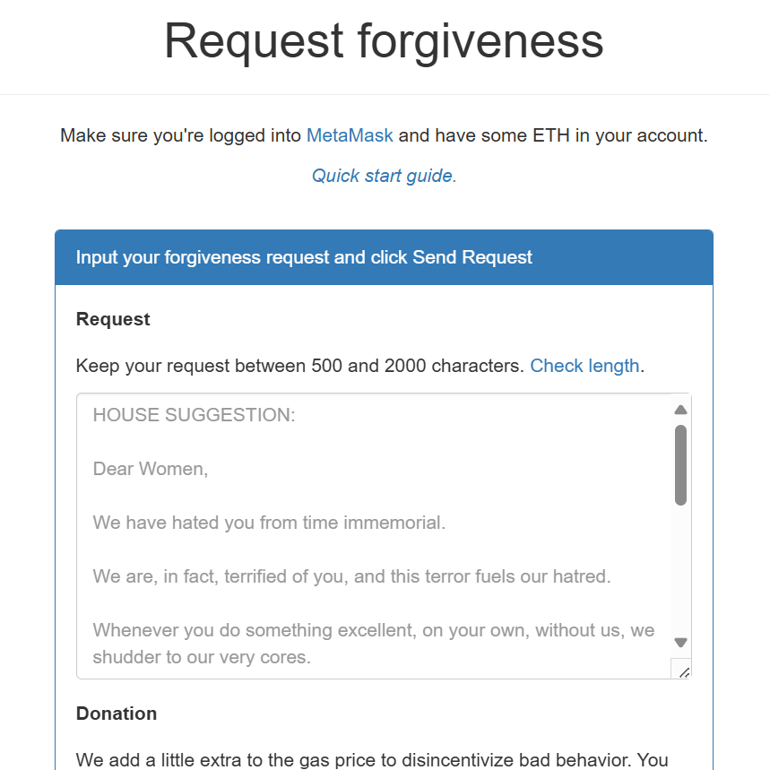

# The in-between years

## January 2017

- I change the medication in an attempt to stop putting on weight.
- I start feeling extraordinarily anxious.
- My mother offers me some valium.
- It works.

## Rape crisis Hornsey

- The Metropolitan Police refer me to the Rape Crisis centre in Hornsey.
- I'm on the waiting list for a therapist. I'm told it could take over year to get to the front of the queue.
- In the meantime, I attend group therapy.
- It may be the first session I attend. As I'm approaching the Rape Crisis building a man circles me on a bicycle. It is Winston M's accomplice from 1989. The man I could never remember the name of.
- He is extremely skinny. His legs are like sticks. He looks unwell; like he has been doing hard drugs for decades. I am in no doubt about who he is.
- I take my place in the circle.
- As we begin, the facilitator says to the group of women "just be aware that there could be a police officer here today".
- I tell the group what happened and who I saw, and how it made me feel, which was very anxious. I'm hyperventilating a little.
- One of the women at this session does not return for any other sessions.
- I can only explain this as an impromptu line up, and I most certainly pointed out the true perp.

## April 2017

- I stop taking the prescription medication but continue taking valium.
- I wonder about the true source of this medication and whether criminal gangs familiar to this story might have something to do with its distribution via Royal Mail.

## July 2017

- I apply for the Metropolitan Police. I was so impressed by the women that interviewed me this time around, I want to be just like them.
- I pass the first interview.
- I'm called for the physical but I know I'll fail because of the valium so I don't go.

## July 2017 to January 2019

- I've become completely dependent on valium. I cannot go to work and be around people without it due to the anxiety I'm suffering.
- I am trying to micro-dose as much as possible but I need it every day.
- It is valium bought online so I'm not even sure what it is exactly.
- My family is impossible to live with.

## September 2018

### Hired for sport, again

- I start contracting for a company called Adaptive in the city on Tuesday 28th August after the late summer bank holiday.
- I interview really well, splendidly, the job sounds amazing, I'm going to be doing so much interesting work, the day rate is fantastic, everyone is so nice, I'm delighted.
- The first day, the persecution begins.
- It's my first morning in the office, I've been there 10 minutes, and I'm being introduced to everyone.
- Harsha, a close colleague, has not even said hello or introduced himself yet.
- He looks at me in an unfriendly way, and he rubs his chin and shakes his head a little, making an expression that says very clearly: *I have no faith in you*.
- From that moment, I'm the target for bullying, from all sides.
- An hour has not yet gone by in my new role. 
- At lunch on the first day, the boss Olivier takes everyone out for lunch because that's how they welcome newcomers.
- Olivier pays for everyone's lunch, but not mine.
- Even the *very few* women, mostly admin staff, are tasked with mucking in.
- Harsha is unusually keen to interrogate me about my PhD and becomes triumphant when he knows more about my subject than I do.
- The thing is, I cannot respond to this sort of aggression.
- Curiously, I was cyber-stalked by X accounts with that theme during the online oppression from September 2023.
- *I'm beginning to wonder about your PhD*, said one.
- It seems that many of those fake accounts that harassed me during this time - and while I was regularly sedated, drugged, and poisoned in my own home - were tech colleagues and the tech-bro pornocracy in general.
- At the Adaptive office, I go quiet, trying to figure out what to do.
- I know if I complain, they'll fire me.
- I'm seriously unhappy in this role.
- I'm pretty much made a secretary again too. It wouldn't be so bad if they were nice about it, but something else was going on.
- One day I'm working from home and I'm requested to attend a meeting in which I'm TOTALLY ignored for two hours. 
- My brother comes down and says, "made you a secretary again have they?" ... and that is also quite curious.
- The reason I say that is because at that time, and for many years, my brother utterly despised me and rarely spoke to me at all.
- This hatred, curiously, began in Thailand and I wonder what really prompted it. You see, we had sort of become friends again in 2009 in Koh Samui, and any male support for an online tech-colleague porn-target would have to be dealt with.
- I know he *met* a British man in Lamai in 2010 (the year of [Jitendra Das](2010.md#why-i-decided-to-be-celibate-for-the-rest-of-my-life) and [Mike Wenham](../2024/march/13-end.md#mike-wenham)) who egged him into getting extraordinarily high every day and he had a sort of mini-breakdown and I had to go and rescue him with the Thai police.
- I wonder if the man who set my brother up with debilitating medication that Christmas in Lamai was the same man who [bared his teeth at me](../2024/december.md#man-bares-his-teeth-at-me) in the Spa Resorts restaurant at Christmas 2024.
- I guess they targeted my brother so assiduously in 2010 to ensure I have no male support.
- Did they keep an open channel of communication with him, that they could rely upon when and if necessary?
- Back at Adaptive on one occasion they ask me what I think of Elon Musk.
- I tell them I think he's a bit of a dick, and everyone laughs.
- Anyway, I'm fired on the anniversary of a suicide attempt, November 6th or 7th.
- The very same day. 
- For no particular reason. 
- A couple of days before, the women go out for lunch together and they make sure I see that I'm not included.
- At the time, I think that they've just decided they don't like me, and they seem to have made that decision the moment I walked through the door.
- It's utterly irrational though. Pure hatred.
- I have no clue that this repeated pattern I experience in tech roles could be related to the criminal activities of the Cano Lopez's and Smith's in baby-rape capital of the world, Dénia Spain where they now have a functioning porn-studio in a school, and where we're probably going to find thousands of missing persons, presumed dead, in a field up there.
- The tech-bro pornocracy probably don't care about that, especially those with a taste for the murder-porn.
- And no-one's ever gonna target their kids are they, or is that naive.
- Perhaps the porn-gangs do target the kids of the pornocracy, maybe for those valuable incest subscriptions; maybe even very famous kids ...
- Anyway, this firing is a psycho-emotional blow like no other, and I become immediately severely suicidal.
- I'm guessing this is exacerbated online too.
- Indeed, for a couple of years online I have been talking *a lot* about suicide-attempt anniversaries and how difficult they are.
- When I say that, I don't mean publicly either, I mean in private chats with friends or perhaps in personal writings, but mostly in Google searches and research and reading I might do online.
- Suicide anniversaries were another *theme* that came up in 2023 and I can only assume this means a female-tech-colleague porn-target's suicide is a desired end result.
- Perhaps they run polls to see what porn-subscribers would prefer to see happen to their favorite *stars*, and pay the most for? 
- Did my tech-colleagues want me to commit suicide? Were they hoping for that? Or did they prefer to see me running around a field naked after a horse?
- Would they have snickered?
- I actually try to find a way to take Adaptive to court but it's pretty impossible as a limited company contractor.
- I attend a CAB consultation, I open a case with the government employment service, I write to my professional organization the IEEE who ignore me, of course; there's a bunch of documentation all over the place on this.
- At the risk of endlessly and uselessly defending myself against people who loathe me and everything I do, I won't detail anymore of their professional-terrorism tactics.
- I do a 7-day fast and detox at Sura Detox in Devon which may have been life saving.
- Nevertheless, my mind is on a suicide-loop, and the Valium is now exacerbating this, except I'm hopelessly addicted to it.

!!! tip "Dark web live action games that target people to make them commit suicide"
    - I'm beginning to wonder what other forms of evil do porn-addicts get their boners from these days.
    - I keep thinking of British Jess at the Buddhist retreat centre near Avila at Christmas.
    - Was she a gone wrong porn-addict?

- Looking back, I believe two men may have had intentions of getting me into a sexual relationship at the office. The first man "popped up" on the first day and I just got this awful feeling from him. It had been planned he would sit with us but then he didn't. A couple of weeks later another guy joins, the web developer, and sits in front of me. I liked him, not romantically obviously, but he seemed like a cool guy. I just wonder about him now... or maybe they were hoping something would happen and then they'd bring him in. He never replied to my messages after I left.
- Also, Jo, another developer there was the husband of an Iyengar yoga teacher from Maida Vale, my yoga school. I wonder if he noticed what was going on for me?

## December 2018

- Heading off to France.
- I get a huge wad of cash for my trip ready.
- It's in the top of my handbag, I haven't closed my handbag.
- I'm using my phone, the camera is operational; anyone with a view of my hacked phone camera will see the wad of cash at the top of my handbag.
- I leave the house and walk to the car.
- A man is approaching me, he is walking in the road smiling at me, saying something weird.
- I don't like the look of him.
- Black hair, pale skin, medium build, a little overweight.
- He walks over to me and reaches out to put his hand in my bag.
- At that moment my neighbor Charlie comes out of his house (which I'm parked right outside).
- The man turns and leaves very quickly.
- He literally had his hand very nearly in my bag; as if he knew what was in there!
- I report this to the local community officer Jan.
- She says; oh he was probably just a bit drunk and being friendly!

## January 2019

- An old friend Willow comes round, I wonder what prompted her to visit, it was not a good time.
- I don't want to talk to her and I tell everyone at home that.
- My mother is very keen I talk to her and badgers me to do so.
- I go to talk to her.
- Seeing Willow who was around during the rape-gang times in 1989 is very triggering for me and I wish people would have listened to me when I told them I did not want to see her.
- Shortly after, no doubt with more online triggering, I take an overdose of valium and end up in A&E.
- The drug nurse meets me the next morning and puts me into the drug rehabilitation system.
- I quit valium and alcohol immediately.
- I find out valium isn't a drug you can die from later on. I'm much relieved about that.

## February to June 2019

### Drugs rehab in Finchley Central

- I'm working 3 days a week at a crypto firm [FetchAI](#fetchai) and going to outpatient rehab the other days in Finchley Central.
- A colleague exposes himself online on Zoom to me at FetchAI. I guess another female-tech-colleague-you-hate porn upload.
- Anyway.
- Rehab is an AMAZING experience and incredibly helpful. Lifesaving.
- I feel so safe there, like I have a whole new family.
- It's kind of inexplicable because, apart from me and a handful of others, the majority of service users are professional drug-addicted criminals.
- You'd think I'd be the least safe in an environment like this, but this is not what my body is telling me.
- In retrospect, I realize that none of these men could afford the kind of porn subscriptions my engineering tech colleagues have been paying for, so of course they won't have seen me regularly in porn, and for that reason, the energy they give me is cleaner and I feel safe with them.
- Perhaps they have suffered similarly too.
- Although, on a couple of occasions, in group therapy, one of the participants might make a comment which seems to suggest they know what I'm watching on Netflix at the time, or what I've read online recently.
- That could easily be a simple prompt from their drug dealer, I guess, and of course from the same criminal gangs that control the expensive subscriptions.
- I see a psychotherapist once a week at Barnet Hospital.
- I have no idea I've been continually sedated and raped for years in Spain, and this includes incest.
- I believe my mental and emotional state is entirely due to my experience of the rape gangs in Tottenham in 1989.
- I talk about that.
- And I'm healing.
- Something happens at home and I realize I have to get away from my family if I want to really heal.
- I make plans to move to Ireland.
- I'm choosing Ireland because I have connected with a trauma therapist who is going to be giving courses there from February 2020, Steve Terrell.
- I'm still feeling suicidally depressed and anxious, but less so, and I'm not using any medication or drinking alcohol.

### Fetch.AI

- The crypto firm I work with is Fetch.AI in Cambridge.
- One of the developers does something extremely weird while I'm there.
- We have an online meeting set up first thing.
- I turn up and put my zoom on.
- His camera is under his desk pointing to his crotch.
- He is sitting at his desk in his boxer shorts.
- I ask him what's going on.
- He fixes his camera.
- He doesn't apologize or explain.
- I laugh it off, as we women do knowing we can't really complain because it's just too much trouble and we need to work.
- Furthermore, I am a contractor so I cannot make an official complaint about sexual harassment anyway.
- Was this man connected up to online porn-addict communities and did he know who I was from the [porn fatwa](../early-years/2003.md#porn-fatwa) now getting out of control?
- Did he upload that morning meeting to the tech-bro porn-networks?
- James Dawes and his team [use the word "Fetch" over and over in their October 2024](../2024/october.md#bullying-at-polygon) meeting at Polygon in 2024, which I believe was specifically done to terrorize and persecute me, with management's awareness and complicity in the bigger story.

## October 2019

- I leave London.
- I have limited communication with my parents, none with my brother.

## The forgivenet®

- I build and deploy the [forgivenet® crypto app](https://1frgvn.com/).

