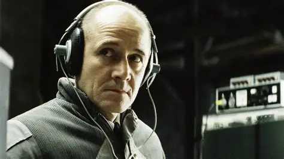

# 1989

## Sullivan

- It's January and we've just buried my aunt Geraldine.
- My mum has offered to feed everyone after the funeral.
- There are *hundreds* of people in our house that day.
- I'm upstairs hiding from it all.
- Dad meets a man called Sullivan; a man who works/had worked for Pan Am in a management role of some sort and knew Geraldine well.
- Dad recognizes him from something his sister Geraldine had told him in the past.
- She had told him that Sullivan brings the big black bag onto the plane at Heathrow, she takes it and keeps it in the office, he doesn't get on the plane, and it's picked up in New York.
- My dad remembers what his sister had told him as he's talking with this man Sullivan in our dining room - or maybe he remembered this detail after meeting the man.
- You can ask him about it.
- Dad told this story again and again, to everyone, and still does.
- He also always said that he *felt* an intense negative energy emanating from the man that made him firmly convinced that he had been involved; not cold, that was my mistake.
- Did he say he thought it felt like guilt?

!!! tip "The Lives of Others"
    - Did someone wearing headphones delay him, so it wouldn't end up like Air India... and he wasn't supposed to know, but he knew...

    

    - I met some families of the Air India disaster [the last time I saw guruji in Rishikesh](../2011-to-2020/2019.md#hanuman-puja-with-guruji-in-rishikesh) in October 2019.
    - We were chatting and they said they went to Cork every year when I told them I was due to go to Cork in February, so that's why they told me their story.
    - ...and then they went a bit quiet on me.
    - Incidentally, this film was one of [the first attempts at communicating](../2023/may.md#twitter) squirrel made, or perhaps one of the first that tried to warn me about the constant monitoring.

- Whenever dad tells anyone about this, he starts off with the energy-emanating part of the story before retelling what Geraldine had told him, as if this had been the bigger, more obvious thing in his mind.
- He told this story to so many people, I guess without realizing the implications of it, and then over the years he got lost in his overwhelming hatred... or perhaps was primed a little and it wouldn't have taken much.
