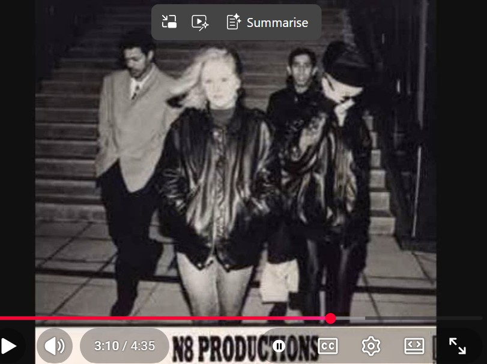

# 1990

## N8

- It is probably May or June.
- The previous summer, in 1989, I was targeted by North London's Jamaican rape-gangs based in Tottenham and elsewhere.
- I am suffering from PTSD. However, I have stopped smoking pot (which brought it on like a tidal wave) and instead I find some comfort and release in drinking alcohol.
- I am still hanging out with the friends who were around me the summer before when I was targeted; Geetha Singham, Willow Kail, Cathy Ayers, etc.
- These girls were not targeted like I was, although it is likely they ended up in porn without their knowledge.
- They bully me, I believe at the time, due to my PTSD symptoms which are obvious and easy to pick on.
- Prior to being targeted by Winston May in the summer of 1989, I was a happy-go-lucky little girl who had no clue about the world, drank alcohol with her friends, and smoked pot and giggled and got the munchies.
- Like the year before, most weekends we go up to Muswell Hill for a drink at the Swiss Chalet pub.
- I'm unaware that I star in numerous rape-porn films that have been flying around North London and elsewhere that have been seen by a whole bunch of people - it's interesting, I wonder how they did that, did they share VHS's around, lend them out to each other? I guess that's it.
- A lot of the adult men drinking at the Swiss Chalet will have been aware of this, if not happy viewers themselves.
- One Saturday night, we're standing outside in the front of the pub, and someone approaches us.
- It's Carl Brian, and we all know him somehow (I can't remember exactly how, just from going out at the weekend to house parties probably).
- Carl is a few years older than us.
- He's talking excitedly about his new band and how they're making a record and looking for a keyboard player.
- Geetha, Willow, and Cathy all pipe up: *oh Katie plays the piano, don't you Katie*.
- I said yes.
- And then they say, *and she raps too, don't you Katie*.
- (The men all called me Kate - I'm not sure why but I suspect it's a porn-name, Mad Kate maybe, something I mentioned in my [2015 statement to the Metropolitan Police](../2011-to-2020/2015.md#statement-to-the-metropolitan-police)).
- Carl seems to be amazed and delighted about this and says repeatedly, *wow Kate, we definitely need a rapper*.
- And he invited me to band practice the following week.
- This was like a miracle for me because I was so unhappy hanging around these girls who clearly despised me.
- It was a breath of fresh air in my life.

### Rapping

- Winston May was a rapper and he used to spend long periods rapping to me while I was high and coming down off something, or coming out of sedation.
- I would end up hoping he'd shut up soon.
- He'd do comedy routines as well, which were excruciating.
- I didn't say anything though.
- Instead, in true empath style, when I got out of his clutches, I started rapping in a similar style and my lyrics were coming from somewhere deep in my subconscious as they seemed to describe things I was unaware of, perhaps even a description of gang rape was in there.
- I didn't notice this for decades.
- At the time, I explained this capacity to mimic as the only way I could take back some control of a dangerous situation where I had zero control.
- The slave took control over the slave master by becoming him.
- I was very clear, even at the time, about that mental process being for healing and protection.
- So I had started rapping, writing lyrics, and I had told my friends about it too, and maybe gave some demonstrations.

### Carl Brian

- Carl is seeing Susana Shaw, she's a bit older than me, maybe by five years.
- She had been in a "relationship" with a body builder when she was younger and got sucked into the testosterone thing.. and would tell me stories about how they'd have sex on his car bonnet in the middle of a petrol station forecourt, things like that.
- I had no idea this was a *MASSIVE* abuse red flag at the time, or I had started to close up to anything that might trigger a PTSD reaction. It's not clear. I realized only in the last ten years how dodgy that all was.
- Anyway. Carl is seeing her, or he had been shagging her from time to time, and then they've split up and he hits on me, and we have sex one night at his house... and then he ghosts me.
- But we're still in the band and I see him every week two or three times a week for practice.
- And I just think he's a pillock.
- (Scrub actually).

### Chris Ludwick

- Carl's partner for the band he's calling N8 (the Hornsey post code) is Chris Ludwick and band practice is at Chris's house in Chris's bedroom in Inderwick Road, Hornsey.
- Chris is an even older man than Carl.
- Other people often come round for band practice; always adult male friends of Chris who aren't musicians or in the band in any capacity such as Dave Row, Joseph Malcolm, and Oliver who is in a band I saw on Facebook recently.
- There were others, I'll try and remember and add them.
- The room is often quite full of adult men, and me, for band practice.
- Susana was around a bit in the beginning because she was, apparently, a bit heartbroken about Carl and trying to get back with him.
- She may have fallen in love with me too - another story - which was a bit weird.
- Another rapper is there, David Paige, an older male with DJ name Delirious D.
- Sarah Bigmore pops in from time to time, she's the singer, but I'm usually the only female in the room.
- It's hard for me to be in a room with a bunch of adult men for long periods so I bring a drink with me to relax.
- I rarely speak.
- No-one knows what I'm thinking, I don't have an opinion about anything.
- Curiously, and I noticed this very starkly at the time, I'm the most trained musician in the room but they all talk to me as if I'm an infant and know nothing.
- I don't say anything.
- Chris Ludwick is very kind to me and we become firm friends.
- I trust him, for a very long time (that pathological thing again...).

### At Paige's house

- Paige lives in Woodgreen.
- One day I go over to Paige's to write some lyrics.
- We're in his bedroom.
- A significant memory from this afternoon is that Paige spoke about a woman we all know having had an experience... and the way he described it was as if he was describing what had happened to me with Winston May.
- This woman we all knew by sight, she was just a teenager also, but I think she was from Muswell Hill and fairly middle class.

### The record

- We make a record.
- It's all very exciting.
- I'm rapping on side A, and Sarah is singing on side B.
- They get hundreds printed out.
- We do some photo-shoots and gigs too.

#### Photo shoots

- A couple of blokes are hanging around a bit, I can't remember there names.
- They're marketers and band managers, we're told.
- We go out for a photo shoot one evening.
- Significantly, I am told to put my head down and my hand up to hide my face.

- I'm told it's because they're more interested in Sarah the singer who is in front.
- But it's more likely to be I'm already *that* famous and they're thinking they might get rich and famous with the band and it'd be dreadful if there was the world's best-known rape-victim in the pics..
- They must have stressed a little.. hopefully way more now. One would hope.

#### Gig in Piccadilly Circus

- The gig was in a function room at the Regent Palace Hotel one Saturday night in Piccadilly Circus (this will be 1991 now).
- The fee to rent this room would have bankrupted any one of us.
- Chris tells me the "managers" have organized it.
- I've just noticed its proximity to the sex clubs of Soho; known haunt of Winston May and Nikki.
- Anyway, very exciting.
- The whole of Hornsey and Muswell Hill seemed to be there, except there were no females apart from my "friends" there, which is weird I only just noticed.
- We performed our song.
- So Carl has a bit of a rap, then me, then Paige.
- Everyone's like wooo hey with Carl and we're all dancing...
- Then it's my turn, and I notice all the men just walk to the back of the stage and basically turn their backs on me. It was very noticeable and I had no idea why they would do that.
- Then its Paige's turn and everyone's like wooo hey and dancing on the stage like before again.
- Then Sarah performs her song.
- Is Sarah just like me? Sarah ended up addicted to crack. Chris used to tell me it was her dodgy boyfriend's fault...

#### And suddenly it's all weird...

- Just before Chris and Carl release the record, like on the day they print them, they decide to change the band's name from N8 to something else.
- There is no explanation for this.
- And that's it, the whole thing is over.
- I continue to see Chris over the years as friends and it may be interesting to look at some of those meetings a bit more closely.
- As in, do I star in sedated-rape-porn from multiple band practices?
- But most of all I wonder if all that *they-never-know* rape-porn-genre, support-content they delight in not only gave the horse-pornographers, murderers, and everyone and everything else that needs the Light shined on it false confidence, but also gave the entire male population of the world the go-ahead to sedate-and-rape the women, children, and babies.
