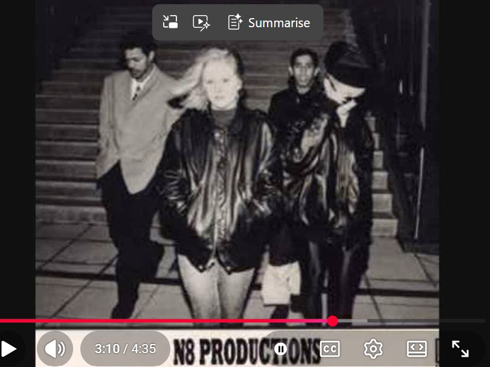
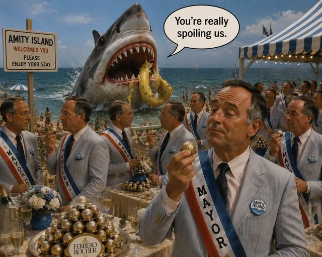

# 1990

## N8

- It is probably May or June.
- The previous summer, in 1989, I was targeted by North London's Jamaican rape-gangs based in Tottenham and elsewhere.
- I am suffering from PTSD. However, I have stopped smoking pot (which brought it on like a tidal wave) and instead I find some comfort and release in drinking alcohol.
- I am still hanging out with the friends who were around me the summer before when I was targeted; Geetha Singham, Willow Kail, Cathy Ayers, etc.
- It wasn't obvious if these girls were not targeted like I was, although it is likely they ended up in porn without their knowledge.
- Cathy Ayers has a new boyfriend, Robert Gale who lives in Archway, and they are together for ages.
- Robert Gale is "proudly" Winston May's cousin.
- The girls bully me, I believe at the time, due to my PTSD symptoms which are obvious and easy to pick on.
- Prior to being targeted by Winston May in the summer of 1989, I was a happy-go-lucky little girl who had no clue about the world, drank alcohol with her friends, and smoked pot and giggled and got the munchies.
- Like the year before, most weekends we go up to Muswell Hill for a drink at the Swiss Chalet pub.
- I'm unaware that I star in numerous rape-porn films that have been flying around North London and elsewhere that have been seen by a whole bunch of people - it's interesting, I wonder how they did that, did they share VHS's around, lend them out to each other? I guess that's it.
- A lot of the adult men drinking at the Swiss Chalet will have been aware of this, if not happy viewers themselves.
- One Saturday night, we're standing outside in the front of the pub, and someone approaches us.
- It's Carl Brian, and we all know him somehow (I can't remember exactly how, just from going out at the weekend to house parties probably).
- Carl is a few years older than us.
- He's talking excitedly about his new band and how they're making a record and looking for a keyboard player.
- Geetha, Willow, and Cathy all pipe up: *oh Katie plays the piano, don't you Katie*.
- I said yes.
- And then they say, *and she raps too, don't you Katie*.
- (The men all called me Kate - I'm not sure why but I suspect it's a porn-name, Mad Kate maybe, something I mentioned in my [2015 statement to the Metropolitan Police](../2011-to-2020/2015.md#statement-to-the-metropolitan-police)).
- Carl seems to be amazed and delighted about this and says repeatedly, *wow Kate, we definitely need a rapper*.
- And he invited me to band practice the following week.
- This was like a miracle for me because I was so unhappy hanging around these girls who clearly despised me.
- It was a breath of fresh air in my life.

### Rapping

- Winston May was a rapper and he used to spend long periods rapping to me while I was high and coming down off something, or coming out of sedation.
- I would end up hoping he'd shut up soon.
- He'd do comedy routines as well, which were excruciating.
- I didn't say anything though.
- Instead, in true empath style, when I got out of his clutches, I started rapping in a similar style and my lyrics were coming from somewhere deep in my subconscious as they seemed to describe things I was unaware of, perhaps even a description of gang rape was in there.
- I didn't notice this for decades.
- At the time, I explained this capacity to mimic as the only way I could take back some control of a dangerous situation where I had zero control.
- The slave took control over the slave master by becoming him.
- I was very clear, even at the time, about that mental process being for healing and protection.
- So I had started rapping, writing lyrics, and I had told my friends about it too, and maybe gave some demonstrations.

### Carl Brian

- Carl is seeing Susana Shaw, she's a bit older than me, maybe by five years.
- She's quite posh actually and lives with her family in a massive house in Muswell Hill.
- Incidentally, I will work with Susana's sister for a short time at the BBC in 1999.
- She had been in a "relationship" with a body builder when she was younger and got sucked into the testosterone thing.. and would tell me stories about how they'd have sex on his car bonnet in the middle of a petrol station forecourt, things like that.
- I had no idea this was a *MASSIVE* abuse red flag at the time, or I had started to close up to anything that might trigger a PTSD reaction. It's not clear. I realized only in the last ten years how dodgy that all was.
- Anyway. Carl is seeing her, or he had been shagging her from time to time, and then they've split up and he hits on me, and we have sex one night at his house... and then he ghosts me.
- But we're still in the band and I see him every week two or three times a week for practice.
- And I just think he's a pillock.
- (Scrub actually).
- At some point during the band madness - May 1990 to October 1991 I would say - Carl finds himself a steady girlfriend Caroline who seems to be stuck to him.

### Chris Ludwick

- Carl's partner for the band he's calling N8 (the Hornsey post code) is Chris Ludwick and band practice is at Chris's house in Chris's bedroom in Inderwick Road, Hornsey.
- Chris is an even older man than Carl.
- Other people often come round for band practice; always adult male friends of Chris who aren't musicians or in the band in any capacity such as Dave Row, Joseph Malcolm, and Oliver who is in a band I saw on Facebook recently.
- There were others, I'll try and remember and add them.
- The room is often quite full of adult men, and me, for band practice.
- Susana was around a bit in the beginning because she was, apparently, a bit heartbroken about Carl and trying to get back with him.
- She may have fallen in love with me too - another story - which was a bit weird. She used to call me her sister in a very intimate way and I didn't really understand it.
- Another rapper is there, David Paige, an older male with DJ name Delirious D.
- Sarah Bigmore pops in from time to time, she's the singer, but I'm usually the only female in the room.
- It's hard for me to be in a room with a bunch of adult men for long periods so I bring a drink with me to relax.
- I rarely speak.
- No-one knows what I'm thinking, I don't have an opinion about anything.
- Curiously, and I noticed this very starkly at the time, I'm the most trained musician in the room but they all talk to me as if I'm an infant and know nothing.
- I don't say anything.
- Chris Ludwick is very kind to me and we become firm friends.
- I trust him, for a very long time (that pathological thing again...).

### At Paige's house

- Paige lives in Woodgreen.
- One day I go over to Paige's to write some lyrics.
- We're in his bedroom.
- A significant memory from this afternoon is that Paige spoke about a woman we all know having had an experience... and the way he described it was as if he was describing what had happened to me with Winston May.
- This woman we all knew by sight, she was just a teenager also, but I think she was from Muswell Hill and fairly middle class.

### The record

- We make a record.
- It's all very exciting.
- I'm rapping on side A, and Sarah is singing on side B.
- They get hundreds printed out.
- We do some photo-shoots and gigs too.

#### Photo shoots

- A couple of blokes are hanging around a bit, I can't remember their names.
- They're marketers and band managers from Soho, we're told.
- We go out for a photo shoot one evening.
- Significantly, I am told to put my head down and my hand up to hide my face.

- I'm told it's because they're more interested in Sarah the singer who is in front.
- But it's more likely to be I'm already *that* famous and maybe they're thinking they might get rich and famous with the band and it'd be dreadful if there was the world's best-known rape-victim in the pics..
- They must have stressed a little.. hopefully way more now. One would hope.

#### Gig in Piccadilly Circus

- The gig was in a function room at the Regent Palace Hotel one Saturday night in Piccadilly Circus (this will be around October/November 1991 now I believe but I could have got the timings wrong a little).
- The fee to rent this room would have bankrupted any one of us.
- Chris tells me the "managers" have organized it.
- I've just noticed its proximity to the sex clubs of Soho; known haunt of Winston May and Nikki.
- Anyway, very exciting.
- The whole of Hornsey and Muswell Hill seemed to be there, except there were no females apart from my "friends" there, which is weird I only just noticed.
- We performed our song.
- So Carl has a bit of a rap, then me, then Paige.
- Everyone's like wooo hey with Carl and we're all dancing...
- Then it's my turn, and I notice all the men just walk to the back of the stage and basically turn their backs on me. It was very noticeable and I had no idea why they would do that.
- Then its Paige's turn and everyone's like wooo hey and dancing on the stage like before again.
- Then Sarah performs her song.
- Is Sarah just like me? Sarah ended up addicted to crack. Chris used to tell me it was her dodgy boyfriend's fault...
- Myself, Sarah, and my girlfriends (Geetha, Cathy, and Willow) were the only females at the gig. The sizable audience was male only.

#### And suddenly it's all weird...

- Just before Chris and Carl release the record, like on the day they print them, they decide to change the band's name from N8 to something else.
- There is no explanation for this.
- And that's it, the whole thing is over.
- The band is taking a break, they tell me.
- I continue to see Chris over the years as friends and it may be interesting to look at some of those meetings - especially one when he introduced me to his "mate" in Stevenage - a bit more closely.
- I expect I'm starring in sedated-rape-porn from multiple band practices?

### One last gig

- It's months later and I've not seen any of the band, and there's been no band practices, it's all finished, then Chris calls telling me the band has decided they've decided the band is going to be live musicians instead of recording artists.
- And there's a band practice, at Carl's house, are you coming?
- Sure.
- I do wonder because none of them really play an instrument but whatever.
- It's nice to have some friends.
- I take the bus to Hornsey, it's October/November 1992 I think. I'm sure I'm studying on year 2 of my degree course.
- I get off the bus at the bottom of the Archway Road and walk round to get the bus to Hornsey.
- As I'm walking round, two young men are behind me and one of them spits on me.
- When I get to Carl's I realize it was a massive greeny spit.
- I'm disgusted but also feel like why would someone spit on me like that.
- Everyone is there in Carl's bedroom and they have a bunch of keyboards set up around the bed.
- Also, the two "marketing" guys are there and they've set up a video camera.
- I don't remember much more of this apart from a weird sensation of seeing the room from above, from the ceiling.

## Tim Westwood, Colin Day, and others

- It's probably also worth mentioning that Cathy and Geetha hung out (were groupies) with DJ Tim Westwood who's just been convicted of multiple sex offenses in the UK.
- Also, Cathy Ayers first went out with Colin Day - who's mother's kitchen table is famous in sedated gang-rape porn starring me.
- If Cathy's in porn from that time she'll be easy to find because of her shoulder-length tight curly red hair and pale skin.
- After Colin she had another boyfriend DJ Mo, who was the DJ in the band Silver Bullet, also a "cousin" of Winston May.
- She may have had a liaison with May himself; she said something weird to me one time which seemed to suggest it.
- Then she went out with Robert Gale for a long time.
- He was Winston May's "cousin" again and they were all so proud about this.
- Robert Gale's friends were always trying to get me into bed, it was annoying.
- Perhaps they did though, without me knowing? You can ask Savage about the trip to Coventry maybe.
- One of them I did like, Colin, pretended he really liked me back and pushed his way in downstairs at my house which was a building site at the time - Pan Am compensation being spent by my parents - and then I never saw him again. He drove a sky blue mini.
- Another thing about Cathy is that when I started to write about these times, I quickly saw a message online about how she was totally legit and normal. Now, only the porn-gangs send me messages like that, and only when they want me to look elsewhere.
- They did the same with Willow who would also be very easy to find in porn.

## Disassociation, ignored red flags 

- The violent sex-attacks I suffered sedated in 1989 at the hands of Winston May and his friends gave me a massive PTSD as I mentioned; and when I wasn't panicking and feeling unsafe, I was permanently disassociated (like [Matthews mother](1993.md#matthews-connections-to-las-marinas)).
- But, I was also totally unaware of what had happened to me in 1989 while I was unconscious until 2006, when I remembered just a tiny bit of it. 
- And I was in total denial (the mind's ingenious self-preservation mechanism) about the experiences I was conscious of happening over those few summer months in 1989.
- For all these reasons, I had no capacity to notice the obvious red flags in front of me.
- Although I probably wouldn't have been able to believe the truth if I did see it.
- These were *apparently* normal, non-criminal men and boys with jobs and families and lives colluding amongst each other to destroy the lives of the women, girls, and children around them.
- And never ever telling.
- And this was nearly forty years ago.
- I was happy to have some friends; all the girls I grew up and hung out with now despised me (wholly related to being a rape-gang victim... they had no idea [they were also victims](#disassociation-ignored-red-flags)) and PTSD made it really hard for me to make new friends in normal, sober, day-to-day settings.
- Looking back over the past four decades, I see that there's nothing special about me apart from I found out what was going on when it finally became so outrageous and obvious - because everyone knew I had been brain-damaged by poison already and were 100% certain I was going to be murdered.
- (I always have to ask how many didn't make it before me, must be thousands? And how many are they doing it to today?)
- Also, because the porn horrors I saw going on in Spain involved minors, and babies, I am never going to stop trying to get help.
- My view is this has been going on so long, right in front of us, there must be thousands upon thousands of women and children suffering sedation and rape, uploaded to porn-networks, every single day on this planet.
- And that is why the only people shocked, horrified, and enraged about Gisele Pelicot were women.
- It hardly even made the news worldwide, remember?
- Just like this police statement is continually ignored by anyone who could do something about it while the good and decent people of Dénia and indeed Spain and everywhere the porn-gangs have infiltrated internationally are picked off by the well-fed sharks.

- All anyone's interested in is the poisoning thing... but that's GOD, and HE decides how and when to apply it and on whom, and you CANNOT and WILL NEVER see it under a microscope, forget about replicating it are you out of your minds!!? It seems to have been mistaken for the whole story, prompting much delay. Instead He's using it to point to where the dark-forces dwell and to say that HE has the dominion over everyone here, good and bad, and He is the One who gives life and takes it away. HE IS saying pay-attention (I guess you got that bit)!!

### The silence, the tidal wave of shame, and the cull

- The silence is deafening.
- After at least forty years of this secret/not-so-secret free-for-all, essentially, the resulting devastation on our world due to sexual perversion and deviance, porn-infiltration into society, and the justification of sedated-rape, incest, pedophilia, and baby-rape is blatantly obvious and cannot be denied.
- I'm gonna have to write a whole section on this incorporating my bible study around it but for now I'll be brief.
- Everywhere I go to get help, I'm ignored. Everywhere.
- I'm aware that thousands upon thousands of good people are aware of the problem now, and still silence.
- It strikes me that the *powers-that-be* have been aware of the problem since it started, but were always part of it, and so silence.
- The lives of the children of Dénia have been in peril for years, and since I've been shouting about it, and still silence, it's clear our world is happy to sacrifice them at the altar of our best-loved and most prolific criminal porn studio in the world.
- It's mind-blowing, and biblical.
- I used to visit Glastonbury often after I had studied with [Howard & Elsa in 2005](../2001-to-2010/2005.md#warrior-in-the-heart).
- I would sit in the Blue Canoe circle with them regularly.
- Over the years, hmm, could it have been 2007 sometime, yes, Elsa was getting a repeated message from spirit while journeying about how this is the time when the world splits down the middle.
- She didn't really understand it but she reported it, and we digested it.
- I didn't understand it either, although the more circles I sat in, the more I realized that men aren't interested in healing.
- Every healing circle I have ever sat in has been predominantly if not totally female in numbers.
- Where are the men? I wondered.
- Now I know. Porn has taken them and filled them with loathing and made them crazy.
- This is the split Elsa was hearing about (which is why seeing the white dove at the Wall sit between us makes me so happy).
- So, of course silence, because mostly men are in charge, and they are in total denial about the problem, continually justifying and diminishing the seriousness of porn as if it didn't involve real people, real children, real babies.
- I used to say criminal porn to be specific, but men who like porn aren't interested in consent. That was pre-2007.
- The women who do make a living on the "legal" porn sites know they'll never make a penny if it doesn't involve some kind of self-harming and brutalization.
- So there's a split. Two women grinding at the mill. Two people in the bed. One of each two is taken.
- It sounds like a cull to me. And I say this thinking about the prophesy in the bible about *desolate cities*.
- Jesus said somewhere that when the time comes to do something about the abomination, if we were to leave it and ignore it, we would undoubtedly destroy ourselves.
- That's why all this.
- God loves us but our mental aberration is programmed for self-destruction so the inevitable always happens, in cycles, and God has to invariably step in.
- Previous cycles; the external evil, the familial evil.
- This cycle, we're dealing with the ancient hate, the loathing of the female, the murder of the mother; a hatred that is bound to obliterate the human race if left unchecked.
- And we're now at the point of no return.
- And still silence.

#### Questions, so many...

- Is the revelation of my/women-and-children's stories the Day of the Lord?
- Does "cull" refer to the application of shame after the revelation?
- Or does God step in and exercise His dominion over our life and death, Noah/Passover style?
- Will whatever's going to happen, happen before we have done anything to prepare for it?
- If so, will we have to scrabble around in a disaster movie setting to fix things?
- Do we release the soul's balm for healing the minds of men pre-cull (Elijah) *and* pre-revelation (women-and-children's stories)?
- Seems sensible and kind to do that don't you think?
- The forgivenet feels like a post-revelation thing.
- Like why would anyone even feel like using it, unless the tidal wave of shame has hit?
- Does the soul's balm run under the forgivenet also, to give people the opportunity for redemption?
- Would the forgivenet even need the balm after the shame has hit?
- Is Elijah a temporary thing?
- So many questions.
- I can't answer any of them without you.
- I forgot to mention how confident I am. Utterly, wholly, confident and optimistic.
