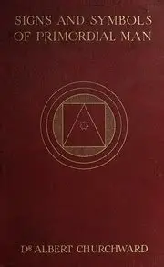
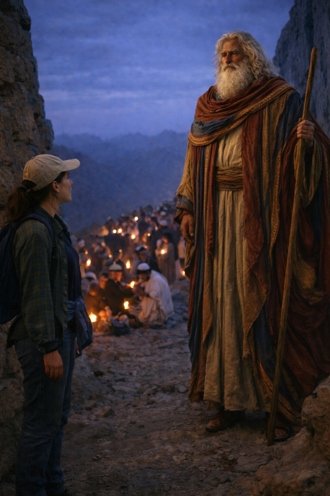
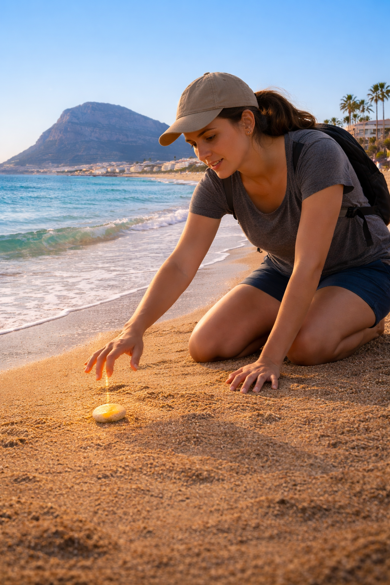

# 1997

## Egypt

### Meeting the Egyptian in Soho

- August one night at a club with Sarah. 
- I first traveled to India with Sarah in 1995. 
- Incidentally, Sarah was also [in the car with me and Ray Archer](1996.md#the-male-stripper-and-worboys) and, I believe, Worboys was in the passenger seat with his male-stripper mate.
- Matthew Copeland is playing a gig at the club.
- We meet an Egyptian historian.
- I tell him about my upcoming trip to Egypt.
- He tells me about a book I must read: *Signs & Symbols of Primordial Man*.

- He's sold it to me entirely.
- I go to East Finchley library the next day probably to see if it's there.
- It's not, of course, but I look it up on the database and request it from the British Library.

### Byron

- In early September, Byron and I leave to travel around Egypt for a month.
- We will visit Cairo and then take a train to Aswan and travel down the Nile on a felucca for few days.
- After that we will go to Dahab for two weeks.

### Mount Sinai

- Last week of our tour.
- We climb Mount Sinai.
- You have to leave really early, around 2am, and climb up in the dark.
- I'm with a bunch of blokes and they're all stomping up the mountain really fast.
- I'm desperate for the toilet, but they're going too fast, and I know they won't wait, and it's dark, so I hold on.
- We get to the top of the mountain and I'm in pain from holding on.
- Everyone takes blankets and finds a spot to sleep to wait for sunrise.
- The sun is starting to reveal some light in the sky but hasn't risen yet.
- I leave Byron with the blankets and head off to find the toilet.
- I'm tired, wired, and my bladder is screaming.
- I don't know where I'm going, I'm sort of staggering around the mountain top which feels a bit unwise.
- There's no-one to ask either.
- I'm thinking about finding somewhere secluded to go but there's nowhere.
- I turn a corner...

### Moses

- In front of me is a man who looks exactly like Moses.
- I'm amazed.
- I don't know what to do with this information.
- We look at each other.
- He looks as surprised to see me as I am him.
- He is old, with long white curly hair and long gowns, just as you might have seen him in a picture.
- I'm thinking either at that moment but definitely later and for many years, *this has to be a guy that lives up here, he's a bit crazy, he thinks he's Moses, dresses like him, and everyone'll know about it, you know, this is too strange for me right now*, and my bladder was screaming, so I turned away from him, and immediately found the toilet.

### Agents

- I tell Byron what happened.
- I can tell he thinks I've lost the plot.
- When we get down to St Catherine's, Byron is chatting with two well-spoken British boys.
- He's told them I think I saw Moses on the mountain.
- They laugh at me, asking if he was carrying two tablets of stone.
- I'm cross, embarrassed, offended.
- I go quiet.

### Telling people, then not telling people

- I told a lot of people about this, everyone probably.
- And at some point a lot later on I realized that perhaps I shouldn't be telling people about this, and so I stopped.
- I remember telling Zoe BJ this.

## Dénia

- October.
- When I get back from Egypt, my bedroom is being decorated so I've nowhere to sleep.
- My friend Roseanne (Bobby), Paul's sister ([*the* Paul](../2025/january.md#paul)), and their younger brother Matthew are going to Benidorm for two weeks.
- They invite me because their friend Martine (PA to George Martin at Abbey Road) dropped out at the last moment.
- I have no money to pay for another trip.
- Roseanne says not to worry, to give her twenty quid.
- How could I say no.
- In the meantime, [the book the Egyptian recommended](#meeting-the-egyptian-in-soho) arrived at East Finchley library so I go to collect it for *reading material* on the Costa Blanca.
- I read it every day.

### The book

- It's bananas; pygmies, axes, masons, forests, signs and symbols (like memes, pre-meme).
- It's an overwhelm of mystical verbiage.
- I understand *nothing*!
- But something keeps me reading.
- I read it every day.

### Las Marinas

- On the second week of our trip to Benidorm we rent a car for a few days.
- Matthew is driving.
- Myself, Bobby, and her new boyfriend Simon are in the car.
- Simon didn't travel with us for the full two weeks package, but instead got a flight over on the second week and paid for a room in the hotel.
- Bobby moved into his room, and me and Matthew had the original three-person hotel room to ourselves.
- One day, we decide to drive North up the coast with the intention of checking out some quieter beaches.
- We skip Altea, Moraira, Benissa, Javea, etc, and instead pull off the motorway at Dénia and drive through the rather long and not very picturesque road into the town on the way to find the beach.
- Eventually after driving around a bit we find the Las Marinas beach road.
- We drive up to the Las Brisas area of Las Marinas, park, and hang out for the afternoon.
- It's lovely, quiet, just a few people milling around; nothing like heaving Benidorm where a man chased me up the road requesting repeatedly I go to his house to take a shower with him, and a 14-year-old boy grabbed my boob in the street one night.
- I go walking on my own at the shore (part of the same walk I will do daily in the summer when I live there).
- I'm examining stones on the sand.
- A stone catches my eye.
- It's white, oval, something about it makes me interested in it.
- I'm so interested in it, I keep it.
- I've never done that before in my life.

!!! tip
    - One has to wonder if anyone suggested, or perhaps told Matt to drive up to the Las Marinas beach of Dénia.    
    - *You must go up there, it's amazing..* for some reason.
    - Not only is Matt the driver Paul's brother, but he was *exceedingly* (an under-exaggeration) good friends with, ahem, Ray Archer at that time also.

### The book that night

- I settle down on my bed with my heavy tome to do a bit of reading that night when we're back in Benidorm.
- It's masons, the corner stone (I think), axes, pygmies, forests.. and then, *the initiate is given the white stone*!
- I nearly fell out of bed.

### The stone

- I kept that stone with me, carried it everywhere I went, until 2015 in Tibet when I left it at Kailash mountain.

### Returning to Sinai 

- I returned to Sinai twice to climb the mountain again, and to see if Moses was still there, just a crazy person who lives up there all the time, or perhaps *THE* Moses, if it really had been him.
- I never saw him again.
- Something makes me wonder what might have happened if I'd been less closed and cynical at the time; like did he having something to say maybe that I missed?
- The last time I went, the guide took me down via the Elijah's cave area which was really special.
- I'd love to go back again.
